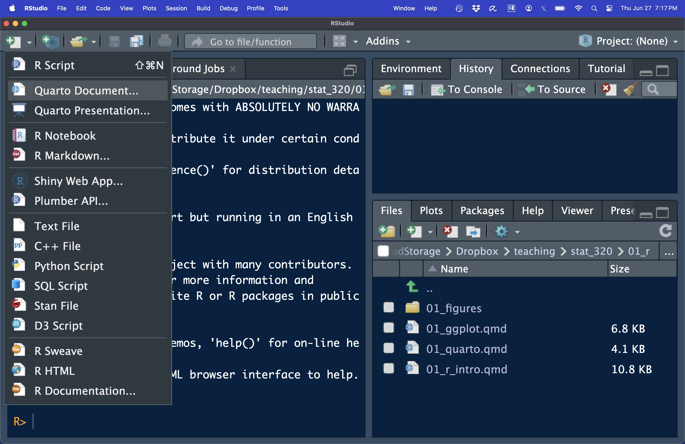
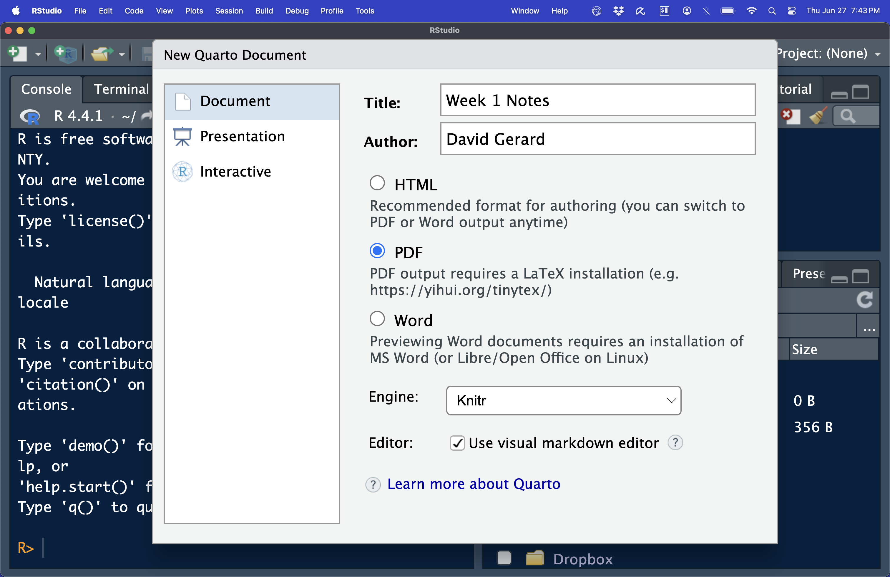

```{r setup, include=FALSE}
knitr::opts_chunk$set(echo = TRUE, 
            fig.width = 4, 
            fig.height = 3, 
            fig.align = "center")
ggplot2::theme_set(ggplot2::theme_bw() + ggplot2::theme(strip.background = ggplot2::element_rect(fill = "white")))
```

# Introduction

- Quarto  is a file format that is a combination of plain text and R code.

- Lots of great educational material is available at <https://quarto.org/>

- You write code and commentary of code in one file. You may then compile 
  (RStudio calls this "rendering") the Quarto  file to many different kinds
  of output: pdf (including beamer presentations), html (including various
  presentation formats), Word, PowerPoint, etc.

- Quarto  is useful for:

  1. Communication of statistical results.
  2. Collaborating with other data scientists.
  3. Using it as a modern lab notebook to *do* data science.
  
- Quarto  can also make "literate programming" documents for python, Julia, JavaScript, etc...

## Getting Statrted

- Install Quarto  via: <https://quarto.org/docs/get-started/>
  
- To make PDF files, you will need to install $\LaTeX$ if you don't have it 
  already. To install it, type in R:
  ```{r, eval=FALSE}
  install.packages("tinytex")
  tinytex::install_tinytex()
  ```
  
- If you get an error while trying to install tinytex, try manually 
  installing \LaTeX\ instead:
  - For Windows users, go to <http://miktex.org/download>
  - For OS users, go to <https://tug.org/mactex/>
  - For Linux users, go to <https://www.tug.org/texlive/>
  
## Playing with Quarto 

- Open up a new Quarto  file:

{fig-alt="R studio screenshot of a new Quarto file."}\ 

- Choose the options for the type of output you want

{fig-alt="Options for new Quarto file."}\ 

- You should now have a rudimentary Quarto  file.

- Save a copy of this file in your "analysis" folder in the "week1" project.

- Quarto  contains three things

  1. A YAML (Yet Another Markup Language) header that controls options for
     the Quarto  document. These are surrounded by `---`.
  2. Code **chunks** --- bits of R code that that are 
     surrounded by ` ```{r} ` and ` ``` `. Only valid R code should go in 
     here.
  3. Plain text that contains simple formatting options.
  
- All of these are are displayed in the default Quarto  file. You can compile
  this file by clicking the "Render" button at the top of the screen or by 
  typing CONTROL + SHIFT + K. Do this now.
  
### Formatting markdown

- Here is Hadley's brief intro to formatting text in Quarto :

  ```{r, comment="", echo=FALSE}
  cat(readr::read_file("./01_figures/formatting.md"))
  ```

### Code Chunks

- You can insert new code-chunks using CONTROL + ALT + I (or using the 
  "Insert" button at the top of RStudio).

- You write all R code in chunks. You can send the current line of R code (the
  line where the cursor is) using CONTROL + ENTER (or the "Run" button at the 
  top of RStudio).
  
- You can run all of the code in a chunk using CONTROL + ALT + C (or using 
  the "Run" button at the top of RStudio).
  
- You can run all of the code in the next chunk using CONTROL + ALT + N (or
  using the "Run" button at the top of RStudio).


### YAML Header

- My typical YAML header will looks like this

  ```{r, comment="", echo=FALSE}
  cat(readr::read_file("./01_figures/yaml_header.Rmd"))
  ```

- All of those settings are fairly self-explanatory.

# Writing Math

- Skip if uninterested.

- You can use the $\LaTeX$ language to write math in Quarto  documents.

- You put inline math between single dollar signs `$math code here$`.

- You put display math (equations on a separate line) between two dollar signs

  ```
  $$
  math code here
  $$
  ```
  
- Subscripts are written with an underscore `_` with braces `{}` surrounding the subscript.
  - $x_{ik}$ is `$x_{ik}$`
  
- Superscripts are written with a caret `^` with braces `{}` surrounding the subscript.
  - $x^{2p}$ is `$x^{2p}$`

- Big sigma notation is `\sum`
  - $\sum_{i=1}^{n}$ is `$\sum_{i=1}^{n}$`
  
- Square root: `\sqrt{}`
  - $\sqrt{x^2 + 1}$ is `$\sqrt{x^2 + 1}$`
  
- log and exponentiation: `\log()` and `\exp()` (note the parentheses, not braces)
  - $\log(x^2 + 1)$ is `$\log(x^2 + 1)$`
  - $\exp(x^2 + 1)$ is `$\exp(x^2 + 1)$`
  
- Greek letters are typically just their spelling beginning with a backslash `\`
  - $\sigma$ is `$\sigma$`
  - $\mu$ is `$\mu$`
  - $\alpha$ is `$\alpha$`
  - $\beta$ is `$\beta$`
  - $\pi$ is `$\pi$`
  - $\tau$ is `$\tau$`
  - etc
  
- The tilde, denoting "is distributed as" is `\sim`
  - $X \sim N(\mu, \sigma^2)$ is `$X \sim N(\mu, \sigma^2)$`
  
- These are the inequality operations
  - $<$ is `$<$`
  - $\leq$ is `$\leq$`
  - $>$ is `$>$`
  - $\geq$ is `$\geq$`
  
- You use a vertical pipe `|` for conditional statements.
  - $Pr(X|Y)$ is `$Pr(X|Y)$`

- Here are some "and" and "or" statements
  - $\cup$ is `$\cup$`
  - $\cap$ is `$\cap$`
  
- Fractions are written with `\frac{}{}`
  - $\frac{x^2 + 1}{\sqrt{2}}$ is `$\frac{x^2 + 1}{\sqrt{2}}$`

- Binomial coefficients are `\binom{}{}`
  - $\binom{n}{2}$ is `$\binom{n}{2}$`

- Let's do a more complicated example:

  $$
  \frac{1}{\sqrt{2\pi\sigma^2}}\exp(-\frac{1}{2\sigma^2}(x - \mu)^2)
  $$
  
  ```
  $$
  \frac{1}{\sqrt{2\pi\sigma^2}}\exp(-\frac{1}{2\sigma^2}(x - \mu)^2)
  $$
  ```


- **Exercise**: Write this equation using $\LaTeX$

  $$
  \binom{n}{k}p^k(1-p)^{n-k}
  $$


- **Exercise**: Write this equation using $\LaTeX$

  $$
  -\frac{n}{2}\log(2\pi\sigma^2) - \frac{1}{2\sigma^2}\sum_{i=1}^{n}(x_i-\mu)^2
  $$
