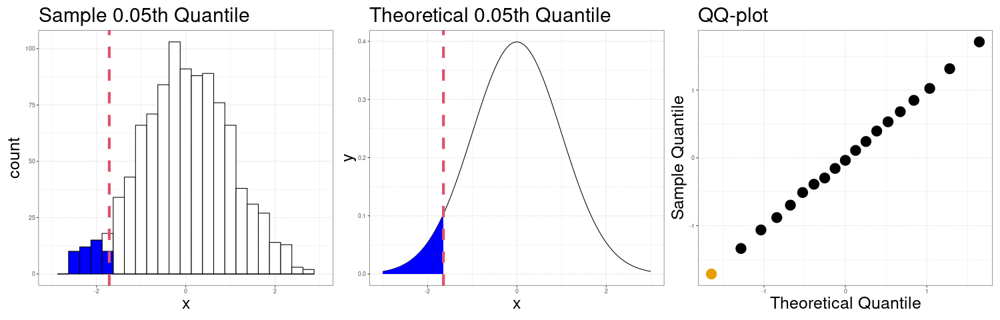
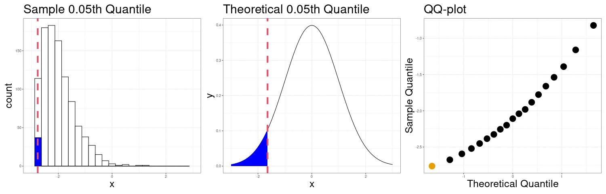
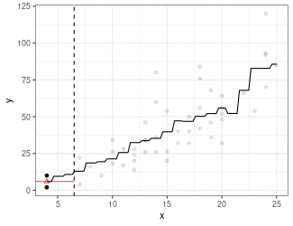
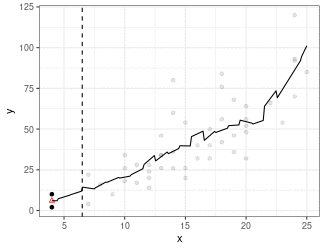
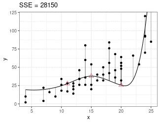
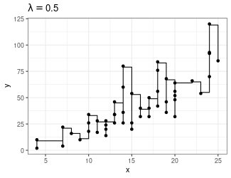
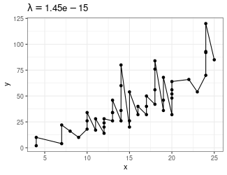

```{r setup, include=FALSE}
set.seed(1)
knitr::opts_chunk$set(echo       = TRUE, 
                      fig.align  = "center",
                      fig.height = 4)
ggplot2::theme_set(ggplot2::theme_bw() + ggplot2::theme(strip.background = ggplot2::element_rect(fill = "white")))
```

```{r klippy, echo=FALSE, include=TRUE}
klippy::klippy()
```

# Learning Objectives

- Chapter 3 of KNNL (skip Sections 3.4--3.6 and the Box-Cox transformation). 
- Interpreting residuals plots.
- Diagnosing violations in the assumptions of the simple linear model.
- Suggesting solutions to remedy the violations.

# Recall: Assumptions in Decreasing Order of Importance

1. **Linearity** - Does the relationship look like a straight line?

2. **Independence** - knowledge of the value of one observation does not give you any information on the value of another.

3. **Equal Variance** - The spread is the same for every value of $x$

4. **Normality** - The distribution isn't too skewed and there aren't any too extreme points. (only an issue if you have outliers and a small number of observations, or if you are doing prediction intervals).

# Problems when Violated

1. **Linearity** - Linear regression line does not pick up actual relationship

2. **Independence** - Linear regression line is unbiased, but standard errors are too small.

3. **Equal Variance** - Linear regression line is unbiased, but standard errors are off.

4. **Normality** - Unstable results if outliers are present and sample size is small.

## Assessment Tools: Scatterplots and Residual Plots

- Make a scatterplot of the explanatory variable ($x$-axis) vs the response ($y$-axis) to check for non-linearity, equal variance, and normality violations.

- Residuals ($y$-axis) vs fitted values ($x$-axis) is often more clear because the signal is removed.

- You should get used to residual plots, because they are necessary when we start doing multiple linear regression 
    - $x$ versus $y$ does not work well as a diagnostic device when you have many $x$'s.

# Dataset 1: Gold Standard

## Dataset 1: Scatterplot

```{r, message = FALSE, echo = TRUE}
library(tidyverse)
library(broom)
x <- runif(100, -3, 3)
y <- x + rnorm(100)
df <- data.frame(x = x, y = y)
```


```{r, echo = TRUE, message=FALSE}
qplot(x = x, y = y, data = df) + geom_smooth(method = "lm", se = FALSE)
```

## Dataset 1: Residual Plot

```{r, echo = TRUE, message=FALSE}
lmout <- lm(y ~ x, data = df)
aout <- augment(lmout)
qplot(x = .fitted, y = .resid, data = aout) + geom_hline(yintercept = 0)
```

## Dataset 1: Summary

- Means are straight lines

- Residuals seem to be centered at 0 for all $x$

- Variance looks equal for all $x$

- Everything looks perfect

- **Exercise**: Describe any issues with this plot.
    ```{r, echo = FALSE, message = FALSE}
    x <- c(runif(30, -3, -2), rep(0, 10), runif(30, 2, 3))
    y <- x + rnorm(length(x))
    df <- data.frame(x = x, y = y)
    qplot(x = x, y = y, data = df) + geom_smooth(method = "lm", se = FALSE)
    ```
    
    ```{block, eval = FALSE, echo = FALSE}
    This plot still looks good. Remember, we have no distributional assumptions on the predictors. We are just looking as spread along columns of the predictors.
    ```

# Dataset 2: Curved Monotone Relationship, Equal Variances

## Dataset 2: Scatterplot

```{r, echo = TRUE}
x <- runif(100, 0, 6)
x <- x - min(x) + 0.5
y <- log(x) * 20 + rnorm(100, sd = 4)
df <- data.frame(x = x, y = y)
```


```{r, echo = TRUE, message=FALSE}
qplot(x = x, y = y, data = df) + geom_smooth(method = "lm", se = FALSE)
```

## Dataset 2: Residual Plot

```{r, echo = TRUE, message=FALSE}
lmout <- lm(y ~ x)
aout <- augment(lmout)
qplot(x = .fitted, y = .resid, data = aout) + geom_hline(yintercept = 0)
```

## Dataset 2: Summary

- Curved (but always increasing *or* always decreasing) relationship between $x$ and $y$.

- Variance looks equal for all $x$

- Residual plot has a parabolic shape.

- These indicate a $\log$ transformation of $x$ could help.

- Why not $\log(y)$? Because taking transforming $y$ can change the variance, and we already have constant variance, so we do not want to mess with that.
    - Recall, random variation occurs in the $y$ direction, not the $x$ direction.
    
- **Exercise**: Consider the following data:
    ```{r}
    dftoy <- tribble(~x, ~y,
                     1, 1, 
                     1, 2, 
                     2, 1, 
                     2, 5,
                     3, 1,
                     3, 20)
    ```
    Plot $x$ versus $y$. Then log-transform $x$ and plot $\log(x)$ versus $y$. Then try log-transforming $y$ and plotting $x$ versus $\log(y)$. Discuss how variation changes (vertically or horizontally) when we log $x$ versus logging $y$.
    
    ```{r, echo = FALSE, eval = FALSE}
    qplot(x = x, y = y, data = dftoy)
    qplot(x = log(x), y = y, data = dftoy)
    qplot(x = x, y = log(y), data = dftoy)
    ```
    
    ```{block, eval = FALSE, echo = FALSE}
    Logging $x$ changes the variation in $x$. Logging $y$ changes the variation in $y$.
    ```

## Dataset 2: Transformed $x$ Scatterplot

```{r, echo = TRUE, message=FALSE}
df <- mutate(df, x_log = log(x))
qplot(x = x_log, y = y, data = df) + geom_smooth(method = "lm", se = FALSE)
```

## Dataset 2: Transformed $x$ Residual Plot

```{r, echo = TRUE, message=FALSE}
lmout <- lm(y ~ x_log, data = df)
aout <- augment(lmout)
qplot(x = .fitted, y = .resid, data = aout) + geom_hline(yintercept = 0)
```

# Dataset 3: Curved Non-monotone Relationship, Equal Variances

## Dataset 3: Scatterplot

```{r}
x <- runif(100, -3, 3)
y <- -x^2 + rnorm(100)
df <- data.frame(x = x, y = y)
```


```{r, echo = TRUE, message=FALSE}
qplot(x = x, y = y, data = df) + geom_smooth(method = "lm", se = FALSE)
```


## Dataset 3: Residual Plot

```{r, echo = TRUE, message=FALSE}
lmout <- lm(y ~ x, data = df)
aout <- augment(lmout)
qplot(x = .fitted, y = .resid, data = aout) + geom_hline(yintercept = 0)
```

## Dataset 3: Summary

- Curved relationship between $x$ and $y$

- Sometimes the relationship is increasing, sometimes it is decreasing.

- Variance looks equal for all $x$

- Residual plot has a parabolic form.

## Dataset 3: Solution

- Fit model:

    $$
    E[Y_i] = \beta_0 + \beta_1 X_i + \beta_2 X_i^2
    $$

- A more complicated solution (which we will not cover) would be to fit model
    $$
    Y_i = 
    \begin{cases}
    \beta_0 + \beta_1 X_i & \text{ if } X_i < C\\
    \beta_0^* + \beta_1^* X_i & \text{ if } X_i > C\\
    \end{cases}
    $$

## Dataset 3: Fitting $E[Y_i] = \beta_0 + \beta_1 X_i + \beta_2 X_i^2$

```{r, echo = TRUE}
df <- mutate(df, x2 = x^2) ## create x^2 first
quad_lm <- lm(y ~ x + x2, data = df) ## lm of x^2 + x
aout <- augment(quad_lm)
qplot(x = x, y = y, data = aout) +
  geom_line(mapping = aes(x = x, y = .fitted), col = "blue", lwd = 1)
```

## Dataset 3: Solution 1 Residuals

```{r, echo = TRUE}
qplot(x = .fitted, y = .resid, data = aout) + geom_hline(yintercept = 0)
```

## Dataset 3: Peak estimation
```{r}
ttemp <- tidy(quad_lm)
beta0 <- ttemp$estimate[[1]]
beta1 <- ttemp$estimate[[2]]
beta2 <- ttemp$estimate[[3]]
```


- Recall that $y = \beta_0 + \beta_1x + \beta_2x^2$ is the equation of a parabola.

- The estimated parabola is $y = `r beta0` + `r beta1` x + `r beta2` x^2$
    

- We can get these coefficient estimates by running
    ```{r}
    tidy(quad_lm)
    ```

- The negative coefficient for $x^2$ indicates that the parabola has a maximum, which we can recall occurs at
    $$
    x = -\frac{\beta_1}{2\beta_2} = -\frac{`r beta1`}{2 \times `r beta2`} = `r -beta1 / (2 * beta2)`
    $$
    So we could say that the trend increases to about 0, then decreases after 0.

# Dataset 4: Curved Monotone Relationship, Variance Increases with $Y$

## Dataset 4: Scatterplot

```{r, echo = TRUE}
x <- runif(100, 0, 2)
y <- exp(x + rnorm(100, sd = 1/2))
df <- data.frame(x = x, y = y)
```

```{r, echo = TRUE, message=FALSE}
qplot(x = x, y = y, data = df) + geom_smooth(method = "lm", se = FALSE)
```


## Dataset 4: Residual Plot

```{r, echo = TRUE, message=FALSE}
lmout <- lm(y ~ x, data = df)
aout <- augment(lmout)
qplot(x = .fitted, y = .resid, data = aout) + geom_hline(yintercept = 0)
```


## Dataset 4: Summary

- Curved relationship between $x$ and $y$

- Variance looks like it increases as $y$ increases

- Residual plot has a parabolic form.

- Residual plot variance looks larger to the right and smaller to the left.

## Dataset 4: Solution

- Take a log-transformation of $y$.

    ```{r, echo = TRUE, message = FALSE}
    df <- mutate(df, y_log = log(y))
    qplot(x = x, y = y_log, data = df) + geom_smooth(method = "lm", se = FALSE)
    ```

## Dataset 4: Solution

```{r, echo = TRUE, message=FALSE}
lmout <- lm(y_log ~ x, data = df)
aout <- augment(lmout)
qplot(x = .fitted, y = .resid, data = aout) + geom_hline(yintercept = 0)
```

- **Exercise**: What if you see something like this? Do you think logging $y$ will help?
    ```{r, echo = FALSE}
    x <- runif(100, 0, 2)
    y <- exp(-x + rnorm(100, sd = 1/2))
    df <- data.frame(x = x, y = y)
    qplot(x = x, y = y, data = df)
    ```

    ```{block, eval = FALSE, echo = FALSE}
    Yes. What's important is that we have increasing variance at higher $y$ and that it is curved. You can try it out!
    ```
    
    ```{r, echo = FALSE, eval = FALSE}
    qplot(x = x, y = log(y), data = df)
    ```

# Dataset 5: Linear Relationship, Equal Variances, Skewed Distribution

## Dataset 5: Scatterplot

```{r}
x <- runif(200)
y <- 15 * x + rexp(200, 0.2)
df <- data.frame(x = x, y = y)
```

```{r, echo = TRUE, message = FALSE}
qplot(x, y, data = df) + geom_smooth(method = "lm", se = FALSE)
```

## Dataset 5: Residual Plot

```{r, echo = TRUE, message=FALSE}
lmout <- lm(y ~ x, data = df)
aout <- augment(lmout)
qplot(x = .fitted, y = .resid, data = aout) + geom_hline(yintercept = 0)
```

## Dataset 5: Summary

- Straight line relationship between $x$ and $y$.

- Variances about equal for all $x$

- Skew for all $x$

- Residual plots show skew.

## Dataset 5: Solution

- Do nothing, but report skew (usually OK to do)

- Be fancy, fit quantile regression:

$$
Median(Y_i) = \beta_0 + \beta_1 X_i
$$

- Be fancy, run a bootstrap (maybe we'll talk about this later).

# Dataset 6: Linear Relationship, Unequal Variances

## Dataset 6: Scatterplot

```{r}
x <- runif(100)
y <- x + rnorm(100, sd = (x + 0.3)^2 / 2)
df <- data.frame(x = x, y = y)
```

```{r, echo = TRUE, message=FALSE}
qplot(x = x, y = y, data = df) + geom_smooth(method = "lm", se = FALSE)
```

## Dataset 6: Residual Plot

```{r, echo = TRUE, message=FALSE}
lmout <- lm(y ~ x, data = df)
aout <- augment(lmout)
qplot(x = .fitted, y = .resid, data = lmout) + geom_hline(yintercept = 0)
```

## Dataset 6: Summary

- Linear relationship between $x$ and $y$.

- Variance is different for different values of $x$. This is called **heteroscedasticity**.

- Residual plots really good at showing this.

## Dataset 6: Solution

- You can try logging both $x$ and $y$, sometimes that works. But that won't work here. Be careful about negative values.
    ```{r}
    df <- mutate(df, y_log = log(y + 0.5),
                 x_log = log(x))
    qplot(x = x_log, y = y_log, data = df)
    ```


- The book will suggest weighted least squares (with weights inverse to the variance).

- But the modern solution is to use **sandwich** estimates of the standard errors.

    ```{r, echo = TRUE, message = FALSE}
    library(lmtest)
    library(sandwich)
    cout <- coeftest(x = lmout, vcov. = vcovHC)
    tidy(cout, conf.int = TRUE)
    ```
    
- `vcovHC()` stands for "Heteroscedastic-consistent variance/covariance".

- Compare to old standard errors
    ```{r}
    tidy(lmout, conf.int = TRUE)
    ```


## Intuition of Sandwich Estimator of Variance

- Simplified Model: $Y_i = \beta_1 x_i$ (so zero intercept)

- Using Calculus: $\hat{\beta}_1 = \frac{\sum_{i = 1}^n x_i y_i}{\sum_{i = 1}^n x_i^2}$\pause

So
\begin{align*}
Var(\hat{\beta}_1) &= Var\left(\frac{\sum_{i = 1}^n x_i y_i}{\sum_{i = 1}^n x_i^2}\right)\\
&=\frac{\sum_{i = 1}^n x_i^2 Var(y_i|x_i)}{\left(\sum_{i = 1}^n x_i^2\right)^2}
\end{align*}\pause

- Usual Method: Estimate $Var(y_i|x_i) = \sigma^2$ with the MSE. 

    - Assumes variance estimate is same for all $i$

- Sandwich Method: Estimate $Var(y_i|x_i)$ with $(y_i - \hat{\beta}_1x_i)^2$ 

    - Allows variance estimate to differ at each $i$

## Notes on Sandwich

- They result in accurate standard errors of the coefficient estimates as long as

    1. The linearity assumption is satisfied.
    
    2. Independence is satisfied
    
    3. You have a large enough sample size.
    
- You cannot use them for prediction intervals

- We will talk more about the sandwich estimator later.

# Dataset 7: Outlying observations

```{r}
x <- runif(100, -3, 3)
y <- x + rnorm(100)
x[[100]] <- 2.6
y[[100]] <- 10
df <- data.frame(x = x, y = y)
```

```{r, echo = TRUE, message=FALSE}
qplot(x = x, y = y, data = df) + geom_smooth(method = "lm", se = FALSE)
```

## Dataset 7: Residual Plot

```{r, echo = TRUE, message=FALSE}
lmout <- lm(y ~ x, data = df)
aout <- augment(lmout)
qplot(x = .fitted, y = .resid, data = aout) + geom_hline(yintercept = 0)
```

- So we see one observation very high in residual plot compared to the other points around that area.

## Dataset 7: Solution

- It's generally a bad idea to discard outlying observations unless you know that this is a processing error or a calculation mistake.

- Generally the procedure to dealing with outliers is:
  1. Detect influential points.
  2. Verify that the outliers are not caused by numerical errors.
  3. Fit the model both with and without the outliers. If the results do not change, report both results.
  4. If the results change, try fitting a robust approach.

- Some robust approaches are described in Section 11.3 of KNNL. One possible approach is quantile regression, which assumes the model
    $$
    Median(Y_i) = \beta_0 + \beta_1X_i
    $$

    ```{r, message = FALSE}
    library(quantreg)
    rqout <- rq(y ~ x, data = df)
    t_rq <- tidy(rqout, conf.int = TRUE)
    t_rq
    ```
    
- We have a large sample size, so the results do not change much.

    ```{r}
    tidy(lmout, conf.int = TRUE)
    ```

- Chapter 10 contains more details on evaluating the influence of outliers.

- **Exercise**: Consider the following data:
    ```{r}
    dftoy <- tribble(~x, ~y,
                     2, 16,
                     4, 23,
                     5, 27, 
                     6, 29,
                     7, 32,
                     8, 35,
                     9, 37,
                     12, 54)
    ```
    Make a scatterplot of `y` on `x`, then make a residual versus fits plot for a regression of `y` on `x`. Does the residual plot suggest that outliers are the issue, or is it decieving you into thinking something else is the issue?
    ```{r, eval = FALSE, echo = FALSE}
    qplot(x = x, y = y, data = dftoy)
    lmtoy <- lm(y ~ x, data = dftoy)
    atoy <- augment(lmtoy)
    qplot(x = .fitted, y = .resid, data = atoy) +
      geom_hline(yintercept = 0)
    ```
    ```{block, echo = FALSE, eval = FALSE}
    The outlier is clearly the issue, but the residual plot makes it seem like there is a non-linearity issue. This is because for outliers that are very influential, they can make it seem like there are other issues.
    ```

# Dataset 8: Sequence plots of residuals to check independence

- Sometimes, the residuals can exhibit **autocorrelation** where residuals close to each other in time (or a sequence) are more similar than those further away.

    ```{r}
    x <- sort(runif(100, -3, 3))
    epsilon <- rep(NA_real_, length.out = length(x))
    epsilon[[1]] <- 0
    rho <- 0.9
    for (i in 2:length(epsilon)) {
      epsilon[[i]] <- 0.85 * epsilon[[i-1]] + rnorm(1)
    }
    y <- x + epsilon
    df <- data.frame(x = x, y = y)
    ```
    
    ```{r, message = FALSE}
    qplot(x = x, y = y, data = df) + geom_smooth(method = "lm", se = FALSE)
    ```

    ```{r}
    lmout <- lm(y ~ x, data = df)
    aout <- augment(lmout)
    aout <- mutate(aout, index = row_number())
    qplot(x = index, y = .resid, data = aout) + geom_hline(yintercept = 0)
    ```
    
- This is a specific issue with the **independence** assumption.

- The OLS fit is still unbiased, but the standard errors will be too small (because we have less information than we think).

## Dataset 8: Solution

- This is discussed in detail in Chapter 12 of KNNL.

- You should first check if including omitted variables helps remove autocorrelation.
    - E.g. plotting annual sales versus average price over time, if you are missing population size, then adjacent years probably have more similar errors.

- You can try to estimate autocorrelation directly (Section 12.4 of KNNL).

- You can also adjust the OLS standard errors using a similar approach to sandwich estimation. This is called the "Newey-West HAC" (Heteroskedasticity- and autocorrelation-consistent) estimate of the standard error.

    ```{r, echo = TRUE, message = FALSE}
    library(lmtest)
    library(sandwich)
    cout <- coeftest(x = lmout, vcov. = vcovHAC)
    tidy(cout, conf.int = TRUE)
    ```
    
    - Notice we used `vcovHAC()` instead of `vcovHC()`.

- Compare to original standard errors
    ```{r}
    tidy(lmout, conf.int = TRUE)
    ```

- You should have large sample sizes for accurate inference ($n\geq 100$) for estimating the autocorrelation or adjusting the standard errors.

# Quantile-Quantile plots of residuals to check normality

- To check the normality of the residuals, plot the sample quantiles of the residuals against the theoretical quantiles of the normal distribution.

- **Quantile**: The $q$th quantile of a variable is the value at with $q$ proportion of the observations fall.

- Sample 0.25-quantile

    ```{r, echo = FALSE, warning = FALSE}
    data.frame(x = rnorm(1000)) %>%
      mutate(islow = x < quantile(x = x, probs = 0.25)) ->
      df
    x25 <- quantile(df$x, probs = 0.25)
    ggplot(df, aes(x = x, fill = islow)) +
      geom_histogram(bins = 25, color = "black") +
      scale_fill_manual(values = c("white", "blue")) +
      geom_vline(xintercept = x25, lty = 2, col = 2, lwd = 2) +
      theme(legend.position = "none") +
      xlim(-3, 3)
    ```

- Theoretical 0.25-quantile

    ```{r, echo = FALSE}
    data.frame(x = seq(-3, 3, length.out = 500)) %>%
      mutate(y = dnorm(x)) ->
      df
    sdf <- filter(df, x < qnorm(0.25))
    ggplot() +
      geom_line(data = df, mapping = aes(x = x, y = y)) +
      geom_ribbon(data = sdf, mapping = aes(x = x, ymin = 0, ymax = y), fill = "blue") +
      geom_vline(xintercept = qnorm(0.25), lty = 2, col = 2, lwd = 2)
    ```
    
- If the residuals were approximately normal, then we would expect the 0.25 quantile of the data to be about the 0.25 quantile of the normal, the 0.7 quantile of the data to be about the 0.7 quantile of the normal, etc.

- We can graphically compare the quantiles by making a scatterplot of the sample quantiles to the theoretical quantiles. This is called a **QQ-plot** (for quantile-quantile).
  
- We usually place the theoretical quantiles on the $x$-axis and the sample quantiles on the $y$-axis.

- Constructing a QQ-plot

  \ 

- **Exercise**: The simplest definition of the $p$th sample quantile is the minimum value $q$ in the sample such that *at least* $p$ proportion of the observations are at or below $q$. In mathematical notation
    $$
    Q(p) = \min\left(q \in \{X_1,X_2,\ldots,X_n\}: p\leq \frac{1}{n}\#\{X_i:X_i < q\}\right)
    $$
    In R, this corresponds to the `type = 1` argument from the quantile function. Try running this code and try understanding this definition:
    ```{r, eval = FALSE}
    quantile(x = c(4, 9, 13, 22, 37), probs = c(0.19999, 0.2, 0.20001, 0.39999, 0.4, 0.40001), type = 1)
    ```
    Which quantiles do you think we would use when constructing a QQ-plot?
    ```{block, eval = FALSE, echo = FALSE}
    The quantile function jumps at k/n where k = 1,2,...,n. It stays at the ceiling value until it reaches that value.
    
    Since we only really observe 5 different quantile values, we should be interested in those jump points. k/n where k = 1,2,...,n.
    ```
    
- QQ-plots Can show us deviations from normality
  
  \ 
  
- QQ-plot indicating right skew.
    ```{r, echo = FALSE}
    x <- rexp(100)
    qplot(sample = x, geom = "qq") +
      geom_qq_line() +
      xlab("Theoretical") +
      ylab("Sample")
    ```

- QQ-plot indicating left skew.
    ```{r, echo = FALSE}
    x <- -rexp(100)
    qplot(sample = x, geom = "qq") +
      geom_qq_line() +
      xlab("Theoretical") +
      ylab("Sample")
    ```
- QQ-plot indicating heavy tails.
    ```{r, echo = FALSE}
    x <- -rt(100, 1)
    qplot(sample = x, geom = "qq") +
      geom_qq_line() +
      xlab("Theoretical") +
      ylab("Sample")
    ```
    
- QQ-plot indicating light tails.
    ```{r, echo = FALSE}
    x <- -runif(100)
    qplot(sample = x, geom = "qq") +
      geom_qq_line() +
      xlab("Theoretical") +
      ylab("Sample")
    ```

  
## QQ-plots in R

- We can evaluate the normality assumption from the bread and peace example.

    ```{r, message = FALSE}
    hibbs <- read_csv("https://dcgerard.github.io/stat_415_615/data/hibbs.csv")
    lmhibbs <- lm(vote ~ growth, data = hibbs)
    ```

- Use `augment()` from the `{broom}` package to obtain the residuals. Then use the `geom = "qq"` argument in the `qplot()` function. Make sure you specify `sample = .resid`, *not* `x = .resid`.

    ```{r}
    aout <- augment(lmhibbs)
    qplot(sample = .resid, data = aout, geom = "qq") +
      geom_qq_line()
    ```
    
- There is a small deviation, but it's not too bad.

## Final notes about normality

- Only worry about normality if you see extreme outliers or other extreme deviations from normality (or if you want prediction intervals).

- Check for normality **last**. Violations of linearity could make it seem like normality is violated.

# Residual plots against omitted predictors

- If you have predictors that you did not use in the model, it is always a good idea to make plots of the residuals against those omitted predictors.

- Consider the Palmer Penguins Data.
    ```{r, message = FALSE, warning = FALSE}
    library(palmerpenguins)
    data("penguins")
    glimpse(penguins)
    lmpen <- lm(body_mass_g ~ bill_length_mm, data = penguins)
    aout <- augment(lmpen)
    penguins %>%
      mutate(.rownames = as.character(row_number())) %>%
      left_join(aout) %>%
      qplot(x = species, y  = .resid, data = ., geom = "boxplot")
    ```
    
- Whenever you see a systematic pattern between the residuals and an omitted predictor (as above), this indicates that you should include that predictor in your model.

# $F$-test for lack-of-fit

- In many cases, you have repeat observations at the same value of the predictors. If you design a study, it is a good idea to include repeats at the same predictor levels.

- If so, then it is possible to run a **lack-of-fit** test:
    - $H_0: E[Y_i] = \beta_0 + \beta_1 X_i$
    - $H_A: E[Y_i] \neq \beta_0 + \beta_1 X_i$
    
- Rejecting this test indicates that the linear model is not a good fit.

- Failing to reject this test tells us that at least we do not have evidence that the linear model is a bad fit.

- We will consider this example in the context of a experiment run on 11 branches of a bank. Each branch offered a set gift size ($X$) to open a new account. The branches then measured the number of new accounts opened ($Y$).
    ```{r}
    bank <- tibble::tribble(~gift, ~accounts,
                            125, 160,
                            100, 112,
                            200, 124,
                             75,  28,
                            150, 152,
                            175, 156,
                             75,  42,
                            175, 124,
                            125, 150,
                            200, 104,
                            100, 136
                            )
    ```
    
    There are 6 values of gift size, with all but one value having two units.

- The basic idea of the lack-of-fit test is to compare the residuals under the regression model (the reduced model) to the residuals under a "saturated" model where each level of $X$ is allowed to have its own mean.


- Reduced Model: SSE(R)
    ```{r, echo = FALSE}
    lm_r <- lm(accounts ~ gift, data = bank)
    aout <- augment(lm_r)
    ggplot(data = aout) +
      geom_segment(aes(x = gift, xend = gift, y = accounts, yend = .fitted), alpha = 1/4, lwd = 2) +
      geom_point(aes(x = gift, y = accounts)) +
      geom_line(aes(x = gift, y = .fitted), color = "blue", lwd = 2) +
      xlab("Gift Size") +
      ylab("Number of Accounts")
    ```

- Full Model: SSE(F)
    ```{r, echo = FALSE}
    bank %>%
      mutate(gift = as.factor(gift)) %>%
      lm(accounts ~ gift, data = .) ->
      lm_f
    aout <- augment(lm_f)
    
    aout %>%
      mutate(gift = as.numeric(as.character(gift))) ->
      aout
    
    aout %>%
      select(gift, .fitted) %>%
      distinct() %>%
      mutate(gift = as.numeric(as.character(gift)),
             gl = gift - 3,
             gu = gift + 3) ->
      gmean
    
    
    ggplot(data = aout) +
      geom_segment(aes(x = gift, xend = gift, y = accounts, yend = .fitted), alpha = 1/4, lwd = 2) +
      geom_segment(data = gmean, aes(x = gl, xend = gu, y = .fitted, yend = .fitted), color = "blue", lwd = 2) +
      geom_point(aes(x = gift, y = accounts)) +
      xlab("Gift Size") +
      ylab("Number of Accounts")
    ```

- There are 11 observations.

- In the reduced model, there are two parameter ($y$-intercept and slope), so $df_R = 11 - 2 = 9$.

- In the full model, there are six parameters (one for each mean to estimate), so $df_F = 11 - 6 = 5$.

- Use the $F$-statistic
    $$
    F^* = \frac{[SSE(R) - SSE(F)] / (df_R - df_F)}{SSE(F) / df_F}
    $$
    
- Under the reduced model, we have
    $$
    F^* \sim F(df_R - df_F, df_F)
    $$

    So we can compare it to this distribution to obtain a $p$-value.
    
## Lack-of-fit Test in R

- First, fit both the reduced and full models.

- The reduced model we've seen before.
    ```{r}
    lm_r <- lm(accounts ~ gift, data = bank)
    ```

- The full model is fit automatically if you convert `gift` to a factor variable. We'll talk about the specifics of how this works when we get to indicator variables in multiple linear regression.

    ```{r}
    df_full <- mutate(bank, gift_factor = as.factor(gift))
    lm_f <- lm(accounts ~ gift_factor, data = df_full)
    ```

- Then use the `anova()` function to compare these two models.

    ```{r}
    anova(lm_r, lm_f)
    ```

- We can verify this $p$-value by calculating the $F$-statistic manually.

    ```{r}
    resid_r <- augment(lm_r)$.resid
    resid_f <- augment(lm_f)$.resid
    sse_r <- sum(resid_r^2)
    sse_f <- sum(resid_f^2)
    df_r <- nrow(bank) - 2
    df_f <- nrow(bank) - 6
    f_star <- ((sse_r - sse_f) / (df_r - df_f)) / (sse_f / df_f)
    pf(q = f_star, df1 = df_r - df_f, df2 = df_f, lower.tail = FALSE)
    ```

## Math notation

- We will change notation. Let $Y_{ij}$ be the $j$th individual in group $i$. Let $X_i$ be the level of group $i$.

- You might recognize the above "saturated" model as a one-way ANOVA model
    $$
    Y_{ij} \sim N(\mu_i, \sigma^2)
    $$

- We compare the ANOVA model to the "reduced" linear regression model.
    $$
    Y_{ij} \sim N(\beta_0 + \beta_1X_i, \sigma^2)
    $$
    where $X_i$ is the level of group $i$.
    
- This makes it more clear that the regression model is a reduced version of the ANOVA model.

## Lack-of-fit test Summary

- Lack-of-fit $F$-test tests the assumption of linearity.
- Needs multiple observations at different predictor values (but some values can have only one observation).
- Small $p$-values indicate lack-of-fit (so linearity is not a valid assumption).

# Other transformations

- The book suggests other transformations (square root, Box-Cox).

- Square root on the response will compress values more mildly than the log.

- The Box-Cox transformation on the response is really a set of transformations that includes the log and the square root as special cases.

- $1/X$ and $exp(X)$ and $exp(-X)$ and $\sqrt{X}$ could all help improve linearity.

- $1/X$ works well when the non-constant variance is *more* severe.

- $\sqrt{X}$ works well when the non-constant variance is *less* severe.

- If your goal is *prediction*, then have at it.

- But if your goal is inference, then you lose all interpretability by using transformations other than $\log()$. So think carefully before trying other transformations.

- If you are transforming a variable that you do not care about (are just controlling for it), then it would be OK to use non-interpretable transformations.

# Back Transforming

- After you make a transformation, you often want to back transform predictions, estimates, etc.

- The steps for this are:
    1. Make estimates, confidence intervals, and prediction intervals on the transformed scale that you used to fit the linear model.
    2. Apply the same transformation to confidence bounds as you do to estimates to interpret (see the [Math Prerequisites](./02_math_prereq.html) lecture).
    3. Apply the inverse transformation you applied to $Y$ to predictions and  prediction bounds to get back to the original scale.
    
## Logging $X$ but not logging $Y$

- From the `mtcars` dataset:
    ```{r}
    data("mtcars")
    qplot(x = log(wt), y = mpg, data = mtcars)
    mtcars <- mutate(mtcars, log_wt = log(wt))
    lm_mt <- lm(mpg ~ log_wt, data = mtcars)
    tidy(lm_mt, conf.int = TRUE)
    ```

- Interpretation: Cars that are 50\% heavier have on average $-17.0 \times \log(1.5) = -6.9$ worse miles per gallon.

- Confidence interval: $-20.2 \times \log(1.5) = -8.2$ to $-14.0 \times \log(1.5) = -5.7$. Notice that we applied the same transformation on the bounds as we did on the estimate.

- Prediction interval
    ```{r}
    newdf <- data.frame(wt = 3)
    newdf <- mutate(newdf, log_wt = log(wt))
    predict(object = lm_mt, newdata = newdf, interval = "prediction")
    ```

    - Prediction interval at a weight of 3000 lbs: 20.49 mpg (14.95 mpg to 26.02 mpg). Notice that I did not transform these since they are already on the proper scale.

## Not logging $X$ but logging $Y$

- The early growth of [COVID-19 in DC](https://dcgerard.github.io/stat_415_615/data.html#dc-covid-tests) looked exponential:
    ```{r, message = FALSE}
    dc <- read_csv("https://dcgerard.github.io/stat_415_615/data/dccovid.csv")
    dc <- select(dc, day, positives)
    dc <- filter(dc, day <= "2020-04-01", day >= "2020-03-11") 
    qplot(x = day, y = log(positives), data = dc)
    ```

    ```{r}
    dc <- mutate(dc, log_positives = log(positives), day_num = as.numeric(day - day[[1]]))
    lm_cov <- lm(log_positives ~ day_num, data = dc)
    tidy(lm_cov, conf.int = TRUE)
    ```

- Each day saw about $\exp(0.218) = 1.24$ times as many COVID cases (about 24\% more).

- Confidence interval: $\exp(0.2049) = 1.23$ to $\exp(0.2311) = 1.26$ times as many. Notice that I applied the same transformation to the bounds as I did to the estimator.

- **Exercise**: How many more COVID cases did we see every two days? Provide a 95\% confidence interval with your estimate.
    ```{block, eval = FALSE, echo = FALSE}
    $\exp(2 * 0.218) = 1.547$
    
    $\exp(2 * 0.2049) = 1.507$
    
    $\exp(2 * 0.2311) = 1.588$
    
    So we estimate about 55\% more covid cases, with 95\% confidence interval of about 51\% more to 59\% more.
    ```


- Prediction interval:

    ```{r}
    newdf <- data.frame(day_num = 10)
    predict(object = lm_cov, newdata = newdf, interval = "prediction")
    ```

    - We predict that about 10 days in, there were about $\exp(4.364) = 78.6$ COVID cases, with prediction interval $\exp(3.965) = 52.7$ to $\exp(4.763) = 117.1$ COVID cases. Notice that I applied the same transformation to my estimate as I did to the bounds of the prediction interval.


## Logging $X$ and logging $Y$

- Wine and mortality follow a power-law decline.
    ```{r}
    library(Sleuth3)
    data("ex0823")
    wine <- ex0823
    qplot(x = log(Wine), y = log(Mortality), data = wine)
    ```

- Fit linear model
    ```{r}
    wine <- mutate(wine, log_wine = log(Wine),
                   log_mort = log(Mortality))
    lm_wine <- lm(log_mort ~ log_wine, data = wine)
    tidy(lm_wine, conf.int = TRUE)
    ```

- Countries that drink twice as much wine per capita have on average ($2^{-0.3556} = 0.78$) 22\% fewer deaths per 1000 individuals.

- Confidence interval: $2^{-0.4678} = 0.7231$ to $2^{-0.2434} = 0.8448$, so anywhere from 16\% fewer deaths per 1000 individuals, to 28\% fewer deaths per 1000 individuals. Notice that I applied the same transformation to the bounds of the confidence interval as I did to the estimate.

- Prediction interval:
    ```{r}
    newdf <- data.frame(Wine = 20)
    newdf <- mutate(newdf, log_wine = log(Wine))
    predict(object = lm_wine, newdata = newdf, interval = "prediction")
    ```

    - So countries that drink 20 liters per person per year have on average mortality rates of about $\exp(1.49) = 4.4$ deaths per 1000 individuals. With a prediction interval of $\exp(0.984) = 2.7$ to $\exp(1.997) = 7.4$ deaths per 1000 individuals.

# Smoothers

- Use non-parametric approaches to curve fitting for exploration purposes. When you have a ton of values, or if the trend is weak relative to the variance, it is sometimes easier to see a trend if you plot an estimate of the curve.

- Lowess works by estimating the mean $Y$ value at a given point $X$ by fitting a regression to points near $X$, weighting the objective function proportionally to how far away values are from $X$. E.g.
    $$
    \sum_{i: X_i \text{ is near } X} w_i[Y_i - (\beta_0 + \beta_1 X_i)]^2,
    $$
    where $w_i$ is larger for values closer to $X$. For each $X$ where you want to make a prediction, it obtains an estimate $\hat{\beta}_0$ and $\hat{\beta}_1$ and estimates the mean value by $\hat{\beta}_0 + \hat{\beta}_1 X$.
    
    - This is not exactly what happens, but gives you an idea of how it works.

- In practice, you don't need to know any of this. Just add `geom_smooth(se = FALSE)` after you make a scatterplot.

    ```{r, message = FALSE}
    qplot(x = growth, y = vote, data = hibbs) +
      geom_smooth(se = FALSE)
    ```

- **Be careful not to over-interpret these.** E.g., don't say that the above is evidence for a leveling off between 1 and 2, then increasing again. Lowess does not provide inference. It can only generate questions.

- There is large literature on different types of smoothers:

### Kernel Regression

- Estimate mean of points in the window (because we are using the [box kernel](https://en.wikipedia.org/wiki/Kernel_(statistics)#Kernel_functions_in_common_use)).

- Use `ksmooth()` to implement kernel smoothing.

\ 

### Local Linear Regression (Simplified LOESS)

- Fit a regression line using only points in window (because we are using the [box kernel](https://en.wikipedia.org/wiki/Kernel_(statistics)#Kernel_functions_in_common_use)).

- Use regression line to estimate point at red triangle.

- Use `loess()` to implement LOESS.

\ 

### Regression Splines

- Piecewise cubic between knots (red triangles).

- Derivatives on both sides of knots must be equal.

- Minimize sum of squares.

- Because splines are piece-wise cubic, they are parametric (though flexible), and so we can include them as covariates in regression. We'll talk about this later.

- You use `lm(y ~ splines::bs(x))` to estimate a smoothing spline.

\ 

### Trend Filtering

- Minimize over $\mu_i$'s:
    $$
    \sum_{i=1}^n(y_i - \mu_i)^2 + \lambda \sum_{1 = 1}^{n-1}|\mu_{i+1} - \mu_i|
    $$

- Larger $\lambda$ puts more weight on second term, pushing adjacent $\mu_i$'s to be equal

\ 

- You can generalize this to include the "second order discrete difference operator" as a penalty, so the result is not just a step function:
    $$
    \sum_{i=1}^n(y_i - \mu_i)^2 + \lambda \sum_{1 = 1}^{n-2}|\mu_{i+2} - 2\mu_{i+1} + \mu_i|
    $$
    
- You can think about the right term as the discrete analogue of the second derivative. This is penalized to 0. The second derivative of a line has 0 dervative, so this pushes the solution toward a line.

\ 

- Use `genlasso::trendfilter()` to implement trend filtering.
