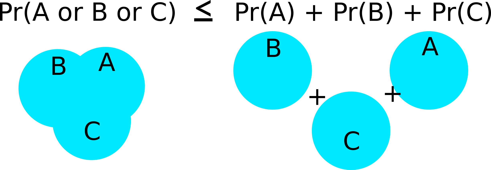

```{r setup, include=FALSE}
set.seed(1)
knitr::opts_chunk$set(echo       = TRUE, 
                      fig.align  = "center",
                      fig.height = 4)
ggplot2::theme_set(ggplot2::theme_bw() + ggplot2::theme(strip.background = ggplot2::element_rect(fill = "white")))
```

```{r klippy, echo=FALSE, include=TRUE}
klippy::klippy()
```

# Learning Objectives

- Chapter 4 of KNNL (skip 4.4).
- Simultaneous Inference
- Measurement Error
- Inverse Prediction

- The following are three issues that you should be aware of. So you should be able to determine that these are issues based on a study design. But you can Google solutions if you ever come across them.

# Simultaneous Inference

## Motivation

- Suppose we run $p$ hypotheses, each rejecting the null when $p < 0.05$.

- If all of the null's are true, what is the probability that we would reject at least one null?

- If these hypotheses are all independent, then we have
    \begin{align}
    Pr(\text{at least one reject }|\text{ all null}) &= 1 - Pr(\text{no reject }|\text{ all null})\\
    &=1 - 0.95^p
    \end{align}
    
- That means that if we ran 100 hypothesis tests, the probability that at least one would be rejected is $1 - 0.95^{100} = 0.9941$. So we would be almost gauranteed to have a false positive (falsely rejecting the null) somewhere.

- Similarly, suppose we construct 100 prediction intervals for 100 new values. What is the probability that at least one prediction interval does not cover the new observation's value? Assuming independence, it is the same calculation $1 - 0.95^{100} = 0.9941$.

- So we are not really controlling for what we thought we were controlling. 

- Coming up with new measures to control, or adjust testing procedures to account for multiple tests, is called **simultaneous inference**.

## Bonferonni Correction

- One solution is to come up with *adjusted* $p$-values.

- Given a family of hypothesis tests, the **adjusted $p$-value** of a test is less than $\alpha$ if and only if the probability of at least one Type I error (among all tests) is at most $\alpha$.

- That is, if you reject when the adjusted $p$-value is less than $\alpha$, then the probability (prior to sampling) of any test producing a Type I error is less than $\alpha$.

- The most basic way to obtain adjusted $p$-values is the Bonferonni procedure where you **multiply the $p$-value by the number of tests**.

- Why does this work? Suppose we have $m$ tests, of which $m_0$ are actually null. The family-wise error rate of such a procedure is

    \begin{align}
    &Pr(\text{Type I error among the }m_0\text{ tests})\\
    &= Pr(mp_1 \leq \alpha \text{ or } mp_2\leq\alpha \text{ or } \cdots \text{ or } mp_{m_0}\leq \alpha)\\
    &= Pr(p_1 \leq \alpha/m \text{ or } p_2\leq\alpha/m \text{ or } \cdots \text{ or } p_{m_0}\leq \alpha/m)\\
    &\leq Pr(p_1 \leq \alpha/m) + Pr(p_2 \leq \alpha/m) + \cdots + Pr(p_{m_0} \leq \alpha/m)\\
    &= \alpha/m + \alpha / m + \cdots + \alpha / m~(m_0 \text{summations})\\
    &= m_0\alpha/m\\
    &\leq m\alpha/m\\
    &= \alpha.
    \end{align}
    
- The first inequality follows from Bonferonni's inequality

    {width=70%}\ 
    
- The Bonferonni confidence interval correction:
    - Recall: confidence intervals of the form estimate $\pm$ multiplier $\times$ standard error.
    - Before, we used the multiplier `qt(1 - alpha / 2, df)` most often (typically `alpha = 0.05`).
    - The Bonferonni procedure uses `qt(1 - alpha / (2m), df)`, where `m` is the number of tests.

- **Exercise**: Prove that family-wise coverage probability of the above procedure for confidence intervals is at least 0.95. (It's easier to start with just two intervals).
    ```{block, eval = FALSE, echo = FALSE}
    \begin{align}
    Pr(\text{all coverage}) &= 1 - Pr(\text{at least one misses})\\
    &= 1 - Pr(\text{first misses or second misses or }\cdots\text{ or mth misses})\\
    &\geq 1 - \left[Pr(\text{first misses}) + Pr(\text{second misses}) + \cdots + Pr(\text{mth misses})\right]\\
    &= 1 - \left(\alpha / m + \alpha / m + \cdots + \alpha / m \right)\\
    &= 1 - m\alpha / m\\
    &= 1 - \alpha
    \end{align}
    ```

    
- There are more sophisticated methods that work better to construct simultaneous confidence intervals, or run multiple hypothesis tests.

- In R, to obtain adjusted $p$-values, just use the `p.adjust()` function, inserting your vector of $p$-values. The default is a better option than Bonferonni.
    ```{r}
    p.adjust(p = c(0.1, 0.2, 0.01, 0.05))
    p.adjust(p = c(0.1, 0.2, 0.01, 0.05), method = "bonferroni") ## not as good
    ```

- **Exercise**: At a plumbing supplies company, a consultant studied the relationship between number of work units performed (`work`), and the total variable labor cost in warehouses during a test period (`cost`). The data are presented below. Provide prediction intervals for new warehouses that perform 50, 100, and 150 work units, using a procedure with a family-wise coverage probability of at least 0.9.

    ```{r, message = FALSE}
    library(tidyverse)
    plumb <- tribble(~work, ~cost,
                     20, 114,
                     196, 921,
                     115, 560,
                     50, 245,
                     122, 575,
                     100, 475,
                     33, 138,
                     154, 727,
                     80, 375,
                     147, 670,
                     182, 828,
                     160, 762)
    ```

    ```{block, eval = FALSE, echo = FALSE}
    We should use a level of 1 - 0.1 / (2 * 3) = 0.9833. Otherwise, we use the same procedure as before to obtain prediction intervals.
    ```
    
    ```{r, eval = FALSE, echo = FALSE}
    qplot(x = work, y = cost, data = plumb) +
      geom_smooth(method = "lm", se = FALSE)
    lev <- 1 - 0.1 / (2 * 3)
    lmout <- lm(cost ~ work, data = plumb)
    newdf <- data.frame(work = c(50, 100, 150))
    predict(object = lmout, newdata = newdf, level = lev, interval = "prediction")
    ```
    
# Measurement Error

## Graphical motivation

- Sometimes, we are interested in the relationship between two variables, but we only observe noisy versions of those variables.

- Examples:
    - Suppose a researcher was interested in studying the association between corn yield ($Y$) and soil nitrogen level ($X$). There are two possible sources of errors when measuring nitrogen level. First, a small soil sample is only taken at a single location on a large plot, so this small sample is a noisy estimate of mean nitrogen level on the whole plot. Second, the chemical assay to measure nitrogen level is not 100\% accurate.
    - A research problem I come across often is studying the association between some biological trait ($Y$) and the dosage of an allele at a locus ($X$). These dosages are estimated from read-counts from sequencing assays, and so are not perfectly accurate.

- Suppose there is a strong underlying relationship between $x$ and $y$.
    ```{r, echo = FALSE, message = FALSE}
    library(tidyverse)
    library(broom)
    library(latex2exp)
    tibble(x = rnorm(100)) %>%
      mutate(y = x + rnorm(n(), sd = 0.2),
             ex = rnorm(n(), sd = 0.5),
             ey = rnorm(n(), sd = 0.5),
             xnew = x + ex,
             ynew = y + ey)->
      df
    
    lmout <- lm(y ~ x, data = df)
    beta1 <- tidy(lmout)$estimate[[2]]
    
    rx <- range(c(df$x, df$xnew))
    ry <- range(c(df$y, df$ynew))
    ggplot(df, aes(x = x, y = y)) +
      geom_point() +
      xlim(rx[[1]], rx[[2]]) +
      ylim(ry[[1]], ry[[2]]) +
      xlab("x") +
      ylab("y") +
      ggtitle(TeX(paste0("$\\hat{\\beta}_1$ = ", round(beta1, digits = 3)))) +
      geom_smooth(method = "lm", se = FALSE)
    ```

## Measurement error for $X$, attenuation

- Let's add noise in the $x$ direction.

    ```{r, echo = FALSE, message = FALSE}
    ggplot(df, aes(x = x, xend = xnew, y = y, yend = y)) +
      geom_point() +
      geom_segment(arrow = arrow(length = unit(0.05, "inches")), col = 2, alpha = 0.5) +
      xlim(rx[[1]], rx[[2]]) +
      ylim(ry[[1]], ry[[2]]) +
      xlab("x") +
      ylab("y") +
      ggtitle("Adding noise")
    ```
    
- $\hat{\beta}_1$ is now much smaller.

    ```{r, echo = FALSE, message = FALSE}
    lmout <- lm(y ~ xnew, data = df)
    beta1 <- tidy(lmout)$estimate[[2]]
    ggplot(df, aes(x = xnew, y = y)) +
      geom_point() +
      xlim(rx[[1]], rx[[2]]) +
      ylim(ry[[1]], ry[[2]]) +
      xlab("Noisy x") +
      ylab("y") +
      ggtitle(TeX(paste0("$\\hat{\\beta}_1$ = ", round(beta1, digits = 3)))) +
      geom_smooth(method = "lm", se = FALSE)
    ```

- Why does this happen? Suppose the *true* underlying relationship is
    \begin{align}
    Y_i &= \beta_0 + \beta_1 X_i + \epsilon_i, ~\epsilon_i \overset{iid}{\sim} N(0, \sigma^2)\\
    X_i^* &= X_i + \delta_i,~\delta_i \overset{iid}{\sim} N(0, \tau^2)
    \end{align}
    
    However, we only observe $X_i^*$, *not* $X_i = X_i^* - \delta_i$. So, converting the true model in terms of $X_i^*$, we have
    \begin{align}
    Y_i &= \beta_0 + \beta_1 X_i + \epsilon_i\\
        &= \beta_0 + \beta_1 (X_i^* - \delta) + \epsilon_i\\
        &= \beta_0 + \beta_1 X_i^* - \beta_1\delta + \epsilon_i\\
        &= \beta_0 + \beta_1 X_i^* + \epsilon^*.
    \end{align}
    
    Thus, if we fit the model $E[Y_i] = \beta_0 + \beta_1 X_i^*$, then our error term is $\epsilon^* = -\beta_1\delta + \epsilon_i$.
    
    Since $\epsilon^*$ and $X^*$ both depend on the value of $\delta_i$, they are *correlated*. In fact, they are negatively correlated
    
    \begin{align}
    cov(X^*, \epsilon^*) &= cov(X_i + \delta_i, -\beta_1\delta_i + \epsilon_i)\\
    &= -\beta_1 cov(\delta_i, \delta_i)\\
    &= -\beta_1 var(\delta_i)\\
    &= -\beta_1\tau^2.
    \end{align}
    
    So, if $\beta_1$ is positive, there is a negative correlation between $X^*$ and $\epsilon^*$. What this means is that larger values of $X_i^*$ (larger than $\bar{X}^*$) tend to have more negative error terms, while smaller values of $X_i^*$ (smaller than $\bar{X}^*$) tend to have more positive error terms. So this correlation smooshes the line toward horizontal.

- **Exercise**: A researcher was setting up an experiment to test the efficacy of some antibiotic. They then *randomly* assigned petri dishes to obtain different concentrations ($X$) of this antibiotic, and then measured the density of bacteria in each petri dish. Why is this *not* an example of measurement error, even though the antibiotic concentrations were randomly assigned.
    ```{block, eval = FALSE, echo = FALSE}
    The covariates are still known without error. It does not matter that they were generated by a random mechanism.
    ```

## Measurement error for $Y$, nbd

- Adding noise to $y$ changes the estimated $\sigma^2$, **not** the estimated $\beta_1$ (on average).

    ```{r, echo = FALSE, message = FALSE}
    ggplot(df, aes(x = x, xend = x, y = y, yend = ynew)) +
      geom_point() +
      geom_segment(arrow = arrow(length = unit(0.05, "inches")), col = 2, alpha = 0.5) +
      xlim(rx[[1]], rx[[2]]) +
      ylim(ry[[1]], ry[[2]]) +
      xlab("x") +
      ylab("y") +
      ggtitle("Adding noise")
    ```
    
    ```{r, echo = FALSE, message = FALSE}
    lmout <- lm(ynew ~ x, data = df)
    beta1 <- tidy(lmout)$estimate[[2]]
    ggplot(df, aes(x = x, y = ynew)) +
      geom_point() +
      xlim(rx[[1]], rx[[2]]) +
      ylim(ry[[1]], ry[[2]]) +
      xlab("x") +
      ylab("Noisy y") +
      ggtitle(TeX(paste0("$\\hat{\\beta}_1$ = ", round(beta1, digits = 3)))) +
      geom_smooth(method = "lm", se = FALSE)
    ```
    
- Mathematically, what is going on is:
    \begin{align}
    Y_i^* &= Y_i + \delta_i\\
    Y_i &= \beta_0 + \beta_1 X_i + \epsilon_i\\
    \Rightarrow Y_i^* - \delta_i &= \beta_0 + \beta_1 X_i + \epsilon_i\\
    \Rightarrow Y_i^* &= \beta_0 + \beta_1 X_i + \delta_i + \epsilon_i\\
    \Rightarrow Y_i^* &= \beta_0 + \beta_1 X_i + \epsilon_i^*\\
    \end{align}   
    
    The reason why this is OK, is that $\epsilon_i^*$ is not correlated with the observed predictor variables, unlike the previous section.

## Berkson model: set $X^*$, nbd even if $X$ is noisy

- To add even more confusion here, suppose that we precisely set $X^*$, but the true value of $X$ might vary from this precisely set value. Then everything turns out to be OK.

- Examples:
    - You set the temperature on an experiment, but the temperature might vary from your setting.
    - You set the pressure according to a gauge, but the pressure might vary from this.

- *Previously*, we had
    $$
    X_i^* = X_i + \delta_i
    $$
    *Now*, we have 
    $$
    X_i = X_i^* + \delta_i
    $$
    This new situation is called a **Berkson Model** and does not pose issues to OLS.
    
- Why? As before, what we have is a modified model
    \begin{align}
    Y_i &= \beta_0 + \beta_1 X_i^* + \epsilon_i^*.
    \end{align}
    However, because the $X_i^*$'s were fixed by us, they are constants and so must be uncorrelated with the $\epsilon_i$'s.
    
- Graphical demonstration
    ```{r, echo = FALSE, message = FALSE}
    tibble(x_star = rep(c(1, 3, 5, 7, 9), each = 20)) %>%
      mutate(ex = rnorm(n(), sd = 0.5),
             x = x_star + ex,
             y = x + rnorm(n(), sd = 0.2)) ->
      df
    
    lm_xstar <- lm(y ~ x_star, data = df)
    beta1_star <- tidy(lm_xstar)$estimate[[2]]
    lm_x <- lm(y ~ x, data = df)
    beta1 <- tidy(lm_x)$estimate[[2]]
    
    xmin <- min(df$x)
    xmax <- max(df$x)
    
    ggplot(data = df, mapping = aes(x = x_star, y = y)) +
      geom_point() +
      xlim(xmin, xmax) +
      geom_smooth(method = "lm", se = FALSE) +
      ggtitle(TeX(paste0("$\\hat{\\beta}_1 = $", round(beta1_star, digits = 3))))
    
    ggplot(data = df, mapping = aes(x = x, y = y)) +
      geom_point() +
      geom_point(mapping = aes(x = x_star, y = y), color = 2, alpha = 1/3) +
      xlim(xmin, xmax) +
      geom_smooth(method = "lm", se = FALSE) +
      ggtitle(TeX(paste0("$\\hat{\\beta}_1 = $", round(beta1, digits = 3))))
    ```

- **Exercise**: Each of the following describes a possible predictor. State whether using that predictor would be an example of a Berkson model versus a "classical error" model.
    1. You want to create the world's best brownies. So you are doing an experiment on how much sugar to add. You use a scale to measure out set weights of sugar. But you know that your scale is old and not too accurate.
    ```{block, eval = FALSE, echo = FALSE}
    Berkson
    ```
    2. For each batch of brownies, you extract a small crumb at a randomly located position in the batch and send it in for pH analysis. The pH for the sample is accurate, but you worry that you are not getting the average pH of the brownie due to heterogenous pH throughout the brownie.
    ```{block, eval = FALSE, echo = FALSE}
    Not Berkson
    ```
    3. You choose to vary the temperature of your oven for each batch, but you know your oven is a little fidgety.
    ```{block, eval = FALSE, echo = FALSE}
    Berkson
    ```
    4. You measure density of the resulting brownies by pushing with your finger and rating density on a scale of 1 to 10.
    ```{block, eval = FALSE, echo = FALSE}
    Not Berkson
    ```
    5. You set up a panel to taste test your brownies. One question asks how frequently the individual eats brownies, but you worry about memory issues.
    ```{block, eval = FALSE, echo = FALSE}
    Not Berkson
    ```
    

- What gets you into trouble is when $X_i^*$ is caused by $X_i$. When $X_i$ is caused by $X_i^*$, then we have a Berkson model and no issues. But having $X_i$ be caused by $X_i^*$ does not necessarily imply that we are doing a set experiment.

- One example that is Berkson but not a controlled experiment:
    - You are interested in studying the effects of dust exposure on lung disease. You have a group of miners from different mines, but you measure dust within their mines, not the actual level of dust the miners were exposed to. This is Berkson because the dust in the mine causes the dust exposure in the miner, so the accurate model is $X_i = X_i^* + \delta_i$.

## Measurement error conclusions:

- To conclude:
    - If your measurements of $y$ are noisy, this is not a problem since that noise gets picked up by the $\epsilon_i$'s.
    - If your measurements of $x$ are noisy and you did not precisely set them, then your regression coefficient estimate of the slope will be "attenuated" toward zero.
    - If your measurements of $x$ are noisy, but you did precisely set them, then you can proceed with OLS as usual.

# Inverse Prediction
