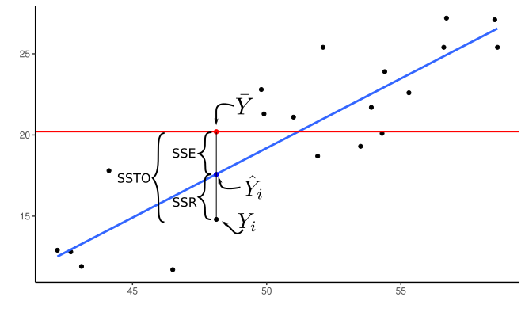

```{r setup, include=FALSE}
library(latex2exp)
knitr::opts_chunk$set(echo       = TRUE, 
                      fig.align  = "center",
                      fig.height = 3, fig.width = 4)
ggplot2::theme_set(ggplot2::theme_bw() + ggplot2::theme(strip.background = ggplot2::element_rect(fill = "white")))
```

```{r klippy, echo=FALSE, include=TRUE}
klippy::klippy()
```

# Learning Objectives

- ANOVA Perspective of hypothesis testing in the multiple linear regression model.
- Sections 6.5, 6.9, 7.1, 7.2, and 7.3 of KNNL

# Sums of squares

- Consider the multiple linear regression model
    $$
    Y_i = \beta_0 + \beta_1 X_{i1} + \beta_2 X_{i2} + \cdots + \beta_{p-1}X_{i,p-1} + \epsilon_i
    $$
- The *error sum of squares* associated with this model is the sum of squared residuals.
    $$
    SSE(X_1,X_2,\ldots,X_{p-1}) = \sum_{i=1}^n\left[Y_i - (\hat{\beta}_0 + \hat{\beta}_1X_{i1} + \hat{\beta}_2X_{i2} + \cdots + \hat{\beta}_{p-1}X_{i,p-1})\right]^2
    $$

- For example, with one variable we have
    $$
    SSE(X_1) = \sum_{i=1}^n\left[Y_i - (\hat{\beta}_0 + \hat{\beta}_1X_{i1})\right]^2
    $$
    or
    $$
    SSE(X_2) = \sum_{i=1}^n\left[Y_i - (\hat{\beta}_0 + \hat{\beta}_2X_{i2})\right]^2
    $$
    etc.
- With two variables we have
    $$
    SSE(X_1,X_2) = \sum_{i=1}^n\left[Y_i - (\hat{\beta}_0 + \hat{\beta}_1X_{i1} + \hat{\beta}_2X_{i2} )\right]^2
    $$

- Note that the $\hat{\beta}$'s are generally different in the above SSE's. That is, $\hat{\beta}_1$ will be different if we fit the model
    $$
    Y_i = \beta_0 + \beta_1 X_{i1} + \epsilon_i
    $$
    and obtain $SSE(X_1)$, versus if we fit the model
    $$
    Y_i = \beta_0 + \beta_1 X_{i1} + \beta_2 X_{i2} + \epsilon_i
    $$
    and obtain $SSE(X_1,X_2)$, versus if we fit the model
    $$
    Y_i = \beta_0 + \beta_1 X_{i1} + \beta_2 X_{i2} + \beta_3 X_{i3} + \epsilon_i
    $$
    and obtain $SSE(X_1,X_2,X_3)$, etc...

- That is, including new predictors affects the coefficient estimates of other predictors.

- Each $SSE$ measures how close the regression surface is to the data. Smaller means closer, larger means further away.


- Let's consider the Body Data example from Table 7.1 of KNNL. Variables include
    - `triceps`: Tricepts skinfold thickness.
    - `thigh`: Thigh circumference.
    - `midarm`: Midarm circumference
    - `fat`: Body fat.
    
    The goal is to predict body fat from the other variables. You can load these data into R using:
    
    ```{r, message=FALSE}
    library(tidyverse)
    library(broom)
    body <- tribble(~triceps, ~thigh, ~midarm, ~fat,
                    19.5, 43.1, 29.1, 11.9,
                    24.7, 49.8, 28.2, 22.8,
                    30.7, 51.9, 37.0, 18.7,
                    29.8, 54.3, 31.1, 20.1,
                    19.1, 42.2, 30.9, 12.9,
                    25.6, 53.9, 23.7, 21.7,
                    31.4, 58.5, 27.6, 27.1,
                    27.9, 52.1, 30.6, 25.4,
                    22.1, 49.9, 23.2, 21.3,
                    25.5, 53.5, 24.8, 19.3,
                    31.1, 56.6, 30.0, 25.4,
                    30.4, 56.7, 28.3, 27.2,
                    18.7, 46.5, 23.0, 11.7,
                    19.7, 44.2, 28.6, 17.8,
                    14.6, 42.7, 21.3, 12.8,
                    29.5, 54.4, 30.1, 23.9,
                    27.7, 55.3, 25.7, 22.6,
                    30.2, 58.6, 24.6, 25.4,
                    22.7, 48.2, 27.1, 14.8,
                    25.2, 51.0, 27.5, 21.1)
    ```
    
    Then if we regress body fat on midarm, we obtain
    ```{r}
    lmmid <- lm(fat ~ midarm, data = body)
    lmmid
    ```
    The estimated regression function is
    $$
    y = 14.7 + 0.2x
    $$
    and the error sum of squares is
    ```{r}
    amid <- augment(lmmid)
    sum(amid$.resid^2)
    ```
    $$
    SSE(midarm) = 485.3
    $$
    If we regress body fat on both midarm and thigh, then we obtain
    ```{r}
    lm_mid_thigh <- lm(fat ~ midarm + thigh, data = body)
    lm_mid_thigh
    ```
    The estimated regression function is
    $$
    y = -26.00 + 0.10x_1 + 0.85x_2
    $$
    and the error sum of sqquare is
    ```{r}
    a_mt <- augment(lm_mid_thigh)
    sum(a_mt$.resid^2)
    ```
    - Notice that the coefficient estimate for `midarm` changed between these two fits.
    - Notice that the SSE decreased when we added thigh.
    
- **NOTE**: The SSE will **always** decrease as you add more predictors (more accurately, it never increases). So, by itself, it is not a good indication of model quality, since it is not always better to add more predictors to a model.
    
    $$
    SSE(X_1) \geq SSE(X_1, X_2) \geq SSE(X_1, X_2, X_3) \text{ etc...}
    $$
    
- But looking at SSE reductions can tell us how much more variability can be explained by adding predictors.


- The **extra sum of squares**
    $$
    SSR(X_1|X_2) = SSE(X_1) - SSE(X_1, X_2)\\
    SSR(X_2|X_1) = SSE(X_2) - SSE(X_1, X_2)\\
    SSR(X_1, X_2|X_3) = SSE(X_3) - SSE(X_1, X_2, X_3)\\
    \text{ etc...}
    $$
    
- Recall: The regression sum of squares is how much the total sum of squares is reduced by including a covariate in the model.
    $$
    SSR(X_1) = SSTO - SSE(X_1)\\
    SSR(X_2) = SSTO - SSE(X_2)\\
    SSR(X_1, X_2) = SSTO - SSE(X_1, X_2)\\
    etc...
    $$
    It is how much variability is accounted for by the regression model.
    
    \ 
    
    ```{r, echo = FALSE, eval = FALSE}
    ggplot(data = body, aes(x = thigh, y = fat)) +
      geom_point() +
      geom_smooth(method = "lm", se = FALSE) +
      geom_hline(yintercept = mean(body$fat), color = "red") +
      theme_classic() ->
      pl
    ## ggsave(filename = "./figs/ss.pdf", plot = pl)
    ```
    

- We can use this to show that the extra sum of squares is also how much the regression sum of squares improves

    $$
    SSR(X_1|X_2) = SSR(X_1, X_2) - SSR(X_1)\\
    SSR(X_2|X_1) = SSR(X_1, X_2) - SSR(X_2)\\
    SSR(X_1, X_2|X_3) = SSR(X_1, X_2, X_3) - SSR(X_3)\\
    \text{ etc...}
    $$

- Proof:
    \begin{align}
    SSR(X_1|X_2) &= SSE(X_1) - SSE(X_1, X_2)\\
    &= [SSTO - SSR(X_1)] - [SSTO - SSR(X_1, X_2)]\\
    &= SSR(X_1, X_2) - SSR(X_1).
    \end{align}

- **Exercise**: True/False and explain: The regression sum of squares never decreases as you include more covariates in a model.
    ```{block, eval = FALSE, echo = FALSE}
    TRUE. SSTO is a constant and SSTO = SSR + SSE. So if SSE never increases, that means that SSR never decreases.
    ```

- **Exercise**: Express $SSR(X_1, X_3 | X_2, X_4)$ both in terms of error sums of squares and in terms of regression sums of squares.

    ```{block, eval = FALSE, echo = FALSE}
    $$
    SSR(X_1, X_3|X_2, X_4) = SSE(X_2, X_4) - SSE(X_1, X_2, X_3, X_4)\\
    SSR(X_1, X_3|X_2, X_4) = SSR(X_1, X_2, X_3, X_4) - SSR(X_2, X_4)\\
    $$
    ```
    
- The total sum of squares can be decomposed using regression sum of squares, extra sum of squares, and error sum of squares as follows:

    $$
    SSTO = SSR(X_1) + SSR(X_2|X_1) + SSR(X_3|X_1, X_2) + SSE(X_1, X_2, X_3)
    $$
    with the pattern continuing if more covariates are in the model.

- The order of covariates does not matter

    $$
    SSTO = SSR(X_3) + SSR(X_2|X_3) + SSR(X_1|X_2, X_3) + SSE(X_1, X_2, X_3)
    $$
    
- Many researchers will represent regression results in terms of this sum of squares decomposition.

- E.g. in R if you use the `anova()` function on the `lm` object, you get the decomposition

    | SS                       |
    |--------------------------|
    | SSR($X_1$)               |
    | SSR($X_2$\|$X_1$)        |
    | SSR($X_3$\|$X_2$,$X_1$)  |
    | SSE($X_1$, $X_2$, $X_3$) |
    
    ```{r}
    lm_all <- lm(fat ~ triceps + thigh + midarm, data = body)
    anova(lm_all)
    ```

- In the above R output, if $X_1$ = triceps, $X_2$ = thigh, and $X_3$ = midarm, then we have
    - $SSR(X_1) = 352$
    - $SSR(X_2|X_1) = 33$
    - $SSR(X_3|X_1, X_2) = 12$
    - $SSE = 98$.
    
- The SSTO is then the sum of these values: $SSTO = 352 + 33 + 12 + 98 = 495$. We can verify this in R
    ```{r}
    ## SSTO
    sum((body$fat - mean(body$fat))^2)
    ```
    
- Showing the sum of squares in this pattern is called "Type I Sum of Squares". 

- Other researchers display the "Type II Sum of Squares":

    | SS                       |
    |--------------------------|
    | SSR($X_1$\|$X_2$, $X_3$) |
    | SSR($X_2$\|$X_1$, $X_3$) |
    | SSR($X_3$\|$X_2$,$X_1$)  |
    | SSE($X_1$, $X_2$, $X_3$) |

- The easiest way to get Type II Sum of Squares is through the `Anova()` function in the `{car}` package
    ```{r, message = FALSE}
    library(car)
    Anova(lm_all)
    ```
    
- **Exercise**: In the above output, using $X_1$ = triceps, $X_2$ = thigh, and $X_3$ = midarm, what is $SSR(X_1|X_2, X_3)$, $SSR(X_2|X_1, X_3)$, $SSR(X_3|X_1, X_2)$, and $SSE(X_1, X_2, X_3)$?
    ```{block, eval = FALSE, echo = FALSE}
    - $SSR(X_1|X_2, X_3)$ = 12.7
    - $SSR(X_2|X_1, X_3)$ = 7.5
    - $SSR(X_3|X_1, X_2)$ = 11.5
    - $SSE(X_1, X_2, X_3)$ = 98.4
    ```


- **Exercise**: Does the Type II sum of squares ANOVA table provide us with enough information to calculate SSTO?
    ```{block, eval = FALSE, echo = FALSE}
    No. It only gives information on conditionally adding each covariate, along with the SSE of using all three covariates. It does not give us marginal information on any of the covariates.
    ```


# Hypothesis Testing

- Why am I torturing you with sums of squares?

- Sums of squares have two uses
    1. Discussing proportionate decline in variability when you add a predictor.
    2. Hypothesis testing.
    
- E.g. "Adding tricep skinfold thickness decreased the sum of squares by 352, but adding in thigh only decreased it by an additional 33."

- Whether this is a big or small reduction is completely context dependent.

- For hypothesis testing, suppose we are considering two **nested** models (null model is a subset of the alternative model)

    - $H_0: Y_i = \beta_0 + \beta_1 X_{i1} + \cdots + \beta_qX_{i,q-1} + \epsilon_i$
    
    - $H_A: Y_i = \beta_0 + \beta_1 X_{i1} + \cdots + \beta_qX_{i,q-1} + \beta_{q}X_{i,q} + \cdots + \beta_{p-1}X_{i,p-1} + \epsilon_i$

    That is, the null model does not include $X_{q},\ldots,X_{p-1}$.
    
- **Exercise**: What values of $\beta_q, \beta_{q+1},\ldots,\beta_{p-1}$ would turn the model under the alternative into the model under the null?

    ```{block, eval = FALSE, echo = FALSE}
    Set them all to 0.
    ```
    
- Let $SSE(R) = SSE(X_1,X_2,\ldots,X_{q-1})$ be the sum of squares under the **reduced model**.

- Let $df_r = n - q$ be the degrees of freedom of the reduced model (sample size minus number of parameters).

- Let $SSE(F) = SSE(X_1,X_2,\ldots,X_{p-1})$ be the sum of squares under the **full model**.

- Let $df_f = n - p$ be the degrees of freedom of the full model (sample size minus number of parameters).

- The test statistic is
    $$
    F^* = \frac{[SSE(R) - SSE(F)] / (df_r - df_f)}{SSE(F) / df_f}
    $$
    
- Under $H_0$, we have
    $$
    F^* \sim F(df_r - df_f, df_f)
    $$
    
- Under $H_A$, $F^*$ would not follow this distribution, and would be larger than expected.
    - This is because the reduction in the error sums of squares ($SSE(R) - SSE(F)$) would be larger than expected by chance alone.

- So we can obtain a $p$-value via $\text{qf}(F^*, df_r - df_f, df_f, \text{lower.tail = FALSE})$.

    ```{r, echo = FALSE}
    library(latex2exp)
    df <- tibble(x = seq(0, 10, length.out = 500)) %>%
      mutate(y = df(x = x, df1 = 3, df2 = 10))
    df_sub <- filter(df, x > 2.5)
    ggplot(df, aes(x = x, y = y)) +
      geom_line() +
      theme_classic() +
      xlab(TeX("$F^*$")) +
      ylab("Density") +
      geom_ribbon(data = df_sub, mapping = aes(ymin = 0, ymax = y), fill = "blue", alpha = 1/2) +
      geom_vline(xintercept = 2.5, lty = 2, col = 2)
    ```
    
- **NOTE**: The null will be rejected if at least one of the unincluded variables have non-zero coefficients. That is, it is not necessarily that case that *all* $\beta_q,\beta_{q+1},\ldots,\beta_p$ are non-zero. So we can re-write the hypotheses as
    - $H_0: \beta_q = \beta_{q+1} = \cdots = \beta_p = 0$
    - $H_A:$ At least one of $\beta_q,\beta_{q+1},\ldots,\beta_p$ is non-zero.
    
- **NOTE**: We can re-write the $F$-statistic in terms of extra sums of squares
    $$
    F^* = \frac{[SSR(X_q,X_{q+1},\ldots,X_{p-1}|X_1,X_2,\ldots,X_{q-1})] / (df_r - df_f)}{SSE(F) / df_f}
    $$
    
    In which case, the **extra degrees of freedom** is $df_r - df_f$, which is the difference in the number of parameters in the full versus reduced model, $p - q$.
  
  
# Applications of $F$-test

## Overall $F$-test

- Consider the testing if at least one variable is associated with our response:
    - $H_0: \beta_1 = \beta_2 = \cdots = \beta_p = 0$
    - $H_A:$ At least one $\beta_1,\beta_{2},\ldots,\beta_p$

- Then under the null 
    $$
    F^* \sim F(p-1, n - p)
    $$
    
- **Exercise**: What is the degrees of freedom of the reduced model?
    ```{block, eval = FALSE, echo = FALSE}
    $n - 1$. There is only one parameter in the reduced model ($\beta_0$).
    ```

- **Exercise**: What is the degrees of freedom of the full model?
    ```{block, eval = FALSE, echo = FALSE}
    $n - p$. There are $p$ parameters in the full model.
    ```
    
- **Exercise**: What is the extra degrees of freedom?
    ```{block, eval = FALSE, echo = FALSE}
    This is the difference in the degrees of freedom of the full and reduced models. So
    
    $(n - 1) - (n - p) = n - 1 - n + p = p - 1$.
    ```

- In R, the overall $F$ test is done automatically and is included in the output of `glance()` from the `{broom}` package. It is the `p.value` term. The `statistic` term is $F^*$.

    ```{r}
    lm_all <- lm(fat ~ triceps + thigh + midarm, data = body)
    glance(lm_all)
    ```

- We can verify this manually
    ```{r}
    a_all <- augment(lm_all)
    
    sse_f <- sum(a_all$.resid^2)
    df_f <- nrow(body) - 4 ## four parameters
    sse_r <- sum((body$fat - mean(body$fat))^2)
    df_r <- nrow(body) - 1 ## one parameter (beta_0)
    
    F_star <- ((sse_r - sse_f) / (df_r - df_f)) / (sse_f / df_f)
    F_star
    pf(q = F_star, df1 = df_r - df_f, df2 = df_f, lower.tail = FALSE)
    ```

## $F$-test for one variable

- If we want to test whether we should include one more variable in the model, we would consider the hypotheses
    - $H_0: \beta_k = 0$
    - $H_A: \beta_k \neq 0$.
    
- If there are $p-1$ variables in the full model, then the full degrees of freedom would be $df_f = n - p$.

- The degrees of freedom of the reduced model would be $df_r = n - (p - 1) = n - p + 1$.

- The extra degrees of freedom would be $(n - p + 1) - (n - p) = n - p + 1 - n + p = 1$. This is the number of parameters different between the two models.

- **Exercise**: Suppose we have three variables and we are testing if $\beta_2$ should be 0. Write out the full and reduced models.
    ```{block, eval = FALSE, echo = FALSE}
    - Reduced: $Y_i = \beta_0 + \beta_1 X_{i1} + \beta_3 X_{i3} + \epsilon_i$
    - Full: $Y_i = \beta_0 + \beta_1 X_{i1} + \beta_2 X_{i2} + \beta_3 X_{i3} + \epsilon_i$
    ```

- Thus, the we have under the null that
    $$
    F^* \sim F(1, n - p)
    $$
- In R, you can obtain the result of all of these tests using `Anova()` from the `{car}` package.
    ```{r}
    lm_all <- lm(fat ~ triceps + thigh + midarm, data = body)
    Anova(lm_all)
    ```

- Let's verify one of these manually. 
    - First, we'll fit a reduced model without `triceps`
        ```{r}
        lm_tm <- lm(fat ~ thigh + midarm, data = body)
        ```
    - Now, let's get the sums of squares and degrees of freedom.
        ```{r}
        a_full <- augment(lm_all)
        a_red <- augment(lm_tm)
        
        sse_full <- sum(a_full$.resid^2)
        sse_red <- sum(a_red$.resid^2)
        df_full <- nrow(body) - 4
        df_red <- nrow(body) - 3
        
        f_star <- ((sse_red - sse_full) / (df_red - df_full)) / (sse_full / df_full)
        f_star
        pf(q = f_star, df1 = df_red - df_full, df2 = df_full, lower.tail = FALSE)
        ```
    
- Recall, we already came up with a way to test against the null of $H_0: \beta_k = 0$ using $t$-statistics.
    ```{r}
    tidy(lm_all)
    ```

- It turns out that using the $F$-test and the $t$-test are *equivalent*. So no need to worry about which one to use.

## $F$-test for including a categorical variable

- We will use the earnings data for this example, which you can read about [here](https://dcgerard.github.io/stat_415_615/data.html#Earnings_Data) and download from [here](https://dcgerard.github.io/stat_415_615/data/earnings.csv)

    ```{r, message=FALSE}
    earnings <- read_csv("https://dcgerard.github.io/stat_415_615/data/earnings.csv")
    ```

- We will consider fitting a model of log-earnings on ethnicity and height.

    ```{r}
    earnings <- mutate(earnings, log_earn = log(earn))
    earnings <- select(earnings, log_earn, ethnicity, height)
    earnings <- filter(earnings, is.finite(log_earn))
    glimpse(earnings)
    ```

- Recall that we can encode a categorical variable with $c$ classes in terms of $c-1$ indicator variables.

- For example, the variable `ethnicity` with $c = 4$ values
    ```{r, echo = FALSE}
    unique(earnings$ethnicity)
    ```
    can be encoded with with variables
    ```{r, echo = FALSE}
    earnings %>%
      select(ethnicity) %>%
      distinct() %>%
      model.matrix(~ethnicity, data = .) %>%
      as_tibble() %>%
      mutate(race = unique(earnings$ethnicity))
    ```
    
- That is, black individuals are coded $X_1 = X_2 = X_3 = 0$, hispanic individuals are coded as $X_1 = 1$ and $X_2 = X_3 = 0$, white individuals are coded as $X_3 = 1$ and $X_1 = X_2 = 0$, and other individuals are coded as $X_2 = 1$ and $X_1 = X_3 = 0$.

- If we also include $X_4$ = height, then we can test for whether or not to include ethnicity in the model by comparing the two models
    - $H_0: Y_i = \beta_0 + \beta_4 X_{i4} + \epsilon_i$
    - $H_A: Y_i = \beta_0 + \beta_1X_{i1} + \beta_2 X_{i2} + \beta_3 X_{i3} + \beta_4 X_{i4} + \epsilon_i$
    
- This is exactly what an $F$-test is useful for.

- The $df_f$ in this case is $n-5$ while the $df_r$ is $n-2$, so the $df_{extra}$ is $(n-2) - (n-5) = 3$.

- We compare the resulting $F^*$ to a $F(3, n-5)$ distribution to obtain the $p$-value.

- In R, when you use a categorical variable in `lm()`, it will automatically convert the variable to indicators.

    ```{r}
    lm_earn <- lm(log_earn ~ ethnicity + height, data = earnings)
    tidy(lm_earn)
    ```

- Notice that the output returns only the $p$-values for tests of whether to include each indicator variable. This is rarely helpful. Use `Anova()` from the `{car}` package to obtain the $p$-value from the $F$-test of whether to include the ethnicity variable at all.

    ```{r}
    Anova(lm_earn)
    ```

- We can verify this calculation in R
    ```{r}
    lm_earn_red <- lm(log_earn ~ height, data = earnings)
    a_full <- augment(lm_earn)
    a_red <- augment(lm_earn_red)
    
    sse_full <- sum(a_full$.resid^2)
    sse_red <- sum(a_red$.resid^2)
    df_full <- nrow(earnings) - 5
    df_red <- nrow(earnings) - 2
    
    f_star <- ((sse_red - sse_full) / (df_red - df_full)) / (sse_full / df_full)
    f_star
    pf(q = f_star, df1 = df_red - df_full, df2 = df_full, lower.tail = FALSE)
    ```

## $F$-test for lack of fit

- If you have repeat observations at the same levels of predictor variables, then you can run a lack-of-fit test as before.

- NOTE: You need to have repeat observations where *all* predictor levels are equal. E.g. this design matrix has *no* repeat observations:
    $$
    \mathbf{X} = 
    \begin{pmatrix}
    1 & 55 & 13\\
    1 & 55 & 17\\
    1 & 43 & 13
    \end{pmatrix}
    $$
    whereas this design matrix has repeat observations at one level (55 for the first predictor and 13 at the second).
    $$
    \mathbf{X} = 
    \begin{pmatrix}
    1 & 55 & 13\\
    1 & 55 & 13\\
    1 & 43 & 13
    \end{pmatrix}
    $$

- Typically, you only have repeat observations like this in a controlled experiment. 

- It is nice to have such repeat observations specifically to test the adequacy of the linear model using an $F$-test lack-of-fit.

- To demonstrate this test, consider the textile strength from @shadid2010study. Variables include
    


# Summary

- If you have a full model and reduced model, which is a **submodel** of the full model (very important), then you can run an $F$-test with the null hypothesis being the reduced model.

- The degrees of freedom for each model is the sample size minus the number of parameters in each model.

- We calculate an $F$-statistic:
    $$
    F^* = \frac{[SSE(R) - SSE(F)] / (df_r - df_f)}{SSE(F) / df_f}
    $$

- Under $H_0$ (the reduced model), the $F^*$ follows an $F(df_r - df_f, df_f)$ distribution. 

- Larger values of $F^*$ provide evidence against the null, since then there is a bigger decline in the SSE between models than expected by chance alone.

- The $F$-test encompases many situations as special cases
    - Overall $F$-test. Use `glance()` from the `{broom}` package.
    - $F$-test for one predictor. Use `Anova()` from the `{car}` package and full model fit.
    - $F$-test for one categorical variable. Use `Anova()` from the `{car}` package on full model fit.
    - $F$-test lack-of-fit. Fit both models, use `Anova()` from the `{car}` package.

# Exercise


# References
