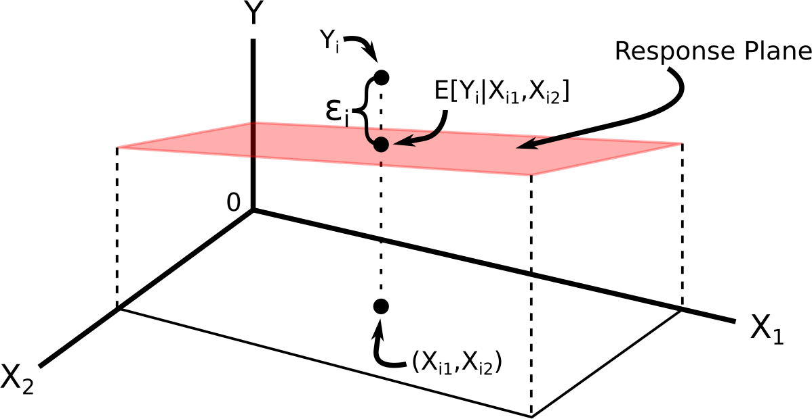
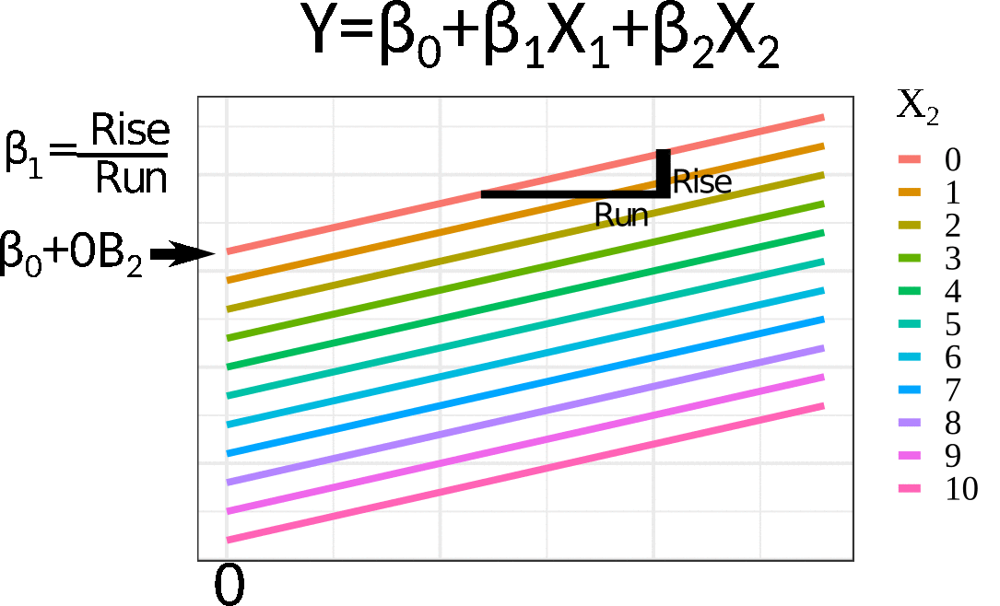
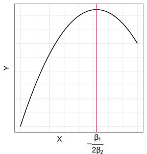

```{r setup, include=FALSE}
library(latex2exp)
knitr::opts_chunk$set(echo       = TRUE, 
                      fig.align  = "center",
                      fig.height = 3, fig.width = 4)
ggplot2::theme_set(ggplot2::theme_bw() + ggplot2::theme(strip.background = ggplot2::element_rect(fill = "white")))
```

```{r klippy, echo=FALSE, include=TRUE}
klippy::klippy()
```

# Learning Objectives

- Multiple linear regression model definition and interpretation.
- Indicator variables, transformed variables, interaction effects,
- Inference
- Diagnostics and remedial measures.
- Chapter 6 of KNNL

# Motivation

- Most regression problems have more than one predictor.

- Multiple linear regression explores the relationship between **one response variable** and **multiple predictor variables**.

    - (if you have multiple response variables, this is called "multivariate" regression, and is a separate topic)

- Examples: 
    - Predicting volume of tractor sales in a territory ($Y$) given number of farms ($X_1$) and crop production ($X_2$).
    - Predicting a political party's vote share in a congressional district ($Y$) given that party's vote share in the previous election ($X_1$) and the incumbancy's status of the political party ($X_2$).

- Why include more predictors?
    - You can often get a more accurate prediction of $Y$ if you include more $X$'s.
    - You can adjust for other variables when assessing the relationship between a response and a predictor of interest. (researchers often call this "controlling" for other variables)
    
- Adjusting is necessary because the strength/sign of a relationship might change once you adjust for a variable.

- Consider the earnings data described [here](https://dcgerard.github.io/stat_415_615/data.html#Earnings_Data) and available for download [here](https://dcgerard.github.io/stat_415_615/data/earnings.csv).

    ```{r, message=FALSE, echo = FALSE}
    library(tidyverse)
    earnings <- read_csv("https://dcgerard.github.io/stat_415_615/data/earnings.csv")
    ```

    We might be interested in the association between height and earnings. Indeed, there seems to be a slight positive relationship.
    ```{r, echo = FALSE, warning = FALSE, message = FALSE}
    earnings %>%
      mutate(log_earn = log(earn)) %>%
      ggplot(mapping = aes(x = height, y = log_earn)) +
      geom_point(alpha = 0.05) +
      geom_smooth(method = "lm", se = FALSE) +
      xlab("Height") +
      ylab("log-earnings")
    ```
    
    But then we remember that men tend to be taller than women, and men tend to make more money than women, and so this might be the reason why **marginally** we are seeing this association between height and earnings.
    ```{r, echo = FALSE, warning = FALSE, message = FALSE}
    library(ggthemes)
    earnings %>%
      mutate(log_earn = log(earn)) %>%
      ggplot(mapping = aes(x = height, y = log_earn)) +
      geom_point(mapping = aes(color = sex), alpha = 0.05) +
      geom_smooth(method = "lm", se = FALSE) +
      geom_smooth(mapping = aes(color = sex), method = "lm", se = FALSE) +
      xlab("Height") +
      ylab("log-earnings") +
      scale_color_colorblind()
    ```
    
    The relationship appears to still be slightly positive within each sex, but nowhere near as strong as the marginal association.

# Multiple linear regression model: 2 predictors

- The multiple linear regression model for two predictors is
    \begin{align}
    Y_i &= \beta_0 + \beta_1X_{i1} + \beta_2X_{i2} + \epsilon_i\\
    E[\epsilon_i] &= 0\\
    var(\epsilon_i) &= \sigma^2\\
    cov(\epsilon_i, \epsilon_j) &= 0 \text{ for all } i \neq j
    \end{align}
    where

    - $Y_i$ is the value of the response for individual $i$.
    - $X_{i1}$ is the value of the first predictor for individual $i$.
    - $X_{i2}$ is the value of the second predictor for individual $i$.
    - $\epsilon_i$ is the error term for individual $i$ (vertical distance from plane).
    
- This necessarily means that
    $$
    E[Y_i] = \beta_0 + \beta_1 X_{i1} + \beta_2X_{i2}
    $$

- We can visualize this model via:

    \ 

- The regression function (the deterministic part) is often called the **regression surface** or the **response surface**.

- **Example**: It's been determined, from the `mtcars` dataset, that the relationship of `drat` ($X_1$) and `wt` ($X_2$) with `mpg` ($Y$) can be described by
    $$
    E[Y] = 30.3 + 1.4 X_1 - 4.8 X_2
    $$
    
    ```{r}
    data("mtcars")
    coef(lm(mpg ~ drat + wt, data = mtcars))
    ```
    
- We interpret multiple linear models the same way we interpret simple linear models while **considering that all predictors except one are fixed.**

- Suppose we are just interested in cars that are exactly 4000 pounds. Then, given a car is 4000 pounds, the regression relationship becomes
    \begin{align}
    E[Y] &= 30.3 + 1.4X_1 - 4.8 \times 4\\
    &= 11.1 + 1.4 X_1.
    \end{align}
    So, given two cars that are the same weight, we expect the car with 1 more `drat` to have 1.4 more miles per gallon, on average.
    
- This interpretation would have held if we considered any other car weight (besides 4000 pounds).

- So $\beta_1$ is interpreted as

    > The expected difference in $Y$ between two individuals that differ by 1 $X_1$ but have the same $X_2$.

- Similarly, $\beta_2$ is interpreted as

    > The expected difference in $Y$ between two individuals that differ by 1 $X_2$ but have the same $X_1$.
    
- In the `mtcars` dataset example, a car that weighs 1000 pounds more but has the same drat will on average have 4.8 worse mpg.

- Visualization for interpretation:

    \ 

# The model

- The multiple linear regression (MLR) model is of the form

    \begin{align}
    Y_i &= \beta_0 + \beta_1X_{i1} + \beta_2X_{i2} + \cdots + \beta_{p-1}X_{i,p-1} + \epsilon_i\\
    E[\epsilon_i] &= 0\\
    var(\epsilon_i) &= \sigma^2\\
    cov(\epsilon_i, \epsilon_j) &= 0 \text{ for all } i \neq j
    \end{align}
    
- Using summation notation, we can write the top equation by
    $$
    Y_i = \beta_0 + \sum_{j=1}^{p-1}\beta_j X_{ij}
    $$
    
- Why use $p-1$ in the indexing? The $p$th variable is $X_{0i} = 1$ and the linear model can be equivalently written
    \begin{align}
    Y_i &= \beta_0X_{0i} + \beta_1X_{i1} + \beta_2X_{i2} + \cdots + \beta_pX_{i,p-1} + \epsilon_i\\
     &= \sum_{j=0}^{p-1}\beta_j X_{ij}
    \end{align}

- The response function
    $$
    E[Y] = \beta_0 + \beta_1X_1 + \beta_2X_2 + \cdots + \beta_{p-1}X_{p-1}
    $$
    is a **hyperplane**. You cannot visualize this (since it involves more than three dimensions).


- The interpretation of $\beta_i$ is similar:

    > The expected difference in $Y$ between two individuals that differ by 1 $X_i$ but have the same values of every other predictor.
    
- Notice that I am not using the words "change", "increase", or "decrease". These are forbidden words in this class.

# The flexibility of the linear model

- Fitting a hyperplane through a cloud of points seems restrictive, but it turns out that the multiple linear regression model is extremely flexible by including transformations of variables as covariates.

## Polynomial regression

- Suppose we want to fit a quadratic function to some data. Our model is

    $$
    Y_i = \beta_0 + \beta_1X_i + \beta_2 X_i^2 + \epsilon_i
    $$

```{r, echo = FALSE, eval = FALSE}
tibble(x = seq(0, 1, length.out = 100)) %>%
  mutate(y = 1 + 1.3 * x - x^2) %>%
  ggplot(aes(x = x, y = y)) +
  geom_line() +
  theme_bw() +
  theme(axis.ticks = element_blank(),
        axis.text = element_blank()) +
  xlab("X") +
  ylab("Y") +
  annotate(geom = "text", x = 0.5, y = 1.3, label = TeX("$-\\frac{\\beta_1}{2\\beta_2}$")) +
  geom_vline(xintercept = 1.3 / 2, col = 2) ->
  pl
ggsave(filename = "./figs/quad.pdf", plot = pl, height = 3, width = 3)
```
    
    \ 
    
- We can redefine predictors:
    \begin{align}
    X_{i1} &= X_i\\
    X_{i2} &= X_i^2
    \end{align}

- Then it is easy to see that this is the multiple linear model:
    $$
    Y_i = \beta_0 + \beta_1X_{i1} + \beta_2 X_{i2} + \epsilon_i
    $$

- This induces curvature in the response surface. 

- It is still called a linear model because it is linear in terms of the parameters (the $\beta$'s).


## Transformed variables

- It should be clear that you can include arbitrary transformations of the $X_i$'s (but this may or may not be a good idea).

- Suppose

    $$
    \log(Y_i) = \beta_0 + \beta_1 X_{i1} + \beta_2 X_{i2} + \beta_3 X_{i3} + \epsilon_i
    $$

    Then if we define $Y_i' = \log(Y_i)$, we have the MLR
    
    $$
    Y_i' = \beta_0 + \beta_1 X_{i1} + \beta_2 X_{i2} + \beta_3 X_{i3} + \epsilon_i
    $$

- Suppose
    $$
    Y_i = \beta_0 + \beta_1 \log(X_{i1}) + \beta_2 X_{i2} + \beta_3 X_{i3} + \epsilon_i
    $$
    
    Then if we define $X_{i1}' = \log(X_{i1})$, we have the MLR
    
    $$
    Y_i = \beta_0 + \beta_1 X_{i1}' + \beta_2 X_{i2} + \beta_3 X_{i3} + \epsilon_i
    $$

- These are result in complicated curved response surfaces.

- It is still called a linear model because it is linear in terms of the parameters (the $\beta$'s).

## Categorical (qualitative) variables

- Categorical variables (such as alive/dead, race, marital status, etc) can be used as predictors in the linear model by using indicator variables.

- An **indicator variable** takes on the value of 1 if a unit belongs to a category and 0 if it does not. 

- E.g., from the `mtcars` dataset, `am` is an indicator variable where
    $$
    X_{i} = 
    \begin{cases}
    1 & \text{ if manual}\\
    0 & \text{ if automatic}
    \end{cases}
    $$

- You could then include this indicator variable into the multiple linear regression model as a predictor. 
    $$
    Y_i = \beta_0 + \beta_1 X_i + \epsilon_i
    $$

- The model for automatic cars is
    $$
    Y_i = \beta_0 + \epsilon_i
    $$
    
- The model for manual cars is
    $$
    Y_i = \beta_0 + \beta_1 + \epsilon_i
    $$
    
- So $\beta_1$ is interpreted as the mean difference between automatic and manual cars.

- If other covariates are included in the model, this interpretation changes to the "mean difference between automatic and manual cars while adjusting for other variables".

- If there are $c$ classes (instead of 2), we use $c-1$ indicator variables to represent this categorical variable.

- For example, in the `mpg` dataset from the `{ggplot2}` package, the `drv` variable has values `"f"`, `"4"` and `"r"`. We could create two variables
    \begin{align}
    X_{i1} &= 
    \begin{cases}
    1 & \text{ if forward-wheel drive}\\
    0 & \text{ otherwise}
    \end{cases}\\
    X_{i2} &= 
    \begin{cases}
    1 & \text{ if 4-wheel drive}\\
    0 & \text{ otherwise}
    \end{cases}
    \end{align}

    The multiple linear regression model (using, say, `cty` as the response) becomes
    
    $$
    Y_i = \beta_0 + \beta_1 X_{i1} + \beta_2 X_{i2} + \epsilon_i
    $$
    
- The model for rear-wheel drive cars is
    $$
    Y_i = \beta_0 + \epsilon_i
    $$

- The model for forward-wheel drive cars is
    $$
    Y_i = \beta_0 + \beta_1 + \epsilon_i
    $$

- The model for 4-wheel drive cars is
    $$
    Y_i = \beta_0 + \beta_2 + \epsilon_i
    $$

- $\beta_0$ is interpreted as the mean city mpg for rear-wheel drive cars.

- $\beta_1$ is interpreted as the mean difference in city mpg between rear-wheel drive and forward-wheel drive cars.

- $\beta_2$ is interpreted as the mean difference in city mpg between rear-wheel drive and 4-wheel drive cars.

- **Exercise**: What is the mean difference in city mpg between 4-wheel drive and forward-wheel drive cars?
    ```{block, eval = FALSE, echo = FALSE}
    $\beta_2 - \beta_1$
    ```


- This parameterization allows for a different mean for each class. This is the **exact same** as ANOVA.

- We'll talk more about indicator variables in Chapter 8.

## Interaction effects

- The effect of one predictor may depend on the values of other predictors.

- E.g., in the height/earnings example, we saw that height might have a stronger earnings effect in men than in women (the slope was steeper for men than for women).


- Interaction terms are represented by multiplying predictors with each other:
    $$
    Y_i = \beta_0 + \beta_1X_{1i} + \beta_2X_{2i} +\beta_3X_{1i}X_{2i} + \epsilon_i
    $$

- We can get back the linear model by setting $X_3 = X_{1i}X_{2i}$. 

- This creates a very complicated and flexible model. We will talk about these interaction terms in chapter 8.

# Matrix Representation

- The matrix representation of the multiple linear regression model is **the exact same** as the matrix representation of the simple linear regression model, once we define the appropriate matrices.

- Let
    \begin{align}
    \mathbf{y} &= 
    \left(
    \begin{array}{c}
    Y_1\\
    Y_2\\
    \vdots\\
    Y_n
    \end{array}
    \right),\\
    \mathbf{X} &= 
    \left(
    \begin{array}{cc}
    1 & X_{11} & X_{12} & \cdots & X_{1,p-1}\\
    1 & X_{21} & X_{22} & \cdots & X_{2,p-1}\\
    \vdots & \vdots & \vdots & & \vdots \\
    1 & X_{n1} & X_{n2} & \cdots & X_{n,p-1}
    \end{array}
    \right),\\
    \mathbf{\beta} &= 
    \left(
    \begin{array}{c}
    \beta_0\\
    \beta_1\\
    \vdots\\
    \beta_{p-1}
    \end{array}
    \right),\\
    \mathbf{\epsilon} &= 
    \left(
    \begin{array}{c}
    \epsilon_1\\
    \epsilon_2\\
    \vdots\\
    \epsilon_n
    \end{array}
    \right)
    \end{align}

- The multiple linear model can be fully expressed with assumptions via
    \begin{align}
    \mathbf{y} &= \mathbf{X}\mathbf{\beta} + \mathbf{\epsilon}\\
    E[\mathbf{\epsilon}] &= \mathbf{0}_n\\
    cov(\mathbf{\epsilon}) &= \sigma^2\mathbf{I}_n
    \end{align}
    
- For the normal linear model (important only for prediction intervals or small sample sizes), you further assume that each $\epsilon_i$ is normally distributed.

- **Exercise**: In the $\mathbf{X}$ matrix. What does the $i$ represent in $X_{ij}$? What does the $j$ represent?
    ```{block, eval = FALSE, echo = FALSE}
    The $i$ represents the unit, the $j$ represents the variable.
    ```


# Estimates and fitted values

$$
Y_i = \beta_0 + \beta_1X_{i1} + \beta_2X_{i2} + \cdots + \beta_{p-1}X_{i,p-1} + \epsilon_i
$$

- The $\beta$'s are unknown. So, as in SLR, we estimate them by OLS:
    $$
    \min_{\beta_0,\beta_1,\ldots,\beta_{p-1}}\sum_{i=1}^n[Y_i - (\beta_0 + \beta_1X_{i1} + \beta_2X_{i2} + \cdots \beta_{p-1}X_{i,p-1})]^2
    $$

- The OLS estimates can be expressed using matrix notation *the exact same way* as in SLR:
    $$
    \hat{\mathbf{\beta}} = (\mathbf{X}^T\mathbf{X})^{-1}\mathbf{X}^T\mathbf{y}
    $$

- The fitted values and the residuals can be expressed using matrix notation *the exact same way* as in SLR:
    $$
    \hat{\mathbf{Y}} = \mathbf{X}(\mathbf{X}^T\mathbf{X})^{-1}\mathbf{X}^T\mathbf{Y}
    $$
    $$
    \mathbf{e} = (\mathbf{I}_n - \mathbf{H})\mathbf{Y}.
    $$
    
# Inference

- One can show that the OLS estimates are unbiased:
    $$
    E[\hat{\mathbf{\beta}}] = \mathbf{\beta},
    $$
    where this expectation is taken over the sampling distribution of $\hat{\mathbf{\beta}}$.
    
- The estimated covariance matrix of $\mathbf{\beta}$ can be expressed the using matrix notation *the exact same way* as in SLR:
    $$
    s^2(\hat{\mathbf{\beta}}) = MSE(\mathbf{X}^T\mathbf{X})^{-1}
    $$

- **Exercise**: What is the dimension of $s^2(\hat{\mathbf{\beta}})$
    ```{block, eval = FALSE, echo = FALSE}
    $p$ by $p$
    ```

- **Exercise**: How would you get the standard error of $\hat{\beta}_i$ from this covariance matrix? We denote this standard error $s\{\hat{\beta}_i\}$.
    ```{block, eval = FALSE, echo = FALSE}
    Find the $(i, i)$th value of $s^2(\hat{\mathbf{\beta}})$ and take a square root.
    ```

- It can be shown that the sampling distribution of $\hat{\beta}_i$ is given by
    $$
    t_i = \frac{\hat{\beta}_i - \beta_i}{s\{\hat{\beta}_i\}} \sim t(n-p)
    $$
    
- Confidence intervals: Because of this sampling distribution, we have
    $$
    \text{Pr}(\text{qt}(\alpha / 2, n-p) \leq t \leq \text{qt}(1 - \alpha/2, n-p)) = 1 - \alpha,
    $$
    where this probability is taken over the sampling distribution of $t$.
    ```{r, echo = FALSE, warning = FALSE, fig.width = 7}
    dfval <- 10
    uval <- qt(1 - 0.05/2, dfval)
    tibble(x = seq(-4, 4, length.out = 500)) %>%
          mutate(y = dt(x = x, df = dfval)) ->
          tdat
    ggplot(tdat, aes(x = x, y = y)) +
      geom_line() +
      theme_classic() +
      theme(axis.text = element_blank(),
              axis.ticks = element_blank(),
              axis.title = element_blank()) +
      geom_ribbon(data = filter(tdat, x < uval, x > -uval), aes(x = x, ymax = y), ymin = 0, fill = "blue") +
      geom_vline(xintercept = uval, lty = 2, col = 2) +
      geom_vline(xintercept = -uval, lty = 2, col = 2) +
      annotate(x = uval + 1, y = max(tdat$y), geom = "text", label = TeX("qt($1 - \\alpha/2$, n-p)"), size = 5) +
      annotate(x = -uval - 0.7, y = max(tdat$y), geom = "text", label = TeX("qt($\\alpha/2$, n-p)"), size = 5) +
      annotate(x = 0, y = max(tdat$y) / 2, geom = "text", label = TeX("$1 - \\alpha$"), color = "white", size = 10)
    ```
    So a 95\% confidence interval can be found by solving for $\beta_i$ in
    \begin{align}
    &\text{qt}(\alpha / 2, n-p) \leq \frac{\hat{\beta}_i - \beta_i}{s\{\hat{\beta}_i\}} \leq \text{qt}(1 - \alpha/2, n-p)\\
    &\Leftrightarrow  \text{qt}(\alpha / 2, n-p)s\{\hat{\beta}_i\} \leq \hat{\beta}_i - \beta_i \leq \text{qt}(1 - \alpha/2, n-p)s\{\hat{\beta}_i\}\\
        &\Leftrightarrow  \hat{\beta}_i - \text{qt}(\alpha / 2, n-p)s\{\hat{\beta}_i\} \geq \beta_i \geq \hat{\beta}_i - \text{qt}(1 - \alpha/2, n-p)s\{\hat{\beta}_i\}.
    \end{align}
    Noting that $\text{qt}(\alpha / 2, n-p) = -\text{qt}(1 - \alpha/2, n-p)$, we can write this interval as
    $$
    \hat{\beta}_i \pm \text{qt}(1 - \alpha/2, n-p)s\{\hat{\beta}_i\}
    $$

- This sampling distribution can also be used to test
    - $H_0: \beta_i = 0$ versus
    - $H_A: \beta_i \neq 0$.
    
    Under the null, we have
    $$
    t^* = \frac{\hat{\beta}_i}{s\{\hat{\beta}_i\}} \sim t(n-p).
    $$
    So to test against $H_0$, we can compare $t^* = \frac{\hat{\beta}_i}{s\{\hat{\beta}_i\}}$ to a $t(n-p)$ distribution and see how extreme it is.
    $$
    \text{$p$-value} = 2*\text{pt}(-|t^*|, n-p).
    $$

    ```{r, echo=FALSE, message = FALSE}
    tibble(x = seq(-4, 4, length.out = 500)) %>%
      mutate(y = dt(x = x, df = 2)) ->
      tdat
    ggplot(tdat, aes(x = x, y = y)) +
      geom_line() +
      theme_classic() +
      theme(axis.text = element_blank(),
              axis.ticks = element_blank(),
              axis.title = element_blank()) +
      geom_ribbon(data = filter(tdat, x > 2.5), aes(x = x, ymax = y), ymin = 0, fill = "blue") +
      geom_ribbon(data = filter(tdat, x < -2.5), aes(x = x, ymax = y), ymin = 0, fill = "blue") +
      geom_vline(xintercept = 2.5, lty = 2, col = 2)
    ```
    
- When we test for $H_0: \beta_1 = 0$ versus $H_A:\beta_1 \neq 0$, we are still allowing all other $\beta_k$'s to be non-zero. That is, we are comparing the two models:
    \begin{align}
    H_0&: Y_i = \beta_0 \phantom{+ \beta_1X_{i1}}\hspace{2.3mm} + \beta_2X_{i2} + \beta_3 X_{i3} + \cdots + \beta_{p-1}X_{i,p-1} + \epsilon_i\\
    H_A&: Y_i = \beta_0 + \beta_1X_{i1} + \beta_2X_{i2} + \beta_3 X_{i3} + \cdots + \beta_{p-1}X_{i,p-1} + \epsilon_i
    \end{align}
    
- The results of this hypothesis would be different if we had other covariates in the model because then we are comparing different models.

# Estimation and Inference in R

- A portrait studio chain contains data on 21 cities (from Section 6.9 of KNNL). Variables include
    - `young`: The number of persons aged 16 or younger in the community (thousands of persons).
    - `disp`: The per capita disposable personal income in the community (thousands of dollars).
    - `sales`: Portrait studio sales in the community (thousands of dollars).
    
- You can load these data into R with:

    ```{r}
    portrait <- tribble(~young, ~disp, ~sales,
                        68.5,   16.7,  174.4,
                        45.2,   16.8,  164.4,
                        91.3,   18.2,  244.2,
                        47.8,   16.3,  154.6,
                        46.9,   17.3,  181.6,
                        66.1,   18.2,  207.5,
                        49.5,   15.9,  152.8,
                        52.0,   17.2,  163.2,
                        48.9,   16.6,  145.4,
                        38.4,   16.0,  137.2,
                        87.9,   18.3,  241.9,
                        72.8,   17.1,  191.1,
                        88.4,   17.4,  232.0,
                        42.9,   15.8,  145.3,
                        52.5,   17.8,  161.1,
                        85.7,   18.4,  209.7,
                        41.3,   16.5,  146.4,
                        51.7,   16.3,  144.0,
                        89.6,   18.1,  232.6,
                        82.7,   19.1,  224.1,
                        52.3,   16.0,  166.5)
    ```

- The goal is to predict sales from these other two variables.
    
- Let's begin with an EDA

    ```{r}
    ggplot(data = portrait, mapping = aes(x = disp, y = sales)) +
      geom_point()
    ggplot(data = portrait, mapping = aes(x = young, y = sales)) +
      geom_point()
    ```

    There seems to be a strong linear relationship between portrait and disp and portrait and young.
    
- A shortcut to making these plots is the `ggpairs()` function from the `{GGally}` package. It creates what's called a **scatterplot matrix**.
    ```{r, message = FALSE}
    library(GGally)
    ggpairs(data = portrait)
    ```

- We will fit the model
    $$
    Y_i = \beta_0 + \beta_1X_{1i} + \beta_2X_{2i} + \epsilon_i
    $$
    We use the same syntax as in SLR, but add multiple predictors on the right hand side of the formula.
    
    ```{r}
    lmout <- lm(sales ~ young + disp, data = portrait)
    lmout
    ```
    
- You obtain coefficient estimates, standard errors, and $p$-values against the null of $\beta_k = 0$ using `tidy()` from the `{broom}` package.

    ```{r}
    library(broom)
    tidy(lmout)
    ```
    
- Confidence intervals can be obtained using the `conf.int = TRUE` argument.
    ```{r}
    tidy(lmout, conf.int = TRUE)
    ```

- We will talk about assessing the fit of this model later.

- **Exercise**: Let $Y_i$ be the sales for community $i$, $X_{i1}$ be the number of young individuals in community $i$, and $X_{i2}$ be the amount of disposable income for individual $i$. Write out the two models that the $p$-value `0.002e-06` is testing. Write out the two models that the $p$-value `3.332e-02` is testing.

    ```{block, eval = FALSE, echo = FALSE}
    The first $p$-value is comparing
    
    - $H_0: Y_i = \beta_0 + \beta_2X_{i2} + \epsilon_i$
    - $H_A: Y_i = \beta_0 + \beta_1X_{i1} + \beta_2X_{i2} + \epsilon_i$
    
    The second $p$-value is comparing
    
    - $H_0: Y_i = \beta_0 + \beta_1X_{i1} + \epsilon_i$
    - $H_A: Y_i = \beta_0 + \beta_1X_{i1} + \beta_2X_{i2} + \epsilon_i$
    ```

- Let's compare these coefficients to those under simple linear regression.

    ```{r}
    lm_simp_young <- lm(sales ~ young, data = portrait)
    tidy(lm_simp_young)
    
    lm_simp_disp <- lm(sales ~ disp, data = portrait)
    tidy(lm_simp_disp)
    ```

- Look how different the coefficient for `disp` is when we include `young` versus when we do not include `young`. 

- **You should generally expect the coefficient estimates of the same variable to differ as you include more covariates in your model.**

- Whenever you include more covariates in a model, the interpretation of the coefficient *on the same variable* changes.

- What is the interpretation of the 31.17 coefficient?

    > Communities that have a per-capita disposable income that is \$1000 more have about \$31,000 more sales on average.
    
- What is the interpretation of the 9.366 coefficient?

    > Communities that have a per-capita disposable income that is \$1000 more, but the same number of young people, have about \$9400 more sales on average.
  
    > Or, adjusting for the number of young people in a community, communities that have \$1000 more in per capita income have \$9400 more sales on average.
    
    - These are equivalent interpretations. I like the first description better, but when you are publishing a paper you should use the second description.

- **Exercise**: Consider the university admissions data, described [here](https://dcgerard.github.io/stat_415_615/data.html#University_Admissions) and available for download here: <https://dcgerard.github.io/stat_415_615/data/university.csv>
    1. Write out, using mathematical notation, the model for a multiple linear regression model for gpa on rank, act, and year. You should define variables.
    ```{block, eval = FALSE, echo = FALSE}
    Let
    
    - $Y_i$: be the GPA of student $i$.
    - $X_{i1}$: be the rank of student $i$.
    - $X_{i2}$: be the act of student $i$.
    - $X_{i3}$: be the year of student $i$.
    
    Then the model we are fitting is
    $$
    Y_i = \beta_0 + \beta_1X_{i1} + \beta_2X_{i2} + \beta_3X_{i3} + \epsilon_i
    $$
    where $E[\epsilon_i] = 0$, $var(\epsilon_i) = \sigma^2$, and $cor(\epsilon_i,\epsilon_j) = 0$ for all $i\neq j$
    ```
    
    
    2. Fit this model in R, estimate the coefficients, and run hypothesis tests against the null that the coefficients of each term are zero.
    ```{r, eval = FALSE, echo = FALSE}
    university <- read_csv("https://dcgerard.github.io/stat_415_615/data/university.csv")
    ggplot(data = university, mapping = aes(x = rank, y = gpa)) +
      geom_point()
    ggplot(data = university, mapping = aes(x = act, y = gpa)) +
      geom_point()
    ggplot(data = university, mapping = aes(x = year, y = gpa)) +
      geom_point()
    lmout_gpa <- lm(gpa ~ rank + act + year, data = university)
    tidy(lmout_gpa)
    ```
    
    3. What is the estimated regression surface?
    
    ```{block, eval = FALSE, echo = FALSE}
    y = -21.248 + 0.010 x_1 + 0.037 x_2 + 0.011 x_3
    ```
    
    4. Provide an interpretation for the coefficient on `rank`.
    
    ```{block, eval = FALSE, echo = FALSE}
    Students that are 10 percent higher in their class have a GPA 0.1 higher on average, after adjusting for ACT scores and year of admission.
    ```
    
    5. Write out the two models that the $p$-value for `year` is testing.
    ```{block, eval = FALSE, echo = FALSE}
    - $H_0: Y_i = \beta_0 + \beta_1X_{i1} + \beta_2X_{i2} + \epsilon_i$
    - $H_A: Y_i = \beta_0 + \beta_1X_{i1} + \beta_2X_{i2} + \beta_3X_{i3} + \epsilon_i$
    ```
    
    6. What is the residual standard deviation?
    
    ```{r, echo = FALSE, eval = FALSE}
    glance(lmout_gpa)$sigma
    ```
    
    
# Estimating mean responses and making predictions.

- Let $\mathbf{X}_h$ denote the $m\times p$ matrix of the predictor values at $m$ new observations.

- The mean value of the response at these new observations is
    $$
    E[\mathbf{y}_h] = \mathbf{X}_h\mathbf{\beta}
    $$
    
- We can estimate this with
    $$
    \hat{\mathbf{y}}_h = \mathbf{X}_h\hat{\mathbf{\beta}} = \mathbf{X}_h(\mathbf{X}^T\mathbf{X})^{-1}\mathbf{X}^T\mathbf{Y}
    $$

- If $\mathbf{X}_h = \mathbf{X}$, then we can use `augment()` from `{broom}` to obtain the fitted value

    ```{r}
    augment(lmout)
    ```

- If we have a new set of predictors, then we need to first create the data frame representing $\mathbf{X}_h$ before using `predict()` to obtain estimated mean values.

    ```{r}
    newdf <- data.frame(young = c(60, 55), disp = c(15, 15.5))
    predict(object = lmout, newdata = newdf)
    ```


- Standard errors for the fitted values can be obtained using matrix notation in the same way as in SLR
    \begin{align}
    var(\hat{\mathbf{y}}_h) &= var(\mathbf{X}_h(\mathbf{X}^T\mathbf{X})^{-1}\mathbf{X}^T\mathbf{Y})\\
    &= \mathbf{X}_h(\mathbf{X}^T\mathbf{X})^{-1}\mathbf{X}^Tvar(\mathbf{Y})\mathbf{X}(\mathbf{X}^T\mathbf{X})^{-1}\mathbf{X}_h^T\\
    &= \sigma^2\mathbf{X}_h(\mathbf{X}^T\mathbf{X})^{-1}\mathbf{X}^T\mathbf{X}(\mathbf{X}^T\mathbf{X})^{-1}\mathbf{X}_h^T\\
    &= \sigma^2\mathbf{X}_h(\mathbf{X}^T\mathbf{X})^{-1}\mathbf{X}_h^T.
    \end{align}
    The standard errors are the square roots of the diagonal of the above matrix.
    
- If $\hat{Y}_h$ is a single value, then the formula for the confidence interval for the mean is
    $$
    \hat{Y}_h \pm qt(1 - \alpha / 2, n-p)s\{\hat{Y}_h\}
    $$

- A Working-Hotelling procedure is also possible for the entire response surface.

- In R, you just tell `predict()` that you want confidence intervals.

    ```{r}
    predict(object = lmout, newdata = newdf, interval = "confidence")
    ```

- **Exercise**: In the above portrait studio example that we implemented in R, write out $\mathbf{X}_h$ and $\mathbf{y}_h$.
    ```{block, eval = FALSE, echo = FALSE}
    $$
    \mathbf{X}_h =
    \begin{pmatrix}
    1 & 60 & 15\\
    1 & 55 & 15.5
    \end{pmatrix}
    $$
    
    $$
    \mathbf{y}_h = 
    \begin{pmatrix}
    158.9\\
    156.3
    \end{pmatrix}
    $$
    ```


- Predicted values $\hat{\mathbf{y}}_h$ at a new set of predictor values $\mathbf{X}_h$ have the same form as the estimated mean response.

- You add the MSE to the estimated standard error to account for the added variability of individual observations.

    $$
    s^2\{pred\} = MSE + s^2\{\hat{\mathbf{y}}_h\}
    $$

- Prediction intervals can then be found by using this standard error
    $$
    \hat{Y}_h \pm qt(1 - \alpha / 2, n-p)s\{pred\}
    $$
    
- In R, you just use the `interval = "prediction"` argument.

    ```{r}
    predict(object = lmout, newdata = newdf, interval = "prediction")
    ```

- Recall, *prediction intervals depend strongly on the normality assumption*.

- Be careful about hidden extrapolations in multiple linear regression. Looking at marginal ranges is not enough.

- In the below plot, the red dot is in the range of $x_1$ = `young` and in the range of $x_2$ = `disp`, but is not in the range of the joint distribution of `young` and `disp`.

    ```{r, echo = FALSE, warning = FALSE}
    library(ggExtra)
    pl <- ggplot(data = portrait, mapping = aes(x = young, y =disp)) +
      geom_point() +
      annotate(geom = "point", x = 45, y = 18.1, color = "red", size = 3) +
      geom_vline(xintercept = 45, col = 2) +
      geom_hline(yintercept = 18.1, col = 2)
    ggMarginal(p = pl, type = "histogram", bins = 10)
    ```

# Diagnostics

- Recall, the assumptions of the linear model in decreasing order of importance are:

    1. **Linearity** - Does the relationship look like a straight line?
    
    2. **Independence** - knowledge of the value of one observation does not give you any information on the value of another.
    
    3. **Equal Variance** - The spread is the same for every value of $x$
    
    4. **Normality** - The distribution isn't too skewed and there aren't any too extreme points. (only an issue if you have outliers and a small number of observations, or if you are doing prediction intervals).

- Residual plots are used the same way as before.

- Plot residuals versus fitted values
    1. See curvature? Try logging variables if appropriate, or other transformation. If it doesn't work, try including quadratic terms.
    2. See non-constant variance? If the goal is estimation, then use sandwich standard errors.
    3. See outlying observations? Try to first explain why that observation is outlying. If that doesn't work, try a robust approach (like quantile regression).
    
- Plotting predictors versus residuals can tell you if you need to log certain predictors.
    
- Plot residuals versus omitted predictor variables to explore if including these variables is necessary.
    - If you see an association between the residuals and the omitted predictor, then you might want to include that predictor.
    
- Obtain residuals in MLR using the same code as in SLR:

    ```{r}
    aout <- augment(x = lmout)
    ggplot(data = aout, mapping = aes(x = .fitted, y = .resid)) +
      geom_point() +
      geom_hline(yintercept = 0)
    ggplot(data = aout, mapping = aes(x = young, y = .resid)) +
      geom_point() +
      geom_hline(yintercept = 0)
    ggplot(data = aout, mapping = aes(x = disp, y = .resid)) +
      geom_point() +
      geom_hline(yintercept = 0)
    ```

    Everything looks good for our portrait example. Even the QQ-plot looks good.
    ```{r}
    ggplot(data = aout, mapping = aes(sample = .resid)) +
      geom_qq() +
      geom_qq_line()
    ```

- **Exercise**: Recall the real estate data that you can read about [here](https://dcgerard.github.io/stat_415_615/data.html#Real_Estate_Sales) and download here: <https://dcgerard.github.io/stat_415_615/data/estate.csv>
    1. Fit a linear model of price on area and lot size. 
    ```{r, eval = FALSE, echo = FALSE}
    library(tidyverse)
    library(broom)
    estate <- read_csv("https://dcgerard.github.io/stat_415_615/data/estate.csv")
    lmest <- lm(price ~ area + lot, data = estate)
    ```
    2. Make residual plots and from these alone, try to deduce any possible issues.
    ```{r, eval = FALSE, echo = FALSE}
    aout <- augment(lmest)
    ggplot(data = aout, mapping = aes(x = .fitted, y = .resid)) +
      geom_point() +
      geom_hline(yintercept = 0)
    ```
    
    ```{block, eval = FALSE, echo = FALSE}
    Linearity looks fine, but there is severe non-constant variance. Let's try logs.
    ```
    
    3. Try to fix the issues from part 2. Iterate making residual plots and fixing issues until you have a final model.
    ```{r, eval = FALSE, echo = FALSE}
    estate_t <- mutate(estate, l_price = log(price))
    lmest <- lm(l_price ~ area + lot, data = estate_t)
    aout <- augment(lmest)
    ggplot(data = aout, mapping = aes(x = .fitted, y = .resid)) +
      geom_point() +
      geom_hline(yintercept = 0)
    ## now looks curved
    ggplot(data = aout, mapping = aes(x = area, y = .resid)) +
      geom_point() +
      geom_hline(yintercept = 0)
    ggplot(data = aout, mapping = aes(x = lot, y = .resid)) +
      geom_point() +
      geom_hline(yintercept = 0)
    ## Logging both area and lot look like it might help (curved relationship in both).
    estate_t <- mutate(estate_t, l_area = log(area), l_lot = log(lot))
    lmest <- lm(l_price ~ l_area + l_lot, data = estate_t)
    aout <- augment(lmest)
    ggplot(data = aout, mapping = aes(x = .fitted, y = .resid)) +
      geom_point() +
      geom_hline(yintercept = 0)
    ggplot(data = aout, mapping = aes(x = l_area, y = .resid)) +
      geom_point() +
      geom_hline(yintercept = 0)
    ggplot(data = aout, mapping = aes(x = l_lot, y = .resid)) +
      geom_point() +
      geom_hline(yintercept = 0)
    ## It looks pretty good.
    ```
    
    4. Write down your final model
    ```{block, eval = FALSE, echo = FALSE}
    log-price = $\beta_0$ + $\beta_1$ log-area + $\beta_2$ log-lot + noise
    
    or 
    
    $$
    \log(Y_i) = \beta_0 + \beta_1 \log(X_{i1}) + \beta_2 \log(X_{i2}) + \epsilon_i\\
    E[\epsilon_i] = 0, var(\epsilon_i) = \sigma^2, cor(\epsilon_i, \epsilon_j) = 0 \text{ for all } i \neq j
    $$
    where $Y_i$ is the price for house $i$, $X_{i1}$ is the area for house $i$, and $X_{i2}$ is the lot-size for house $i$.
    ```
    
    5. Obtain coefficient estimates and interpret them on the original scale of all variables.
    ```{r, eval = FALSE, echo = FALSE}
    range(estate$area)
    range(estate$lot)
    tidy(lmest)
    ```
    
    ```{block, eval = FALSE, echo = FALSE}
    Houses that are twice as large, but the same lot size, are worth about 2.3 (2^1.22) times as much, on average.
    
    Houses that have twice the lot-size, but are the same area, are worth about 8\% (2^0.11 = 1.08) more, on average.
    ```
    
    6. A new house is on sale. It has an area of 1000 square feet and a lot-size of 10,000. The realter wants you to give them a range of possible selling prices.
    ```{r, eval = FALSE, echo = FALSE}
    newdf <- data.frame(area = 1000, lot = 10000)
    newdf <- mutate(newdf, 
                    l_area = log(area),
                    l_lot = log(lot))
    exp(predict(object = lmest, newdata = newdf, interval = "prediction"))
    ```
    
    ```{block, eval = FALSE, echo = FALSE}
    Houses with that lot-size and area can sell anywhere from \$57,885 to \$139,404.
    ```
