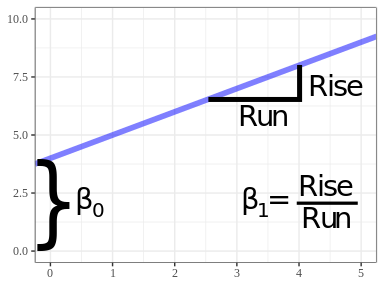

```{r setup, include=FALSE}
knitr::opts_chunk$set(echo = TRUE)
ggplot2::theme_set(ggplot2::theme_bw() + ggplot2::theme(strip.background = ggplot2::element_rect(fill = "white")))
library(ggplot2)
library(dplyr)
library(plotly)
library(DiagrammeR)
data("mtcars")
```

# Learning Objectives

- What is linear regression?
- What are the goals of linear regression?
- What can linear regression accomplish?
- How are other procedures related to linear regression?
- <https://lindeloev.github.io/tests-as-linear/>

# What is simple linear regression?

1. Equation for line: $y = \beta_0 + \beta_1 x$

    \ 

2. Have cloud of points

    ```{r, echo = FALSE, fig.width=4.65, fig.height=3.6}
    qplot(x = drat, y = mpg, data = mtcars)
    ```
    
3. Fit line to cloud of points

    ```{r, message=FALSE, fig.width = 4.65, fig.height = 3.6, echo = FALSE}
    qplot(x = drat, y = mpg, data = mtcars) +
      geom_smooth(method = "lm", se = FALSE)
    ```
    
4. Infer slope from fitted line

    \ 
    
5. Inference:
    a. Test if slopes are 0
    b. Confidence intervals on slopes.
    c. Interpret sign/magnitude of slopes.
    
# What is multiple linear regression?

1. Equation for a 2-d plane:
    $$
    y = \beta_0 + \beta_1 x_1 + \beta_2 x_2
    $$

    - When $x_1$ is fixed (not changing), $y = \beta_0 + \beta_1 x_1 + \beta_2 x_2$ is the equation for a line with slope $\beta_2$ and $y$-intercept $\beta_0 + \beta_1 x_1$.
    
    - When $x_2$ is fixed (not changing), $y = \beta_0 + \beta_1 x_1 + \beta_2 x_2$ is the equation for a line with slope $\beta_1$ and $y$-intercept $\beta_0 + \beta_2 x_2$.
    
    - So a plane can be interpreted as a line when you fix all predictors but one.

2. Have a cloud of points:

    ```{r, echo = FALSE, message = FALSE}
    fig <- plot_ly() %>%
      add_markers(data = mtcars, x = ~drat, y = ~wt, z = ~mpg, size = I(20))
    fig <- fig %>% layout(scene = list(xaxis = list(title = 'drat'),
                          yaxis = list(title = 'wt'),
                          zaxis = list(title = 'mpg')))
    fig
    ```

3. Fit plane to cloud of points:
    
    ```{r, echo = FALSE}
    lmout <- lm(mpg ~ drat + wt, data = mtcars)
    planedf <- expand.grid(drat = seq(from = min(mtcars$drat), to = max(mtcars$drat), length.out = 5),
                           wt = seq(from = min(mtcars$wt), to = max(mtcars$wt), length.out = 5))
    planedf$mpg <- predict(object = lmout, newdata = planedf)
    
    fig <- fig %>%
      add_mesh(data = planedf, x = ~drat, y = ~wt, z = ~mpg, opacity = 0.3)
    fig
    ```

4. Infer slopes from fitted plane.

5. Inference:
    a. Test if slopes are 0
    b. Confidence intervals on slopes.
    c. Interpret sign/magnitude of slopes.
    
# Steps of a Regression Analysis

- The above procedures assume that:
    1. The cloud of points roughly follows a line (or plane).
    2. All predictors (the $x$'s) are associated with the response (the $y$). We might have many predictors and we need to choose which ones to include.

- We typically need to transform the data or try out a few models. 

- Steps:

```{r, echo = FALSE, fig.height=7}
grViz(diagram = "digraph flowchart {
  node [fontname = arial, shape = rectangle]
  tab1 [label = '@@1']
  tab2 [label = '@@2']
  tab3 [label = '@@3']
  tab4 [label = '@@4']
  tab5 [label = '@@5']
  tab6 [label = '@@6']
  tab7 [label = '@@7']
  tab8 [label = '@@8']
  taby [label = '@@9']
  tabn [label = '@@10']
  
  tab1 -> tab2 -> tab3 -> tab4 -> taby -> tab6 -> tab7 -> tab8;
  tab4 -> tabn -> tab5 -> tab3;
}
  
  [1]: 'START'
  [2]: 'Exploratory\\nData Analysis'
  [3]: 'Develop one\\nor more tentative\\nregression models'
  [4]: 'Is\\none or more of\\nthe regression models\\nsuitable for the data\\nat hand?'
  [5]: 'Revise regression\\nmodels and/or\\ndevelop new ones'
  [6]: 'Identify most\\nsuitable model'
  [7]: 'Make inferences\\none basis of\\nregression model'
  [8]: 'STOP'
  [9]: 'YES'
  [10]: 'NO'
  ")
```


# What can you use it for?

- Detecting trends.
    - Easy to see trends if you have two variables. Harder if you have more. Need something more sophisticated.
    - Linear regression allows us to say "folks that have bigger x tend to have bigger y".

- Control for other variables. 
    - "Folks that have the *same* z but *bigger* x tend to have bigger y."
    
- Prediction
    - Most machine learning tasks in the read world are "small data".
    - The fancy ML methods have many parameters that require lots of data to estimate.
    - Linear regression is often the best you can do in small data tasks.

# Generality

- Many statistical procedures are special cases of (or approximations to) linear regression.

- Understanding linear regression really well will give you a deeper understanding of statistics in general.

## One sample $t$-test

- $H_0$: Average MPG = 20
- $H_A$: Average MPG $\neq$ 20

```{r, echo = FALSE}
mtcars %>%
  qplot(x = mpg, data = ., geom = "histogram", bins = 10) +
  geom_vline(xintercept = 20, lty = 2, col = 2)
```

```{r}
## t-test p-value
t.test(mtcars$mpg, mu = 20)$p.value

## linear regression p-value
lmout <- lm(mpg - 20 ~ 1, data = mtcars)
coef(summary(lmout))[, "Pr(>|t|)"]
```

## Two-sample $t$-test

```{r, echo = FALSE}
mtcars %>%
  mutate(am = as.factor(am)) %>%
  qplot(x = am, y = mpg, data = ., geom = "boxplot")
```

```{r}
## t-test p-value
t.test(mpg ~ am, data = mtcars, var.equal = TRUE)$p.value

## linear regression p-value
lmout <- lm(mpg ~ am, data = mtcars)
coef(summary(lmout))["am", "Pr(>|t|)"]
```

## One-way ANOVA

```{r, echo = FALSE}
mtcars %>%
  mutate(gear = as.factor(gear)) %>%
  qplot(y = mpg, x = gear, data = ., geom = "boxplot")
```

```{r}
## F-test p-value from ANOVA
mtcars %>%
  mutate(gear = as.factor(gear)) %>%
  aov(mpg ~ gear, data = .) %>%
  anova()

## F-test p-value from linear model
mtcars %>%
  mutate(gear = as.factor(gear)) %>%
  model.matrix(~gear, data = .) %>%
  as_tibble() %>%
  mutate(mpg = mtcars$mpg) ->
  lmdat
head(lmdat)

lmout <- lm(mpg ~ 1 + gear4 + gear5, data = lmdat)
summary(lmout)
```

- $p$-value for the $F$-tests in both cases was about 0.000295

## Many other connections

- Correlation tests, rank tests, chi-square tests, and many others can be seen as approximations of linear regression.
