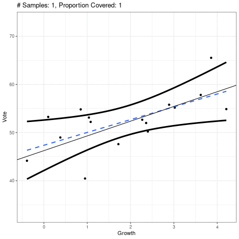

```{r setup, include=FALSE}
set.seed(1)
knitr::opts_chunk$set(echo       = TRUE, 
                      fig.align  = "center")
ggplot2::theme_set(ggplot2::theme_bw() + ggplot2::theme(strip.background = ggplot2::element_rect(fill = "white")))
```

```{r klippy, echo=FALSE, include=TRUE}
klippy::klippy()
```

# Learning Objectives

- Chapter 2 of KNNL (skip section 2.11).
- Sampling distributions of OLS estimates.
- Hypothesis testing for regression coefficients.
- Confidence intervals for regression coefficients.
- Regression line intervals: pointwise confidence, prediction, confidence bands
- $F$-tests for regression models.
- $R$ and $R^2$.

# Testing $H_0:\beta_1=0$

- Recall our model for simple linear regression:
    \begin{align}
    Y_i &= \beta_0 + \beta_1 X_i + \epsilon_i\\
    \epsilon_i &\overset{i.i.d.}{\sim} N(0, \sigma^2)
    \end{align}
    
- A common task is to test the following hypotheses:
    - $H_0: \beta_1 = 0$. 
        - $Y_i$ and $X_i$ are not *linearly* associated.
        - $E[Y_i|X_i] = \beta_0$ no matter the value of $X_i$. So $X_i$ doesn't tell us anything about $Y_i$ (in the context of linear relationships).
    - $H_A: \beta_1 \neq 0$.
        - $Y_i$ and $X_i$ are *linearly* associated.
        - We can get better guesses by of $Y_i$ by knowing $X_i$ than if we did not know $X_i$.
        
- Overview of the strategy of hypothesis testing:

    \ 
    
    1. We obtain a test statistic whose large/small values will provide support against the null.
    2. We compare the observed test-statistic to the distribution of hypothetical test statistics we would have observed *if the null were true*. 
        - This distribution is called the **sampling distribution** of the test statistic.
    3. We obtain the **$p$-value**: The probability of seeing a data as extreme or more extreme than what we saw *if the null were true*.
    4. If the $p$-value is small, then our data would be very rare if the null were true, so we claim the null is not true.
    5. If the $p$-value is large, then our data would be common if the null were true. But it could also be common if the null were false, so we make no claims.
    
## Sampling distribution

- The sampling distribution of $\hat{\beta}_1$ is
    $$
    \hat{\beta}_1 \sim N\left(\beta_1, \frac{\sigma^2}{\sum_{i=1}^n (X_i - \bar{X})^2}\right).
    $$

- We will prove the mean result of this.

- Note that $\hat{\beta}_1 = \sum_{i=1}^nk_iY_i$ where $k_i = \frac{X_i - \bar{X}}{\sum_{i=1}^n(X_i - \bar{X})^2}$.

- Property from theory: Any linear combination of independent normal random variables is also normal.
    - So we just need the mean and variance of $\hat{\beta}_1$ to know its distribution.
    
    \begin{align}
    E[\hat{\beta}_1] &= E\left[\sum_{i=1}^nk_iY_i\right]\\
    &=\sum_{i=1}^nk_iE[Y_i]\\
    &=\sum_{i=1}^nk_i(\beta_0 + \beta_1 X_i)\\
    &= \beta_0\sum_{i=1}^nk_i + \beta_1\sum_{i=1}^nk_iX_i.
    \end{align}

- We will now prove that $\sum_{i=1}^nk_i = 0$ and $\sum_{i=1}^nk_iX_i = 1$.

    \begin{align}
    \sum_{i=1}^nk_i &= \frac{\sum_{i=1}^n(X_i - \bar{X})}{\sum_{i=1}^n(X_i - \bar{X})^2}\\
    &= \frac{\sum_{i=1}^nX_i - \sum_{i=1}^n\bar{X}}{\sum_{i=1}^n(X_i - \bar{X})^2}\\
    &= \frac{n\bar{X} - n\bar{X}}{\sum_{i=1}^n(X_i - \bar{X})^2}\\
    &= 0.
    \end{align}


    \begin{align}
    \sum_{i=1}^nk_iX_i &= \frac{\sum_{i=1}^nX_i(X_i - \bar{X})}{\sum_{i=1}^n(X_i - \bar{X})^2}\\
    &= \frac{\sum_{i=1}^nX_i^2 - \bar{X}\sum_{i=1}^nX_i}{\sum_{i=1}^n(X_i - \bar{X})^2}\\
    &= \frac{\sum_{i=1}^nX_i^2 - n\bar{X}^2}{\sum_{i=1}^n(X_i - \bar{X})^2}\\
    &= \frac{\sum_{i=1}^nX_i^2 - 2n\bar{X}^2 + n\bar{X}^2}{\sum_{i=1}^n(X_i - \bar{X})^2}\\
    &= \frac{\sum_{i=1}^nX_i^2 - 2\bar{X}\sum_{i=1}^nX_i + n\bar{X}^2}{\sum_{i=1}^n(X_i - \bar{X})^2}\\
    &= \frac{\sum_{i=1}^n(X_i^2 - 2\bar{X}X_i + \bar{X}^2)}{\sum_{i=1}^n(X_i - \bar{X})^2}\\
    &= \frac{\sum_{i=1}^n(X_i - \bar{X})^2}{\sum_{i=1}^n(X_i - \bar{X})^2}\\
    &= 1
    \end{align}
    
- Putting this together, we have
    $$
    E[\hat{\beta}_1] =  \beta_0\sum_{i=1}^nk_i + \beta_1\sum_{i=1}^nk_iX_i = \beta_0 \times 0 + \beta_1 \times 1 = \beta_1.
    $$
    
- The proof for $var(\hat{\beta}_1)$ is similar.

## Finding a test statistic.

- The standard deviation of the sampling distribution of an estimator is called the **standard error**.

- The standard error $\hat{\beta}_1$ is $\frac{\sigma^2}{\sum_{i=1}^n (X_i - \bar{X})^2}$.

- We don't know $\sigma^2$, but we have an estimator for it, the mean squared error (MSE).

    $$
    MSE = \frac{1}{n-2} \sum_{i=1}^n(Y_i - \hat{Y}_i)^2
    $$

- So the estimated standard error of $\hat{\beta}_1$ is $s(\hat{\beta}_1)$ where
    $$
    s^2(\hat{\beta}_1) = \frac{MSE}{\sum_{i=1}^n (X_i - \bar{X})^2}
    $$
    - We usually just say "standard error", even when we are talking about the estimated standard error.
    

- The distribution of
    $$
    \frac{\hat{\beta}_1 - \beta_1}{s(\hat{\beta}_1)} \sim t_{n-2}
    $$
    - A $t$ distribution with $n-2$ degrees of freedom.
    - $n$ is the sample size.
    - We subtract two because we estimated two parameters $\beta_0$ and $\beta_1$ when we were calculating the MSE.


# Confidence Interval for $E[Y_i|X_i]$

  \ 
  
# Prediction Interval for $\hat{Y}_{i(new)}$ given $X_{i(new)}$

  \ 

# Confidence Bands

  \ 

# ANOVA approach to hypothesis testing

- Our hypothesis test is a comparison between the two models:
    \begin{align}
    Y_i = \beta_0 + \epsilon_i\\
    Y_i = \beta_0 + \beta_1 X_i + \epsilon_i
    \end{align}
    
- We will call the first model the **reduced** model and the second model the **full** model. This is because the reduced model is a subset of the full model (you get the reduced from the full by setting $\beta_1 = 0$).

- Sum of squares of reduced model

    $$
    SSE(R) = \sum_{i=1}^n(Y_i - \bar{Y})^2
    $$

    ```{r, echo = FALSE, message = FALSE}
    library(tidyverse)
    library(broom)
    
    hibbs <- read_csv("https://dcgerard.github.io/stat_415_615/data/hibbs.csv")
    lmout <- lm(vote ~ growth, data = hibbs)
    tout <- tidy(lmout)
    beta0 <- tout$estimate[[1]]
    beta1 <- tout$estimate[[2]]
    
    hibbs %>%
      mutate(yhat = beta0 + beta1 * growth,
             ybar = mean(vote)) ->
      hibbs
    ```
    
    ```{r, echo = FALSE}
    ggplot(data = hibbs) +
      geom_point(aes(x = growth, y = vote)) +
      geom_line(aes(x = growth, y = ybar), lwd = 2, col = "blue", alpha = 1/3) +
      xlab("Growth") +
      ylab("Vote") +
      geom_segment(aes(x = growth, xend = growth, y = vote, yend = ybar))
    ```
    
- Sum of squares of full model

    $$
    SSE(F) = \sum_{i=1}^n(Y_i - \hat{Y}_i)^2
    $$

    ```{r, echo = FALSE}
    ggplot(data = hibbs) +
      geom_point(aes(x = growth, y = vote)) +
      geom_line(aes(x = growth, y = yhat), lwd = 2, col = "blue", alpha = 1/3) +
      xlab("Growth") +
      ylab("Vote") +
      geom_segment(aes(x = growth, xend = growth, y = vote, yend = yhat))
    ```

- Under the null that the reduced model is true, we have that the following statistic has a sampling distribution that is $F(1, n-2)$
    $$
    F^* = \frac{[SSE(R) - SSE(F)]/(df_R - df_F)}{SSE(F)/df_F}
    $$

# Coefficient of Determination

# Correlation Coefficient
