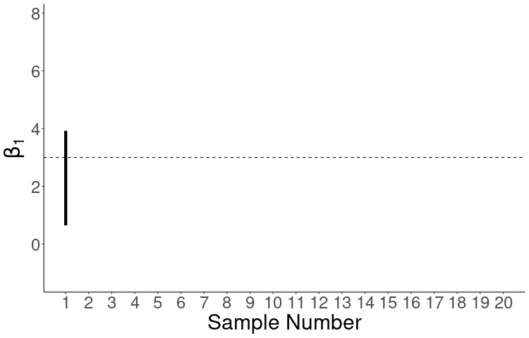

```{r setup, include=FALSE}
set.seed(1)
knitr::opts_chunk$set(echo       = TRUE, 
                      fig.align  = "center",
                      fig.height = 3)
ggplot2::theme_set(ggplot2::theme_bw() + ggplot2::theme(strip.background = ggplot2::element_rect(fill = "white")))
```

```{r klippy, echo=FALSE, include=TRUE}
klippy::klippy()
```

# Learning Objectives

- Chapter 2 of KNNL (skip section 2.11).
- Sampling distributions of OLS estimates.
- Hypothesis testing for regression coefficients.
- Confidence intervals for regression coefficients.
- Regression line intervals: point-wise confidence, prediction, confidence bands
- $F$-tests for regression models.
- $R$ and $R^2$.

# Testing $H_0:\beta_1=0$

- Recall our model for simple linear regression:
    \begin{align}
    Y_i &= \beta_0 + \beta_1 X_i + \epsilon_i\\
    \epsilon_i &\overset{i.i.d.}{\sim} N(0, \sigma^2)
    \end{align}
    
- A common task is to test the following hypotheses:
    - $H_0: \beta_1 = 0$. 
        - $Y_i$ and $X_i$ are not *linearly* associated.
        - $E[Y_i|X_i] = \beta_0$ no matter the value of $X_i$. So $X_i$ doesn't tell us anything about $Y_i$ (in the context of linear relationships).
    - $H_A: \beta_1 \neq 0$.
        - $Y_i$ and $X_i$ are *linearly* associated.
        - We can get better guesses of $Y_i$ by knowing $X_i$ than if we did not know $X_i$.
        
- Overview of the strategy of hypothesis testing:

    \ 
    
    1. We obtain a test statistic whose large/small values will provide support against the null.
    2. We compare the observed test-statistic to the distribution of hypothetical test statistics we would have observed *if the null were true*. 
        - This distribution is called the **null sampling distribution** of the test statistic.
    3. We obtain the **$p$-value**: The probability of seeing a data as extreme or more extreme than what we saw *if the null were true*.
    4. If the $p$-value is small, then our data would be very rare if the null were true, so we claim the null is not true.
    5. If the $p$-value is large, then our data would be common if the null were true. But it could also be common if the null were false, so we make no claims.
    
- **Exercise**: What is wrong with the statement: "We test against the null of $H_0: \hat{\beta}_1 = 0$."

    ```{block, eval = FALSE, echo = FALSE}
    Hypotheses concern statements about parameters, not statistics.
    ```

- **Exercise**: What is wrong with the following interpretation of the $p$-value: "The $p$-value is the probability that the null hypothesis is true, so small $p$-values suggest we reject the null hypothesis."

    ```{block, eval = FALSE, echo = FALSE}
    $p$-values are not probability statements about hypotheses. They are probability statements of data *assuming the null hypothesis were true*. 
    
    Think about it this way: The above interpretation is making statements of $Pr(H_0|data)$, while $p$-values give statements about $Pr(data|H_0)$.
    ```

- **Exercise**: What is wrong with the following: "The $p$-value is large, so we accept the null hypothesis".

    ```{block, eval = FALSE, echo = FALSE}
    We never accept the null hypothesis. That is because to obtain the $p$-value, we first assume the null is true. The logic goes that if the $p$-value is small then we observed rare data if the null were true. But if the $p$-value is large, it is common under the null, but it could also be common under the alternative. So we don't have evidence one way or the other.
    ```


## Sampling distribution

- The sampling distribution of $\hat{\beta}_1$ is
    $$
    \hat{\beta}_1 \sim N\left(\beta_1, \frac{\sigma^2}{\sum_{i=1}^n (X_i - \bar{X})^2}\right).
    $$

- We will prove the mean result of this. If you get a PhD in Statistics, you go through these type of calculations all of the time.

- Note that $\hat{\beta}_1 = \sum_{i=1}^nk_iY_i$ where $k_i = \frac{X_i - \bar{X}}{\sum_{i=1}^n(X_i - \bar{X})^2}$.

- Property from theory: Any linear combination of independent normal random variables is also normal.

- **So we just need the mean and variance of $\hat{\beta}_1$ to know its distribution.**
    
    \begin{align}
    E[\hat{\beta}_1] &= E\left[\sum_{i=1}^nk_iY_i\right]\\
    &=\sum_{i=1}^nk_iE[Y_i]\\
    &=\sum_{i=1}^nk_i(\beta_0 + \beta_1 X_i)\\
    &= \beta_0\sum_{i=1}^nk_i + \beta_1\sum_{i=1}^nk_iX_i.
    \end{align}

- We will now prove that $\sum_{i=1}^nk_i = 0$ and $\sum_{i=1}^nk_iX_i = 1$.

    \begin{align}
    \sum_{i=1}^nk_i &= \frac{\sum_{i=1}^n(X_i - \bar{X})}{\sum_{i=1}^n(X_i - \bar{X})^2}\\
    &= \frac{\sum_{i=1}^nX_i - \sum_{i=1}^n\bar{X}}{\sum_{i=1}^n(X_i - \bar{X})^2}\\
    &= \frac{n\bar{X} - n\bar{X}}{\sum_{i=1}^n(X_i - \bar{X})^2}\\
    &= 0.
    \end{align}


    \begin{align}
    \sum_{i=1}^nk_iX_i &= \frac{\sum_{i=1}^nX_i(X_i - \bar{X})}{\sum_{i=1}^n(X_i - \bar{X})^2}\\
    &= \frac{\sum_{i=1}^nX_i^2 - \bar{X}\sum_{i=1}^nX_i}{\sum_{i=1}^n(X_i - \bar{X})^2}\\
    &= \frac{\sum_{i=1}^nX_i^2 - n\bar{X}^2}{\sum_{i=1}^n(X_i - \bar{X})^2}\\
    &= \frac{\sum_{i=1}^nX_i^2 - 2n\bar{X}^2 + n\bar{X}^2}{\sum_{i=1}^n(X_i - \bar{X})^2}\\
    &= \frac{\sum_{i=1}^nX_i^2 - 2\bar{X}\sum_{i=1}^nX_i + n\bar{X}^2}{\sum_{i=1}^n(X_i - \bar{X})^2}\\
    &= \frac{\sum_{i=1}^n(X_i^2 - 2\bar{X}X_i + \bar{X}^2)}{\sum_{i=1}^n(X_i - \bar{X})^2}\\
    &= \frac{\sum_{i=1}^n(X_i - \bar{X})^2}{\sum_{i=1}^n(X_i - \bar{X})^2}\\
    &= 1
    \end{align}
    
- Putting this together, we have
    $$
    E[\hat{\beta}_1] =  \beta_0\sum_{i=1}^nk_i + \beta_1\sum_{i=1}^nk_iX_i = \beta_0 \times 0 + \beta_1 \times 1 = \beta_1.
    $$
    
- The proof that $var(\hat{\beta}_1) = \frac{\sigma^2}{\sum_{i=1}^n (X_i - \bar{X})^2}$ is similar.

- **Exercise**: What happens to the variance of $\hat{\beta}_1$ when the $X_i$'s are more spread out?

    ```{block, eval = FALSE, echo = FALSE}
    It gets smaller, indicating that we get more certain of our estimate of $\beta_1$ when we have more dispersed predictor values.
    ```

## Standard errors

- The standard deviation of the sampling distribution of an estimator is called the **standard error**.

- This quantity is important for describing how certain we are about an estimate.

- The standard error $\hat{\beta}_1$ is $\frac{\sigma^2}{\sum_{i=1}^n (X_i - \bar{X})^2}$.

- We don't know $\sigma^2$, but we have an estimator for it, the mean squared error (MSE).

    $$
    MSE = \frac{1}{n-2} \sum_{i=1}^n(Y_i - \hat{Y}_i)^2
    $$

- So the estimated standard error of $\hat{\beta}_1$ is $s(\hat{\beta}_1)$ where
    $$
    s^2(\hat{\beta}_1) = \frac{MSE}{\sum_{i=1}^n (X_i - \bar{X})^2}
    $$

- We usually just say "standard error", even when we are talking about the estimated standard error.

## Finding a test statistic

- Our goal when testing against $H_0: \beta_1 = 0$ is to find a statistic that (i) can provide evidence against $H_0$ based on its value and (ii) we know the distribution of under $H_0$.

- The distribution of
    $$
    \frac{\hat{\beta}_1 - \beta_1}{s(\hat{\beta}_1)} \sim t_{n-2}
    $$
    - A $t$ distribution with $n-2$ degrees of freedom.
    - $n$ is the sample size.
    - We subtract two because we estimated two parameters $\beta_0$ and $\beta_1$ when we were calculating the MSE.
    
- Thus, if $H_0: \beta_1 = 0$ were true, we would have that
    $$
    t^* = \frac{\hat{\beta}_1}{s(\hat{\beta}_1)} \sim t_{n-2}
    $$
    But if $H_A$ were true, then $t^*$ would not follow a $t_{n-2}$ distribution.
 
- We can compare $t^*$ to a $t_{n-2}$ distribution to see how extreme it is.

    $$
    p-\text{value} = 2*\text{pt}(-|t^*|, n-2).
    $$

    ```{r, echo=FALSE, message = FALSE}
    library(tidyverse)
    tibble(x = seq(-4, 4, length.out = 500)) %>%
      mutate(y = dt(x = x, df = 2)) ->
      tdat
    ggplot(tdat, aes(x = x, y = y)) +
      geom_line() +
      theme_classic() +
      theme(axis.text = element_blank(),
              axis.ticks = element_blank(),
              axis.title = element_blank()) +
      geom_ribbon(data = filter(tdat, x > 2.5), aes(x = x, ymax = y), ymin = 0, fill = "blue") +
      geom_ribbon(data = filter(tdat, x < -2.5), aes(x = x, ymax = y), ymin = 0, fill = "blue") +
      geom_vline(xintercept = 2.5, lty = 2, col = 2)
    ```


## Implement in R

- R will automatically calculate $t$-values and $p$-values, so we never need to manually make these calculations.

- We first fit the linear model using `lm()` as before, saving the output to a variable.

    ```{r, message=FALSE}
    library(tidyverse)
    library(broom)
    hibbs <- read_csv("https://dcgerard.github.io/stat_415_615/data/hibbs.csv")
    lmhibbs <- lm(vote ~ growth, data = hibbs)
    ```

- We then again use the `tidy()` function from the `{broom}` package.

    ```{r}
    t_hibbs <- tidy(lmhibbs)
    ```

- The `statistic` variable contains the $t$-statistics, while the `p.value` variable contains the $p$-value for the test that the parameter equals 0.

    ```{r}
    t_hibbs
    ```

- In the above output the $t$-statistic against the null of $\beta_1 = 0$ is 4.4.

- So in the above output, the $p$-value against the null of $\beta_1 = 0$ is `6.1e-04` = $6.1 \times 10^{-4} = 0.00061$.

- We can verify that the $p$-value can be derived directly from the $t$-statistic.

    ```{r}
    n <- nrow(hibbs)
    2 * pt(q = -abs(4.396), df = n - 2)
    ```

- **Exercise**: Fill in the missing values (the `NA`'s) from the following R output:

    ```{r, echo = FALSE}
    data("mtcars")
    tout <- tidy(lm(mpg ~ drat, data = mtcars))
    tout$statistic[[2]] <- NA
    tout$std.error[[1]] <- NA
    tout
    ```

    ```{block, eval = FALSE, echo = FALSE}
    Since $t^* = \hat{\beta} / se(\hat{\beta})$, we have that $se(\hat{\beta}) = \hat{\beta} / t^*$. So the missing standard error is -7.525 / -1.374 = 5.477.
    
    The missing $t$-statistic is $\hat{\beta} / se(\hat{\beta})$ = 7.678 / 1.507 = 5.095
    ```

- **Exercise**: Verify your answer to the previous exercise by fitting a regression of `mpg` on `drat` from the `mtcars` dataset.

    ```{r, echo = FALSE, eval = FALSE}
    data("mtcars")
    tout <- tidy(lm(mpg ~ drat, data = mtcars))
    tout
    ```

# Confidence interval for $\beta_1$

- Remember: interpreting confidence intervals:
    - CORRECT: We used a procedure that would capture the true parameter in 95%
      of repeated samples.
    - CORRECT: *Prior to sampling*, the probability of capturing the true
      parameter is 0.95.
    - CORRECT: We reject the null that $H_0: \beta_1 = \mu$ at the 0.05 level if $\mu$ lies outside of the 95\% confidence interval for $\beta_1$ (connection between confidence intervals and hypothesis tests).
    - WRONG: After sampling, the probability of capturing the true parameter
      is 0.95. 
        - Because after sampling the parameter is either in the interval
          or it's not. We just don't know which.

    \ 
    
- Let's construct a $(1-\alpha)$ confidence interval (typically $\alpha = 0.05$ so we would construct a 95\% confidence interval).

- Let
    $$
    \ell = \text{qt}(\alpha/2, n-2)\\
    u = \text{qt}(1 - \alpha/2, n-2)\\
    $$
    For some $0 < \alpha < 1$.

- Note that $\ell = - u$

    ```{r}
    alpha <- 0.05
    n <- 10
    qt(alpha / 2, n - 2)
    qt(1 - alpha / 2, n - 2)
    ```

- Since $t^* = \frac{\hat{\beta}_1 - \beta_1}{s(\hat{\beta}_1)} \sim t_{n-2}$, we have that
    $$
    Pr\left(-u \leq \frac{\hat{\beta}_1 - \beta_1}{s(\hat{\beta}_1)} \leq u \right) = 1 - \alpha
    $$

    ```{r, echo = FALSE, warning = FALSE}
    library(latex2exp)
    uval <- 2.5
    tibble(x = seq(-4, 4, length.out = 500)) %>%
          mutate(y = dt(x = x, df = 2)) ->
          tdat
    ggplot(tdat, aes(x = x, y = y)) +
      geom_line() +
      theme_classic() +
      theme(axis.text = element_blank(),
              axis.ticks = element_blank(),
              axis.title = element_blank()) +
      geom_ribbon(data = filter(tdat, x < uval, x > -uval), aes(x = x, ymax = y), ymin = 0, fill = "blue") +
      geom_vline(xintercept = uval, lty = 2, col = 2) +
      geom_vline(xintercept = -uval, lty = 2, col = 2) +
      annotate(x = uval + 0.2, y = max(tdat$y), geom = "text", label = "u", size = 8) +
      annotate(x = -uval - 0.2, y = max(tdat$y), geom = "text", label = "-u", size = 8) +
      annotate(x = 0, y = max(tdat$y) / 2, geom = "text", label = TeX("$1 - \\alpha$"), color = "white", size = 10)
    ```
    
- Thus, we have
    \begin{align}
    &Pr\left(-u \leq \frac{\hat{\beta}_1 - \beta_1}{s(\hat{\beta}_1)} \leq u \right) = 1 - \alpha\\
    &\Leftrightarrow Pr\left(-u s(\hat{\beta}_1) \leq \hat{\beta}_1 - \beta_1 \leq u s(\hat{\beta}_1) \right) = 1 - \alpha\\
    &\Leftrightarrow Pr\left(-u s(\hat{\beta}_1) - \hat{\beta}_1\leq  -\beta_1 \leq u s(\hat{\beta}_1) - \hat{\beta}_1 \right) = 1 - \alpha\\
    &\Leftrightarrow Pr\left(\hat{\beta}_1 + u s(\hat{\beta}_1)\geq  \beta_1 \geq \hat{\beta}_1 - u s(\hat{\beta}_1) \right) = 1 - \alpha\\
    \end{align}

- Thus $\hat{\beta}_1 \pm u s(\hat{\beta}_1)$, where $u = \text{qt}(1 - \alpha/2, n-2)$ is a $(1-\alpha)$ confidence interval for $\beta_1$.

- Intervals that we calculate in this class will always be of the form
    $$
    \text{estimate} \pm \text{multiplier} \times \text{standard error}
    $$
    - For exams, I want you to be able to take an estimate and a standard error and (i) tell me how to find the multiplier in R and (ii) use these three components to calculate a confidence interval. So, e.g., know that for simple linear regression we use `qt(p = 1 - alpha / 2, df = n - 2)`.
    - Intervals can be calculate in more complicated ways.

- Again, it is the interval that is random (and varies across repeated samples), not the parameter.

## Implementation in R.

- R will return confidence intervals if you ask, so you typically do not need to do these calculations in practice.

- First, use `lm()` to fit the linear model.
    ```{r, message=FALSE}
    hibbs <- read_csv("https://dcgerard.github.io/stat_415_615/data/hibbs.csv")
    lmhibbs <- lm(vote ~ growth, data = hibbs)
    ```

- Use the `tidy()` function from the `{broom}` package, but use the `conf.int = TRUE` argument. The confidence interval will be in the `conf.low` and `conf.high` variables.

    ```{r}
    t_hibbs <- tidy(lmhibbs, conf.int = TRUE)
    select(t_hibbs, term, estimate, p.value, conf.low, conf.high)
    ```
    
- You can change the level using the `conf.level` argument. E.g. to calculate a 99\% confidence interval you would do

    ```{r}
    t_hibbs <- tidy(lmhibbs, conf.int = TRUE, conf.level = 0.99)
    select(t_hibbs, term, estimate, p.value, conf.low, conf.high)
    ```

- A full interpretation might go something like this:

    > We estimate that incumbants to have on average 3.1\% higher vote-share in years which experience 1\% more growth (95\% confidence interval of 1.6\% higher to 4.6\% higher). We have strong evidence that this association is not due to chance alone ($p = 0.00061$, $n = 16$).
    
- **Exercise**: Make a plot of `qt(1 - alpha, 10)` from `alpha = 0.01` to `alpha = 0.1`. What does the the plot tell you about the width of confidence intervals as `alpha` increases?

    ```{r, echo = FALSE, eval = FALSE}
    alpha <- seq(from = 0.01, to = 0.1, length.out = 100)
    u <- qt(1 - alpha, 10)
    ggplot(data = data.frame(alpha = alpha, u = u), mapping =  aes(x = alpha, y = u)) +
      geom_line()
    ```
    ```{block, eval = FALSE, echo = FALSE}
    As $\alpha$ increases, the multiplier to the standard error decreases, making the width of the confidence intervals smaller. Since the confidence level is $1-\alpha$, this means that as as the confidence level increases, the width of the confidence interval increases.
    
    You need to have wider confidence intervals to capture the true parameter more often.
    ```

- **Exercise**: From the `mtcars` dataset, obtain the confidence interval for the slope parameter from a regression of `mpg` on `drat`.

    ```{r, eval = FALSE, echo = FALSE}
    lm_mtcars <- lm(mpg ~ drat, data = mtcars)
    tidy(lm_mtcars, conf.int = TRUE) %>%
      filter(term == "drat") %>%
      select(term, conf.low, conf.high)
    ```

# Best Practices and other comments

- Always provide $p$-values. Never state that results are "significant" or "not significant" without reporting a $p$-value.

- Always report effect size (i.e. slope) estimates with their corresponding 95\% confidence intervals.

- Always report the sample size.

- Almost never use 1-sided tests (folks will look at you suspiciously).

- Don't interpret $p$-values so discretely. I.e. 0.049 is not more significant than 0.051.

- Rules of thumb:
    - $p < 0.001$: Very strong evidence.
    - $p < 0.01$: Strong evidence.
    - $p < 0.05$: Evidence.
    - $p < 0.1$: Weak evidence.
    - $p > 0.1$: No evidence.

- We derived the sampling distribution of $\hat{\beta}_1$ using normality. But this is not that important as long as (i) you have a large sample size or (ii) the data aren't too skewed.
    - Central limit theorem guarantees distributional results for large sample size.
    
- The sampling distribution assumes the $X_i$'s don't change in repeated samples, but this only shows up as important if you are literally trying to reproduce a study.

- Inference on $\beta_0$
    - $\hat{\beta}_0$ is a statistic, so it has a sampling distribution.
    - We can use this sampling distribution to run hypothesis tests for $\beta_0$, or obtain confidence intervals for $\beta_0$.
    - R reports these automatically (in the row called "`(Intercept)`")
    - These are almost never useful.

# Other interval estimates

- There are three other types of intervals that we are interested in:

1. A confidence interval for the mean response at a given predictor level $E[Y_i|X_i]$.

2. A prediction interval for a single observation at a given predictor level.

3. A confidence band to capture the entire regression line.

We will go through these three intervals in turn.

## Confidence Interval for $E[Y_i|X_i]$

- Recall $E[Y_i|X_i] = \beta_0 + \beta_1 X_i$

- Let $\hat{Y}_i = \hat{\beta}_0 + \hat{\beta}_1 X_i$.

- Since $\hat{\beta}_0$ and $\hat{\beta}_1$ are random (and having sampling distributions), that means that $\hat{Y}_i$ is random (and has a sampling distribution).

    $$
    \hat{Y}_i \sim N\left(\beta_0 + \beta_1 X_i, \sigma^2\left[\frac{1}{n} + \frac{(X_i - \bar{X})^2}{\sum_{i=1}^n(X_i - \bar{X})^2}\right]\right)
    $$

- $\hat{Y}_i$ is an unbiased estimator of $\beta_0 + \beta_1 X_i$.

- The estimated standard error is $s(\hat{Y}_i)$ where
    $$
    s^2(\hat{Y}_i) = \text{MSE}\left[\frac{1}{n} + \frac{(X_i - \bar{X})^2}{\sum_{i=1}^n(X_i - \bar{X})^2}\right]
    $$

- **Exercise**: What value of $X_i$ results in the smallest standard error?

    ```{block, eval = FALSE, echo = FALSE}
    The smallest standard error occurs at $X_i = \bar{X}$. Since the second summand in the standard error is always positive, it is minimized when it is 0, which occurs when $X_i = \bar{X}$.
    ```

- From stat theory, we have that
    $$
    \frac{\hat{Y}_i - E[Y_i|X_i]}{s(\hat{Y}_i)} \sim t_{n-2}
    $$

- We can use this to obtain a confidence interval for $E[Y_i|X_i]$.
    $$
    \hat{Y}_i \pm \text{qt}(1 - \alpha / 2, n-2)s(\hat{Y}_i)
    $$

- Graphic of interpretation:

  \ 
  
- This confidence interval only applies when a *single* mean response is to be estimated.

- These are called **point-wise confidence intervals** because they provide confidence intervals for the mean at a single $X_i$.

- If you use `geom_smooth()` from `{ggplot2}`, the resulting confidence intervals are all point-wise.

- **Exercise**: Write a paragraph on the strategy you would use to test $H_0: E[Y_i|X_i] = \mu$ for some prespecified $\mu$.

### Confidence interval for mean response in R

- Take the output of `lm()`
    ```{r}
    lmhibbs <- lm(vote ~ growth, data = hibbs)
    ```

- Create a new data frame that contains the desired level(s) of $X_i$.

    ```{r}
    newdf <- data.frame(growth = c(1.2, 2.4))
    ```

- Use `predict()` with the `interval = "confidence"` argument to obtain confidence intervals. They are in the `lwr` and `upr` columns.
    ```{r}
    predict(object = lmhibbs, newdata = newdf, interval = "confidence") %>%
      cbind(newdf)
    ```
    
- Change the level using the `level` argument.

    ```{r}
    predict(object = lmhibbs, newdata = newdf, interval = "confidence", level = 0.99) %>%
      cbind(newdf)
    ```


  
## Prediction Interval for $\hat{Y}_{i(new)}$ given $X_{i(new)}$

- What if, instead of estimating the mean at a given $X_i$, we want to estimate the value of **a single observational/experimental unit** at $X_i$.

- **Prediction**: Estimating the value of a single experimental/observational unit.

- So "estimation" is reserved for parameters, and "prediction" is reserved for unit values.

- In linear regression, the predicted value at $X_i$ *is the same* as the estimated mean at $X_i$.

    $$
    \hat{Y}_{i(new)} = \hat{\beta}_0 + \hat{\beta}_1X_{i(new)}
    $$

- The difference between prediction and estimation for linear regression, then, is in intervals.

- A $(1-\alpha)$ **prediction interval** captures $(1-\alpha)$ new values, over both repeated samples and repeated values.

- It's easier to begin thinking about prediction intervals as if $\beta_0$, $\beta_1$, and $\sigma^2$ were known. Suppose we know these values, then
    $$
    Y_{i(new)} \sim N(\beta_0 + \beta_1X_{i(new)}, \sigma^2),
    $$
    - So a prediction interval would be $\beta_0 + \beta_1X_{i(new)} \pm \text{qnorm}(1-\alpha/2)\sigma$. 
    - E.g. for a 95\% prediction interval, we would add and subtract 2 standard deviations from $\beta_0 + \beta_1X_{i(new)}$.
    
- But $\beta_0$, $\beta_1$, and $\sigma^2$ are not known. So if we just added and subtracted the 2 MSE from the estimated regression line, we could make some big mistakes if our regression line estimate was way off.
    ```{r, echo = FALSE}
    library(ggthemes)
    df <- data.frame(x = 1, xend = 1, y = 0.4, yend = 0.8)
    dfline <- data.frame(x = c(0, 1.1, 0, 1.1),
                         y = c(0, 1.1, 0.1, 0.65),
                         Line = c("Truth", "Truth", "Estimated", "Estimated")) %>%
      mutate(Line = parse_factor(Line, levels = c("Truth", "Estimated")))
    
    ggplot() +
      geom_line(data = dfline, mapping = aes(x = x, y = y, color = Line), lwd = 2) +
      geom_errorbar(data = df, mapping = aes(x = x, ymin = y, ymax = yend), width = 0.05, lwd = 2) +
      theme_classic() +
      theme(axis.text = element_blank(),
            axis.title = element_blank(),
            axis.ticks = element_blank()) +
      scale_color_colorblind() +
      annotate(geom = "point", x = 1, y = 1.1, color = "red", size = 3)
    ```

- Use the following as the prediction variance:
    \begin{align}
    \sigma^2(\text{pred}) &= \text{var}(\hat{\beta}_0 + \hat{\beta}_1X_i) + \text{var}(\epsilon_i)\\
    &= \text{var}(\hat{\beta}_0 + \hat{\beta}_1X_i) + \sigma^2\\
    \end{align}

- We can estimate $\sigma^2$ with the MSE, and we can estimate $\text{var}(\hat{\beta}_0 + \hat{\beta}_1X_i)$ with the standard error of the estimated mean response at $X_{i(new)}$, $s^2(\hat{Y}_i)$.
    
- Doing this, we obtain the following estimated prediction variance:
    $$
    s^2(\text{pred}) = s^2(\hat{Y}_i) + MSE.
    $$

- KEY IDEA: Variance of prediction = variance of estimated mean + error variance.
    
- The corresponding prediction interval is
    $$
    \hat{\beta}_0 + \hat{\beta}_1X_{i(new)} \pm \text{qt}(1 - \alpha/2, n-2)s(\text{pred})
    $$

- Graphic for interpretation: 

  \ 
  
- **Exercise**: Which is bigger, the prediction interval or the confidence interval for the mean, at a given $X_i$? Why?

    ```{block, eval = FALSE, echo = FALSE}
    The prediction interval. This is because the standard error of prediction is the MSE plus the standard error for the mean estimate, and the MSE $\geq 0$.
    ```

### Prediction Intervals in R.

- The steps are the exact same as the confidence intervals for the mean, except we use the `interval = "prediction"` argument in `predict()`.

    ```{r}
    lmhibbs <- lm(vote ~ growth, data = hibbs)
    newdf <- data.frame(growth = c(1.2, 2.4))
    predict(object = lmhibbs, newdata = newdf, interval = "prediction") %>%
      cbind(newdf)
    ```
    
- Change the level using the `level` argument.

    ```{r}
    predict(object = lmhibbs, newdata = newdf, interval = "prediction", level = 0.99) %>%
      cbind(newdf)
    ```

## Confidence Bands

- A $(1 - \alpha)$ confidence band is a procedure that produces a region that captures the **entire regression line** in $(1 - \alpha)$ of repeated samples.

- We won't go into how this works, but the formula for such a band is
    $$
    \hat{\beta}_0 + \hat{\beta}_1X_i \pm Ws(\hat{Y}_i), \text{ where}
    $$
    - $W = \sqrt{2\text{qf}(1-\alpha, 2, n-2)}$,
    - $s(\hat{Y}_i)$ is the standard error for the mean response at each $X_i$.
    
- Graphic for interpretation: 

  \ 
  
- There is no base R function that I can find that does this, but here is one if you want to use it:
    ```{r}
    #' Working-Hotelling bands for simple linear regression.
    #'
    #' Intervals of the form "fit +/- w * standard-error", where w^2 is 
    #' found by \code{p * qf(level, p, n - p)}.
    #'
    #' @param object An object of class "lm".
    #' @param newdata A data frame containing the new data.
    #' @param level The confidence level of the band.
    #'
    #' @author David Gerard
    whbands <- function(object, newdata, level = 0.95) {
      stopifnot(inherits(object, "lm"))
      stopifnot(inherits(newdata, "data.frame"))
      stopifnot(is.numeric(level), length(level) == 1)
      pout <- stats::predict(object = object, 
                             newdata = newdata, 
                             se.fit = TRUE, 
                             interval = "none")
      n <- nrow(stats::model.matrix(object))
      p <- ncol(stats::model.matrix(object))
      w <- sqrt(p * stats::qf(p = level, df1 = p, df2 = n - p))
      lwr <- pout$fit - w * pout$se.fit
      upr <- pout$fit + w * pout$se.fit
      pout$fit <- cbind(fit = pout$fit, lwr = lwr, upr = upr)
      return(pout)
    }
    ```
    
- Applying this function to the Hibbs data

    ```{r, fig.height = 4}
    lmhibbs <- lm(vote ~ growth, data = hibbs)
    newdf <- data.frame(growth = seq(from = min(hibbs$growth), 
                                     to = max(hibbs$growth), 
                                     length.out = 100))
    whfit <- whbands(object = lmhibbs, newdata = newdf)
    whfit$fit %>%
      cbind(newdf) ->
      newdf
    
    ggplot() +
      geom_point(data = hibbs, mapping = aes(x = growth, y = vote)) +
      geom_line(data = newdf, mapping = aes(x = growth, y = lwr)) +
      geom_line(data = newdf, mapping = aes(x = growth, y = upr))
    ```
    
- "wh" stands for "Working-Hotelling".

## Comparing intervals

```{r, echo = FALSE, fig.height=4}
library(ggthemes)
npoints <- 100
newdf <- data.frame(growth = seq(min(hibbs$growth), max(hibbs$growth), length = npoints))

sdest <- sigma(lmhibbs)
ci_out <- predict(lmhibbs, newdata = newdf, interval = "confidence", se.fit = TRUE)
pred_out <- predict(lmhibbs, newdata = newdf, interval = "prediction", se.fit = TRUE)

fmult <- sqrt(2 * qf(p = 0.95, df1 = 2, df2 = nrow(hibbs) - 2))

newdf$Fit <- ci_out$fit[, 1]
data.frame(
  growth   = c(newdf$growth, newdf$growth),
  Bound      = c(rep("Lower", npoints), rep("Upper", npoints)),
  Pointwise  = c(ci_out$fit[, 2], ci_out$fit[, 3]),
  Bands      = c(newdf$Fit - fmult * ci_out$se.fit, newdf$Fit + fmult * ci_out$se.fit),
  Prediction = c(pred_out$fit[, 2], pred_out$fit[, 3])
  ) %>%
  gather(key = "Type", value = "Value", Pointwise:Prediction) %>%
  mutate(Group = paste0(Bound, Type),
         Type = parse_factor(Type, levels = c("Pointwise", "Bands", "Prediction"))) ->
  banddf

ggplot(data = hibbs, mapping = aes(x = growth, y = vote)) +
  geom_point() +
  geom_line(data = newdf, mapping = aes(x = growth, y = Fit), lty = 1, col = "black", lwd = 1, alpha = 1/2) +
  geom_line(data = banddf, mapping = aes(x = growth, y = Value, group = Group, color = Type), lwd = 1) +
  scale_color_colorblind() +
  xlab("Growth") +
  ylab("Vote")
```

# ANOVA approach to hypothesis testing

- In this section, we will talk about a different strategy to testing $H_0: \beta_1 = 0$.

- In simple linear regression, this results in the *exact same $p$-value* as the test that uses the $t$-statistic. 

- However, this strategy is more applicable to general linear hypotheses that we'll discuss in multiple linear regression.

- Testing $H_0: \beta_1 = 0$ is really a comparison between the two models:
    \begin{align}
    H_0: Y_i &= \beta_0 + \epsilon_i\\
    H_A: Y_i &= \beta_0 + \beta_1 X_i + \epsilon_i
    \end{align}

- We will call the first model the **reduced** model and the second model the **full** model. This is because the reduced model is a subset of the full model (you get the reduced from the full by setting $\beta_1 = 0$).

- Our strategy will be to compare the residuals under $H_0$ and $H_A$. If $H_A$ were true, we would expect the those residuals to be much smaller than the residuals under $H_0$ (because the line fits a lot better).

- If $H_0$ were true, then we would expect the residuals under $H_A$ to only be a little bit smaller than those under $H_0$.

- We fit $H_A$ by the method of least squares, obtaining the OLS estimates and the corresponding residuals.

- We fit $H_0$ also by least squares. It turns out that under $H_0$, the OLS estimate is just $\bar{Y}$.

- We measure how small the residuals are by the sum of squared residuals.

- Sum of squares of reduced model

    $$
    SSE(R) = \sum_{i=1}^n(Y_i - \bar{Y})^2
    $$

    ```{r, echo = FALSE, message = FALSE}
    library(tidyverse)
    library(broom)
    
    hibbs <- read_csv("https://dcgerard.github.io/stat_415_615/data/hibbs.csv")
    lmout <- lm(vote ~ growth, data = hibbs)
    tout <- tidy(lmout)
    beta0 <- tout$estimate[[1]]
    beta1 <- tout$estimate[[2]]
    
    hibbs %>%
      mutate(yhat = beta0 + beta1 * growth,
             ybar = mean(vote)) ->
      hibbs
    ```
    
    ```{r, echo = FALSE}
    ggplot(data = hibbs) +
      geom_point(aes(x = growth, y = vote)) +
      geom_line(aes(x = growth, y = ybar), lwd = 2, col = "blue", alpha = 1/3) +
      xlab("Growth") +
      ylab("Vote") +
      geom_segment(aes(x = growth, xend = growth, y = vote, yend = ybar))
    ```
    
- Sum of squares of full model

    $$
    SSE(F) = \sum_{i=1}^n(Y_i - \hat{Y}_i)^2
    $$

    ```{r, echo = FALSE}
    ggplot(data = hibbs) +
      geom_point(aes(x = growth, y = vote)) +
      geom_line(aes(x = growth, y = yhat), lwd = 2, col = "blue", alpha = 1/3) +
      xlab("Growth") +
      ylab("Vote") +
      geom_segment(aes(x = growth, xend = growth, y = vote, yend = yhat))
    ```

- NOTE: $SSE(F)$ will *always* be less than or equal to $SSE(R)$. 
    - This is since $SSE(R)$ is a subset of $SSE(F)$, and so if $SSE(R)$ is the smallest the residuals can get, then we can set $\beta_1 = 0$ in the full model to get $SSE(F) = SSE(R)$.

- Under the null that the reduced model is true, we have that the following statistic has a sampling distribution that is $F(1, n-2)$
    $$
    F^* = \frac{[SSE(R) - SSE(F)]/(df_R - df_F)}{SSE(F)/df_F}
    $$
- $df_r = n - 1$: sample size of $n$ minus 1 for the single parameter we estimate in the reduced model.

- $df_f = n - 2$: sample size of $n$ minus 2 for the two parameters we estimate in the full model.
    
- If $H_A$ were true, then we would expect $F^*$ to be large, because this would increase the size of $SSE(R) - SSE(F)$. So we *only* compare $F^*$ to the right tail of $F(1, n-2)$ distribution.

    ```{r, echo = FALSE}
    library(latex2exp)
    tdat <- tibble(x = seq(from = 0, to = 3, length.out = 500)) %>%
      mutate(y = df(x = x, df1 = 1, df2 = 10))
    ggplot() +
      geom_line(data = tdat, mapping = aes(x = x, y = y)) +
      geom_ribbon(data = filter(tdat, x > 0.7), mapping = aes(x = x, ymin = 0, max = y), fill = "blue") +
      geom_vline(xintercept = 0.7, lty = 2, col = 2) +
      xlab(TeX("$F^*$")) +
      ylab(TeX("df($F^*$, 1, n-2)"))
    ```

- Let's verify this result manually:
    ```{r}
    lmhibbs <- lm(vote ~ growth, data = hibbs)
    aout <- augment(lmhibbs)
    sse_full <- sum(aout$.resid^2)
    ybar <- mean(hibbs$vote)
    sse_reduced <- sum((aout$vote - ybar)^2)
    n <- nrow(hibbs)
    df_r <- n - 1
    df_f <- n - 2
    f_star <- ((sse_reduced - sse_full) / (df_r - df_f)) / (sse_full / df_f)
    f_star
    pf(q = f_star, df1 = 1, df2 = n - 2, lower.tail = FALSE)
    ```

- This is the same as the $p$-value from the output of $tidy()$.
    ```{r}
    tidy(lmhibbs)$p.value[[2]]
    ```


## ANOVA terminology

- Confusingly, statisticians have alternative terms for these sums of squares that you might see.

    ```{r, echo = FALSE, message = FALSE}
    library(tidyverse)
    library(broom)
    
    hibbs <- read_csv("https://dcgerard.github.io/stat_415_615/data/hibbs.csv")
    lmout <- lm(vote ~ growth, data = hibbs)
    tout <- tidy(lmout)
    beta0 <- tout$estimate[[1]]
    beta1 <- tout$estimate[[2]]
    
    hibbs %>%
      mutate(yhat = beta0 + beta1 * growth,
             ybar = mean(vote)) ->
      hibbs
    ```

- The $SSE(F)$ is sometimes called the $SSE$ (sum of squares error).

    $$
    SSE = \sum_{i=1}^n(Y_i - \hat{Y}_i)^2
    $$

    ```{r, echo = FALSE}
    ggplot(data = hibbs) +
      geom_point(aes(x = growth, y = vote)) +
      geom_line(aes(x = growth, y = yhat), lwd = 2, col = "blue", alpha = 1/3) +
      xlab("Growth") +
      ylab("Vote") +
      geom_segment(aes(x = growth, xend = growth, y = vote, yend = yhat))
    ```

- The $SSE(R)$ is sometimes called the $SSTO$ (sum of squares total).

    $$
    SSTO = \sum_{i=1}^n(Y_i - \bar{Y})^2
    $$
    
    ```{r, echo = FALSE}
    ggplot(data = hibbs) +
      geom_point(aes(x = growth, y = vote)) +
      geom_line(aes(x = growth, y = ybar), lwd = 2, col = "blue", alpha = 1/3) +
      xlab("Growth") +
      ylab("Vote") +
      geom_segment(aes(x = growth, xend = growth, y = vote, yend = ybar))
    ```

- The difference $SSE(R) - SSE(F)$ is sometimes called $SSR$ (sum of squares regression).

    $$
    SSR = \sum_{i=1}^n(\hat{Y}_i - \bar{Y})^2
    $$

    ```{r, echo = FALSE}
    ggplot(data = hibbs) +
      geom_point(aes(x = growth, y = vote)) +
      geom_line(aes(x = growth, y = yhat), lwd = 2, col = "blue", alpha = 1/3) +
      xlab("Growth") +
      ylab("Vote") +
      geom_line(aes(x = growth, y = ybar), lwd = 2, col = "blue", alpha = 1/3) +
      geom_segment(aes(x = growth, xend = growth, y = ybar, yend = yhat))
    ```

- We have the result that
    $$
    SSTO = SSR + SSE
    $$

## Degrees of freedom

- **Degrees of freedom** are how many units of independent information we have.
  - You can consider it a measure of the variability of a sum of squares.
  - Larger means more information (lower variability).
  - Smaller means less information (higher variability).
  
- $SSTO$ has $n - 1$ degrees of freedom, called $df_{TO}$ ($n$ observations minus 1 parameter that we estimate).

- $SSE$ has $n-2$ degrees of freedom, called $df_{E}$ ($n$ observations minus 2 parameters that we estimate).

- $SSR$ has $1$ degree of freedom, called $df_{R}$ ($\hat{Y}$ used 2 parameters, while $\bar{Y}$ only used 1 parameter, so the difference is 1).

- It is always the case that $df_{TO} = df_E + df_R$.

## Mean Squares

- A sum of squares divided by its degrees of freedom is called a **mean square**.

- The **mean squared error** is
$$
MSE = SSE / df_E = SSE / (n-2)
$$

- The **mean square regression** is 
    $$
    MSR = SSR / df_R = SSR / 1
    $$
    
- We can show that this is an equivalent definition of $F^*$.
$$
F^* = \frac{MSR}{MSE} = \frac{SSR / df_R}{SSE / df_E} = \frac{(SSTO - SSE) / (df_{TO} - df_{E})}{SSE / df_E}
$$

## ANOVA Table

- Because you can (i) "partition" the total sum of squares into the regression sum of squares and the error sum of squares, and (ii) "partition" the total degrees of freedom into the error degrees of freedom and the regression degrees of freedom, some folks represent regression fits in terms of an ANOVA (analysis of variance) table

- It's called "analysis of variance" because we look at the sum of squares and how they partition between different models.

- We often present the results of an ANOVA in a table, which can contain some or all of the following elements (usually some components are missing):

    |            | SS                                          | df                | MS  | $p$-value                   |
    |------------|:-------------------------------------------:|:-----------------:|:---:|:---------------------------:|
    | Regression | $SSR = \sum_{i=1}^n(\hat{Y}_i - \bar{Y})^2$ | $df_R = p - 1$    | MSR | pf($F^*$, $df_R$, $df_E$, lower.tail = FALSE) |
    | Error      | $SSE = \sum_{i=1}^n(Y_i - \hat{Y})^2$       | $df_E = n - p$    | MSE |                             |
    | Total      | $SSTO = \sum_{i=1}^n(Y_i - \bar{Y})^2$      | $df_{TO} = n - 1$ |     |                             |
    
- Here $p$ is the number of predictors (so $p = 1$ in the simple linear regression).

## ANOVA implementation in R

- To calculate the ANOVA table in R, use the `Anova()` function from the `{car}` package. You just pass the `lm` object to the `Anova()` function.
    ```{r, message = FALSE}
    library(car)
    Anova(mod = lmhibbs)
    ```

- **Exercise**: From the output of `Anova()`, label each of the following (which can be found in the above table): $df_R$, $df_E$, $SSE$, $SSR$.

```{block, eval = FALSE, echo = FALSE}
          Sum Sq Df F value  Pr(>F)
growth       SSR  dfR  19.3 0.00061
Residuals    SSE  dfE 
```

- **Exercise**: Using the above ANOVA table, derive the MSE (the estimated variance).

    ```{block, eval = FALSE, echo = FALSE}
    198 / 14 = 14.14
    
    So the estimated standard deviation is 3.76, which is what we obtained from `glance()`.
    ```

- There exists an `anova()` function in R, and it produces the same results for simple linear regression, but it produces worse results for multiple linear regression.

- We can use the `linearHypothesis()` function from the `{car}` package to run a general linear hypothesis.

    ```{r, message = FALSE}
    linearHypothesis(model = lmhibbs, "growth = 0")
    ```

- **Exercise**: From the output of `linearHypothesis()`, label each of the following (which can be found in the above table): $df_R$, $df_E$, $df_{TO}$, $SSE$, $SSR$, $SSTO$.
    ```{block, eval = FALSE, echo = FALSE}
    It's a weird format, but we have
    
       Res.Df    RSS      Df Sum of Sq    F  Pr(>F)
    1 $df_TO$ $SSTO$                          
    2  $df_E$  $SSE$  $df_R$     $SSR$ 19.3 0.00061
    ```
    
- You can use `linearHypothesis()` to test for other values of $\beta_1$. E.g. $H_0: \beta_1 = 2$ versus $H_A: \beta_1 \neq 2$.

    ```{r}
    linearHypothesis(model = lmhibbs, hypothesis.matrix = "growth = 2")
    ```

# Coefficient of Determination

- $\frac{1}{n-2}SSE$ is the estimated variance under the linear regression model.

- $\frac{1}{n-1}SSTO$ is the estimated variance under the model $Y_i = \beta_0 + \epsilon_i$ (no linear association between $X$ and $Y$).

- A common measure of the strength of the linear association between $X$ and $Y$ is the **coefficient of determination**
    $$
    R^2 = 1 - \frac{SSE}{SSTO}
    $$

- If $SSE$ is much smaller than $SSTO$, then the residuals in the linear model are *much* smaller than the residuals in the reduced model, and $R^2$ is close to 1.

- If $SSE$ is about the same as $SSTO$, then then residuals in the linear model are about the same as the residuals in the reduced model, and $R^2$ is close to 0.

- You can interpret $R^2$ as the proportionate reduction of total variation associated with the use of the predictor variable $X$.

- Properties:
    - $0 \leq R^2 \leq 1$
    - $R^2$ close to 0 $\Rightarrow$ weak *linear* association.
    - $R^2$ close to 1 $\Rightarrow$ strong *linear* association.
    - For simple linear regression, it turns out that $R^2$ is the squared correlation coefficient, but $R^2$ is defined more generally to multiple linear regression while correlation is not as applicable.
    
- Important notes:
    - $R^2$ tells you *nothing* about if the regression line is a good fit. $R^2$ might be very high but there might be a curved relationship.
        ```{r, echo = FALSE}
        set.seed(1)
        df <- data.frame(x = runif(10, 0, 1))
        df$y <- (df$x-0.3)^2
        lmtemp <- lm(y ~ x, data = df)
        
        ggplot(data = df, mapping = aes(x = x, y = y)) +
          geom_point() +
          ggtitle(TeX(paste0("$R^2 = $", round(summary(lmtemp)$r.square, digits = 2))))
        ```
    - $R^2$ only tells you about the *linear* relationship, the $R^2$ could be 0 but the relationship is very strongly curved.
        ```{r, echo = FALSE}
        set.seed(2)
        df <- data.frame(x = runif(10, 0, 1))
        df$y <- (df$x-0.5)^2
        lmtemp <- lm(y ~ x, data = df)
        
        ggplot(data = df, mapping = aes(x = x, y = y)) +
          geom_point() +
          ggtitle(TeX(paste0("$R^2 = $", round(summary(lmtemp)$r.square, digits = 2))))
        ```
        
- You obtain the $R^2$ from the `glance()` function from the `{broom}` package.

    ```{r}
    glance(lmhibbs)
    ```

- Different R^2 values
    ```{r, warning=FALSE, echo=FALSE, fig.height=3, fig.width=3}
    set.seed(1)
    x <- runif(100)
    sigseq <- seq(0, 0.75, length.out = 7)
    
    for (i in seq_along(sigseq)) {
      y <- x + rnorm(length(x), sd = sigseq[[i]])
      r2 <- summary(lm(y ~ x))$r.square
      ggplot(data = data.frame(x = x, y = y), mapping = aes(x = x, y = y)) +
        geom_point() +
        ggtitle(TeX(paste0("$R^2 = ", round(r2, digits = 2), "$"))) +
        theme(axis.text = element_blank(),
              axis.title = element_blank(),
              axis.ticks = element_blank()) ->
        pl
      print(pl)
    }
    ```


