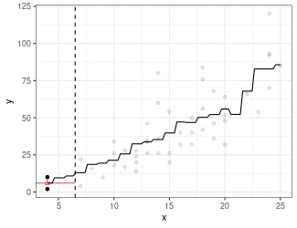
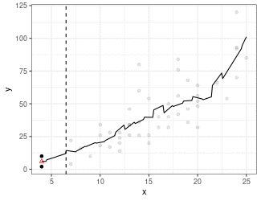
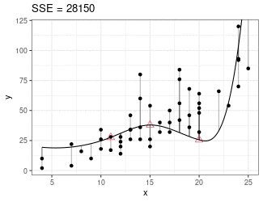

```{r setup, include=FALSE, message=FALSE}
set.seed(1)
library(latex2exp)
library(tidyverse)
library(ggthemes)
knitr::opts_chunk$set(echo       = TRUE, 
                      fig.align  = "center",
                      fig.height = 3, fig.width = 4)
ggplot2::theme_set(ggplot2::theme_bw() + ggplot2::theme(strip.background = ggplot2::element_rect(fill = "white")))
```

```{r klippy, echo=FALSE, include=TRUE}
klippy::klippy()
```

# Learning Objectives

- Various GIFs for nonparametric regression.

# Kernel Regression

```{r, eval = FALSE, echo = FALSE}
#' Kernel regression plot demonstration
#' 
#' @param x The observed x-values
#' @param y The observed y-values
#' @param x0 The point at which we want to make a prediction
#' @param bandwidth The bandwidth
ksquart <- function(x, y, x0, bandwidth = 2.5) {
  ksdf <- as.data.frame(ksmooth(x = x, 
                                y = y,
                                kernel = "box",
                                bandwidth = 2 * bandwidth))
  
  df <- tibble(x = x,
               y = y,
               w = 1 * (abs((x0 - x) / bandwidth) <= 1)
               )
  y0 <- sum(df$w * df$y / sum(df$w))
  
  # df2 <- data.frame(x = seq(min(df$x), max(df$x), length.out = 200))
  # df2$w <- 1 * (abs((x0 - df2$x) / bandwidth) <= 1)
  # ggplot(df, aes(x = x, y = w)) +
  #   geom_point() +
  #   ylab("Gaussian Kernel Weight") +
  #   geom_line(data = df2)

  ggplot(df, aes(x = x, y = y, alpha = w)) +
    geom_point() +
    annotate(geom = "point", x = x0, y = y0, color = "red", shape = 2) +
    geom_vline(xintercept = x0 - bandwidth, lty = 2) +
    geom_vline(xintercept = x0 + bandwidth, lty = 2) +
    annotate(geom = "segment", 
             x = x0 - bandwidth,
             xend = x0 + bandwidth,
             y = y0, 
             yend = y0,
             col = 2) +
    geom_line(data = ksdf, mapping = aes(x = x, y = y), alpha = 1) +
    guides(alpha = "none") +
    coord_cartesian(xlim = c(min(x), max(x))) +
    theme_bw()
}

x <- cars$speed
y <- cars$dist
ksquart(x = x, y = y, x0 = 2)

x0seq <- seq(min(x), max(x), length.out = 200)
pl_list <- list()
for (i in seq_along(x0seq)) {
  pl_list[[i]] <- ksquart(x = x, y = y, x0 = x0seq[[i]])
}
library(animation)
saveGIF(expr = {
  for (i in seq_along(pl_list)) {
    print(pl_list[[i]])
  }
}, movie.name = "./ksreg.gif", interval = 0.1, ani.height = 250, ani.width = 325)
```

- Estimate mean of points in the window (because we are using the [box kernel](https://en.wikipedia.org/wiki/Kernel_(statistics)#Kernel_functions_in_common_use)).

\ 

# Local Linear Regression (Simplified LOESS)

```{r, eval = FALSE, echo = FALSE}
library(tidyverse)
x <- cars$speed
y <- cars$dist
bandwidth <- 2.5

simdf <- data.frame(x0 = seq(min(x), max(x), length.out = 200),
                    y0 = NA_real_,
                    beta0 = NA_real_,
                    beta1 = NA_real_)

for (i in seq_len(nrow(simdf))) {
  x0 <- simdf$x0[[i]]
  df <- tibble(x = x,
               y = y,
               w = 1 * (abs((x0 - x) / bandwidth) <= 1)
               )
  lmout <- lm(y ~ x, data = df, weights = w)
  simdf$y0[[i]] <- predict(lmout, data.frame(x = x0))
  simdf$beta0[[i]] <- coef(lmout)[[1]]
  simdf$beta1[[i]] <- coef(lmout)[[2]]
}

pl_list <- list()
for (i in seq_len(nrow(simdf))) {
  x0 <- simdf$x0[[i]]
  y0 <- simdf$y0[[i]]
  beta0 <- simdf$beta0[[i]]
  beta1 <- simdf$beta1[[i]]
  df <- tibble(x = x,
               y = y,
               w = 1 * (abs((x0 - x) / bandwidth) <= 1)
               )
  
  ggplot(df, aes(x = x, y = y, alpha = w)) +
    geom_point() +
    annotate(geom = "point", x = x0, y = y0, color = "red", shape = 2) +
    geom_vline(xintercept = x0 - bandwidth, lty = 2) +
    geom_vline(xintercept = x0 + bandwidth, lty = 2) +
    annotate(geom = "segment", 
             x = x0 - bandwidth,
             xend = x0 + bandwidth,
             y = beta0 + beta1 * (x0 - bandwidth), 
             yend = beta0 + beta1 * (x0 + bandwidth),
             col = 2) +
    geom_line(data = simdf, mapping = aes(x = x0, y = y0), alpha = 1) +
    guides(alpha = "none") +
    coord_cartesian(xlim = c(min(x), max(x))) +
    theme_bw() ->
    pl_list[[i]]
}

library(animation)
saveGIF(expr = {
  for (i in seq_along(pl_list)) {
    print(pl_list[[i]])
  }
}, movie.name = "./lsreg.gif", interval = 0.1, ani.height = 250, ani.width = 325)
```

- Fit a regression line using only points in window (because we are using the [box kernel](https://en.wikipedia.org/wiki/Kernel_(statistics)#Kernel_functions_in_common_use)).

- Use regression line to estimate point at red triangle.

\ 

# Smoothing Splines

```{r, eval = FALSE, echo = FALSE}
set.seed(7)
library(tidyverse)
library(splines)
x <- cars$speed
y <- cars$dist
knots <- quantile(x = x, probs = c(0.2, 0.5, 0.8))
bmat <- bs(x = x, knots = knots)

bnots <- cbind(1, bs(x = knots, knots = knots, Boundary.knots = range(x)))

lmout <- lm(y ~ bmat)
beta <- coef(lmout)


xnew <- seq(min(x), max(x), length.out = 200)
bnew <- cbind(1, bs(xnew, knots = knots))


beta0 <- beta + rnorm(n = 7, mean = 0, sd = beta)
betamat <- mapply(FUN = seq, from = beta0, to = beta, length.out = 50)

pl_list <- list()
for (i in seq_len(nrow(betamat))) {
  betanow <- betamat[i, ]
  ynew <- bnew %*% betanow
  ynots <- bnots %*% betanow
  
  yhat <- cbind(1, bmat) %*% betanow
  sse <- sum((y - yhat)^2)
  
  tibble(x = x, y = y, yhat) %>%
    ggplot() +
    geom_point(aes(x = x, y = y)) +
    geom_segment(aes(x = x, y = y, yend = yhat, xend = x), alpha = 0.3) +
    annotate(geom = "point", x = knots, y = ynots, col = 2, pch = 2, size = 3) +
    geom_line(data = tibble(x = xnew, y = ynew), mapping = aes(x = x, y = y)) +
    theme_bw() +
    coord_cartesian(ylim = c(min(y), max(y))) +
    ggtitle(paste0("SSE = ", round(sse))) ->
    pl_list[[i]]
}

library(animation)
saveGIF(expr = {
  for (i in seq_along(pl_list)) {
    print(pl_list[[i]])
  }
}, movie.name = "./spreg.gif", interval = 0.1, ani.height = 250, ani.width = 325)

```

- Piecewise cubic between knots (red triangles).

- Derivatives on both sides of knots must be equal.

- Minimize sum of squares.

\ 


