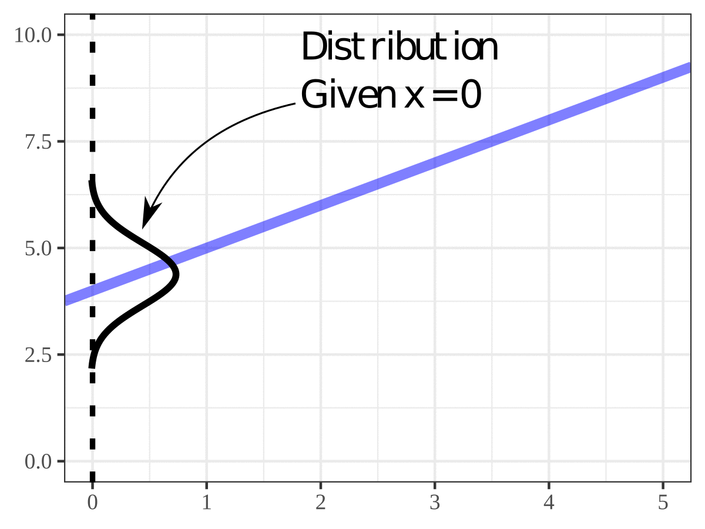
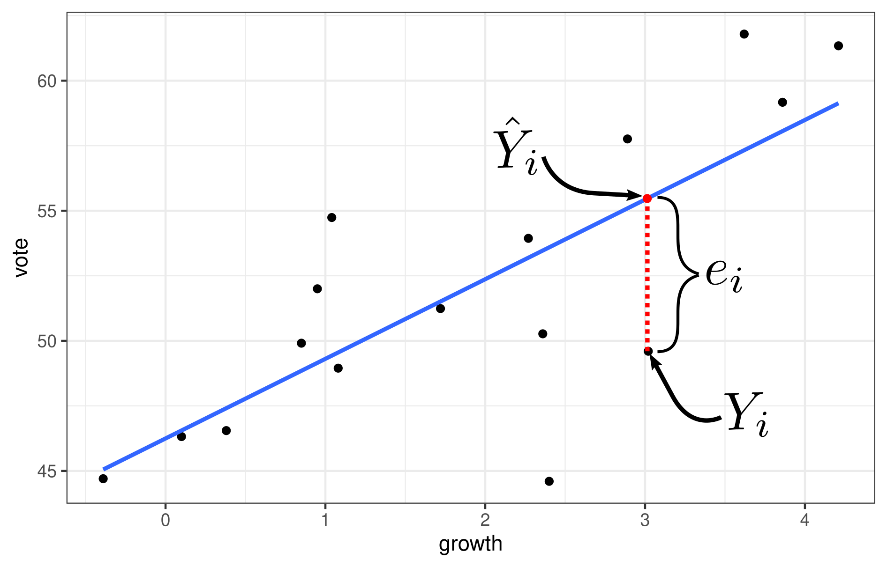

```{r setup, include=FALSE}
set.seed(1)
knitr::opts_chunk$set(echo       = TRUE, 
                      fig.align  = "center")
ggplot2::theme_set(ggplot2::theme_bw() + ggplot2::theme(strip.background = ggplot2::element_rect(fill = "white")))
```

```{r klippy, echo=FALSE, include=TRUE}
klippy::klippy()
```

# Learning Objectives

- Chapter 1 of KNNL.
- Goals of regression analysis.
- The simple linear regression model.
- Least-squares approach to estimating parameters.
- The Ordinary Least Squares (OLS) estimates.

# Overview

- **Observational/experimental Units**: The people/places/things/animals/groups
  that we collect information about. Also known as "individuals" or "cases".
  Sometimes I just say "units".
  
- **Variable**: A property of the observational/experimental units. 
    - E.g.: height of a person, area of a country, marital status.
    
- **Value**: The specific level of a variable for an observational/experimental 
  unit.
    - E.g.: Bob is 5'11'', China has an area of 3,705,407 square miles, Jane is divorced.
    
- **Quantitative Variable**: The variable takes on numerical values where arithmetic operations ($+$/$-$/$\times$/$\div$) make sense. 
    - E.g.: height, weight, area, income.
    - Counterexample: Phone numbers, social security numbers.

- **Regression Analysis**: Study relationship between or more *quantitative* variables.

- **Response Variable**: 
    - What we think is either caused by or explained by the predictor variable. 
    - Also called "outcome variable" and "dependent variable". 
    - Usually denote this with the letter $y$.

- **Predictor Variable**: 
    - What we think causes or explains the outcome variable. 
    - Also called a "feature", "explanatory variable", "independent variable", and (when doing an experiment) a "treatment variable". 
    - Typically have more than one predictor. 
    - Usually denote these with the letters $x_1$, $x_2$, $x_3$, $\ldots$, $x_p$.

- Two quantitative variables can have either a **functional** or a **statistical** relationship.

- **Functional relationship**: There is an exact mathematical formula relating the value of one quantitative variable $x$ (the predictor) to the other $y$ (the response).
    $$
    y = f(x)
    $$
    $f()$ is some function relating the correspondence of $x$ to $y$.

    - E.g.: $x$ = the radius of a circle and $y$ = the area of a circle then
        $$
        y = \pi x^2
        $$
    
    ```{r, echo=FALSE, message=FALSE, fig.width = 4, fig.height = 3}
    library(tidyverse)
    library(latex2exp)
    df <- tibble(x = seq(0, 1, length.out = 5)) %>%
      mutate(y = pi * x ^ 2)
    
    tibble(x = seq(0, 1, length.out = 100)) %>%
      mutate(y = pi * x ^ 2) %>%
      ggplot(aes(x = x, y = y)) +
      geom_line() +
      geom_point(data = df) +
      theme(axis.text = element_blank(),
            axis.ticks = element_blank())
    ```
    
- **Statistical Relationship**: 
    - Is not a perfect relation. 
    - Functional + noise.
    
    - E.g. "bread and peace" data from Chapter 7 of [ROS](https://avehtari.github.io/ROS-Examples/) looking at the statistical relationship between economic growth and vote-share of the incumbant for president.
    
    ```{r, message=FALSE}
    library(readr)
    library(ggplot2)
    hibbs <- read_csv("https://dcgerard.github.io/stat_415_615/data/hibbs.csv")
    qplot(x = growth, y = vote, data = hibbs) +
      geom_smooth(method = "lm", se = FALSE)
    ```

    - Can say higher higher growth tends to have higher vote-share. But relationship is not perfect (but still pretty good!)

    - The scattering of points about the line represents variation in vote share that is not associated with economic growth.
    
- Goals of Regression:

    1. **Description**:
        a. Gene expression ($x$) is associated with height ($y$).
        b. Biological sex ($x$) is associated with salary ($y$).
        
    2. **Prediction**:
        a. Predict sales ($y$) based on product attributes ($x$'s)
        b. Predict crop yield ($y$) based on genomic markers ($x$'s)

- When we describe relationships, this does not imply causation.
    - You need very special settings for "causal inference", which we might cover later in the course.
    - One special case where we can make causal claims is when we have a completely randomized experiment, where predictor values are randomly assigned.

- E.g. A researcher noticed that murder rates went up whenever ice cream consumption increased.

# The Simple Linear Regression Model

- The model: 
    $$
    Y_i = \beta_0 + \beta_i X_i + \epsilon_i
    $$
    
    - $Y_i$: The response value for unit $i$. 
    
    - $X_i$: The predictor value for unit $i$.
    
    - $\beta_0$: The $y$-intercept of the regression line.
    
    - $\beta_1$: The slope of the regression line.
    
    - $\epsilon_i$: The random noise of individual $i$.
        - This is a random variable.
        - $E[\epsilon_i] = 0$ (mean zero).
        - $var(\epsilon_i) = \sigma^2$ (variance is the same for all $i$).
        - $cor(\epsilon_i, \epsilon_j) = 0$ for all $i \neq j$ (uncorrelated errors).

- $X_i$ and $Y_i$ are typically known. We usually have a sample of $(X_1, Y_1), (X_2, Y_2), \ldots, (X_n, Y_n)$.
    - E.g. $X_i$ could be the economic growth in year $i$, and $Y_i$ could be the incumbent vote-share for year $i$. 
    
- $\beta_0$, $\beta_1$ are called **parameters** and are typically not observed. They must be inferred from a sample of values $(X_1, Y_1), (X_2, Y_2), \ldots, (X_n, Y_n)$.

- **Regression line**: $y = \beta_0 + \beta_1x$

- Assumptions in decreasing order of importance:
    
    1. **Linearity**: $E[Y_i|X_i] = \beta_0 + \beta_1X_i$
    
    2. **Uncorrelated errors**: $cor(\epsilon_i, \epsilon_j) = 0$ for all $i \neq j$
    
    3. **Constant Variance**: $var(\epsilon_i) = \sigma^2$
    
- Note: Distribution of $Y_i$ is conditional on $X_i$.

    {width=50%}\ 

- **Exercise**: Suppose the regression model between two variables is
    $$
    Y_i = 3 + 2 x_i + \epsilon_i,~~var(\epsilon_i) = \sigma^2
    $$
    
    1. What is the mean of $Y_i$ if $X_i = -1$?
    
```{block, eval = FALSE, echo = FALSE}
The mean is 1. 3 - 2 * -1
```

    2. What is the variance of $Y_i$ if $X_i = -1$?
    
    ```{block, eval = FALSE, echo = FALSE}
    $\sigma^2$, as it is for all values of $X_i$.
    ```
    
    3. Suppose $X_i = 1$ and $Y_i = 4$. What is $\epsilon_i$?
    
    ```{block, eval = FALSE, echo = FALSE}
    $\epsilon_i = Y_i - \beta_0 - \beta_1 X_i = 4 - 3 - 2 * 1 = -1$
    ```

# Review of interpretation

- $\beta_0$:
    - $Y$-intercept of the regression line.
    - If $0$ is in the range of the $X_i$'s, then can also interpret this as the value of $E[Y_i|X_i = 0]$. But cannot use this interpretation if 0 is outside of the $X_i$'s.
    
- $\beta_1$: 
    - Difference in average of $Y_i$'s when $X_i$'s differ by 1.
    - Do **not** use implicitely causal language like "change" or "increase" or "decrease".
    
- Relationships are **positive** if $\beta_1 > 0$ (larger $x$ tend to correspond to larger $y$).

    ```{r, echo = FALSE, fig.height=3, fig.width=5}
    a <- 0.15
    b <- 0.4
    par(mar=c(3,3,1,1), mgp=c(2,.5,0), tck=-.01)
    plot(c(0,2.2), c(0,a+2.2*b), pch=20, cex=.5, main=TeX("$y = \\beta_0 + \\beta_1 x$ (with $\\beta_1 > 0$)"),
      bty="l", type="n", xlab="x", ylab="y", xaxt="n", yaxt="n", xaxs="i", yaxs="i")
    axis(1, c(0,1,2))
    axis(2, c(a,a+b,a+2*b), c(TeX("$\\beta_0$"),TeX("$\\beta_0+\\beta_1$"),TeX("$\\beta_0+2\\beta_1$")))
    abline(a, b, lwd = 3, col = "blue")
    ```

    

- Relationships are **negative** if $\beta_1 < 0$ (larger $x$ tend to correspond to smaller $y$).

    ```{r, echo = FALSE, fig.height=3, fig.width=5}
    a <- 0.95
    b <- -0.4
    par(mar=c(3,3,1,1), mgp=c(2,.5,0), tck=-.01)
    plot(c(0,2.2), c(0,a+.2), pch=20, cex=.5, main=TeX("$y = \\beta_0 + \\beta_1 x$ (with $\\beta_1 < 0$)"),
      bty="l", type="n", xlab="x", ylab="y", xaxt="n", yaxt="n", xaxs="i", yaxs="i")
    axis(1, c(0,1,2))
    axis(2, c(a,a+b,a+2*b), c(TeX("$\\beta_0$"),TeX("$\\beta_0+\\beta_1$"),TeX("$\\beta_0+2\\beta_1$")))
    abline(a, b, lwd = 3, col = "blue")
    ```
    
- Two variables are uncorrelated if $\beta_1 = 0$ (the value of $x$ does not matter, the value of $y$ tends to stay the same).

    ```{r, echo = FALSE, fig.height=3, fig.width=5}
    a <- 0.15
    b <- 0
    par(mar=c(3,3,1,1), mgp=c(2,.5,0), tck=-.01)
    plot(c(0, 2), c(a, a), pch=20, cex=.5, main=TeX("$y = \\beta_0 + \\beta_1 x$ (with $\\beta_1 = 0$)"),
      bty="l", type="n", xlab="x", ylab="y", xaxt="n", yaxt="n", xaxs="i", yaxs="i")
    axis(1, c(0,1,2))
    axis(2, c(a), c(TeX("$\\beta_0$")))
    abline(a, b, lwd = 3, col = "blue")
    ```
    
- **Example**: In the bread and peace example, a regression line that fits the data well is

    $$
    y = 46.25 + 3.06
    $$
    
    **Correct**: Years that show 1 percentage point more growth tend to have 3 percentage points larger vote shares for the incumbant.
    
    **Incorrect**: Incumbant vote-share increases 3 percentage points for each 1 percentage point increase in growth.

# Estimating Parameters
    
```{r, echo = FALSE, eval = FALSE}
library(animation)
library(dplyr, warn.conflicts = FALSE)
library(tidyr, warn.conflicts = FALSE)
vote_mean <- mean(hibbs$vote)
growth_mean <- mean(hibbs$growth)
lmout <- lm(vote ~ growth, data = hibbs)
slope_max <- coef(lmout)[["growth"]]

slope_seq <- seq(0, slope_max, length.out = 25)
slope_seq <- c(slope_seq, rev(slope_seq))

pl_list <- list()
for (i in seq_along(slope_seq)) {
  slope <- slope_seq[[i]]
  hibbs %>%
    mutate(vote_center = vote - vote_mean,
           growth_center = growth - growth_mean,
           x1 = growth_center,
           y1 = slope * x1,
           x2 = x1,
           y2 = vote_center,
           diff = y1 - y2,
           x3 = x1 + diff,
           y3 = y2,
           x4 = x3,
           y4 = y1,
           x5 = x1,
           y5 = y1) %>%
    select(-year, 
           -growth, 
           -vote,
           -inc_party_candidate, 
           -other_candidate,
           -growth_center, 
           -vote_center) %>%
    mutate(obs = row_number()) %>%
    gather(-diff, -obs, key = "coord", value = "value") %>%
    separate(col = "coord", into = c("dim", "pos"), sep = 1) %>%
    spread(key = "dim", value = "value") %>%
    mutate(x = x + growth_mean,
           y = y + vote_mean,
           diff = abs(diff)) ->
    polydf
  
  polydf %>%
    select(diff, pos) %>%
    filter(pos == 1) %>%
    summarize(ss = sum(diff ^ 2)) %>%
    .$ss ->
    ss
  
  ggplot() +
    geom_point(data = hibbs, mapping = aes(x = growth, y = vote)) +
    geom_polygon(data = polydf, 
                 mapping = aes(x = x, y = y, group = obs, fill = diff), 
                 alpha = 1/5) +
    theme(legend.position = "none") +
    geom_abline(slope = slope, intercept = vote_mean - slope * growth_mean) +
    ylim(44.6, 61.8) +
    xlim(-7, 12) +
    ggtitle(paste0("Sum of Squares: ", round(ss))) +
    scale_fill_gradient(low = "blue", high = "orange", breaks = seq(0, 10, length = 10)) ->
    pl

  pl_list[[i]] <- pl
}

saveGIF(expr = {
  for (i in seq_along(pl_list)) {
    print(pl_list[[i]])
  }
}, movie.name = "ols.gif", interval = 0.1)
```


- We have data $(X_1, Y_1), (X_2, Y_2), \ldots, (X_n, Y_n)$, and we want to estimate $\beta_0$ and $\beta_1$ in the equation

    $$
    Y_i = \beta_0 + \beta_1 X_i + \epsilon_i
    $$

- Idea: Try to get $Y_i$  as close to its mean. So we want each $Y_i - (\beta_0 + \beta_1 X_i)$ to be close to 0.

- To make all of these differences on average close to zero, consider minimizing the *sum of squares*:

    $$
    \sum_{i=1}^n \left[Y_i - (\beta_0 + \beta_1 X_i)\right]^2
    $$

- Visualization:

    

- We can solve for the $\beta_0$ and $\beta_1$ that minimize this sum of squares.

- We denote the resulting estimates by $\hat{\beta}_0$ and $\hat{\beta}_1$, and call them the **OLS estimates** (ordinary least squares estimates).

- In equations:

    \begin{align}
    \hat{\beta}_0 &= \bar{Y} - \hat{\beta}_1\bar{X},\\
    \hat{\beta}_1 &= cor(X, Y) \frac{sd(Y)}{sd(X)},\\
    cor(X, Y) &= \frac{\frac{1}{n-1}\sum_{i=1}^n(X_i - \bar{X})(Y_i - \bar{Y})}{\sqrt{\frac{1}{n-1}\sum_{i=1}^n(X_i - \bar{X})^2}\sqrt{\frac{1}{n-1}\sum_{i=1}^n(Y_i - \bar{Y})^2}},\\
    sd(X) &= \sqrt{\frac{1}{n-1}\sum_{i=1}^n(X_i - \bar{X})^2},\\
    sd(Y) &= \sqrt{\frac{1}{n-1}\sum_{i=1}^n(Y_i - \bar{Y})^2}.
    \end{align}
    
- Notice that the estimate of $\beta_1$ is a linear function of the correlation coefficient.

- To derive these (if you are a Statistics BS or MS, you should do this exercise once without looking at the solution):
    1. Take the derivative of the least squares objective function with respect to both $\beta_0$ and $\beta_1$. 
    2. Set equal to 0 and solve for $\beta_0$ and $\beta_1$ (2 equations and 2 unknowns).
    3. Simplify into the terms above.
    4. Use a second derivative test to verify that this is a minimum.
    
## Note on Least Squares

- Least squares inference is much more widely applicable to beyond the linear model.

- Suppose

    $$
    Y_i = f(X_i;\theta) + \epsilon_i,
    $$
    
    where $\theta$ is some vector of parameters. E.g. in the simple linear regression model 
    $$
    \theta = (\beta_0, \beta_1) \text{ and}\\
    f(X_i;\theta) = \beta_0 + \beta_1X_i
    $$
    Then we can estimate $\theta$ by minimizing the sum of squares over $\theta$.
    
    $$
    \hat{\theta} = \text{argmin}_{\theta}\sum_{i=1}^n\left[Y_i - f(X_i;\theta)\right]^2
    $$
    
- If it is hard to find $\hat{\theta}$ analytically, then there are numerical procedures that can be used to systematically minimize the sum of squares (e.g. gradient descent).

# Finding OLS Estimates in R

- Use `lm()` (for "linear model") to obtain coefficient estimates.

- The first argument of `lm()` is a *formula* of the form `response ~ predictor`. That squiggly line (`~`) separating the response from the predictor is called a "tilde".

- The second argument is the data frame that holds the variables.

- Using the Hibbs data

    ```{r}
    lmout <- lm(vote ~ growth, data = hibbs)
    ```

- You can print out the values and the values under `Coefficients` are the OLS estimates of $\beta_0$ and $\beta_1$.

    ```{r}
    lmout
    ```
    
- $\hat{\beta}_0 = 46.25$

- $\hat{\beta}_1 = 3.06$

- Estimated regression line: $y = 46.25 + 3.06 x$.

- It is a pain to extract these values using base R, but the `{broom}` package has a nice function called `tidy()` that returns coefficient estimates in a data frame.

    ```{r}
    library(broom)
    est <- tidy(lmout)
    est
    est$estimate
    ```

- **Exercise**: From the `mtcars` data, find the OLS estimates of `mpg` (the response) on `wt` (the predictor). Interpret the coefficients. You can load these data into R using:

    ```{r}
    data("mtcars")
    ```

    ```{r, eval = FALSE, echo = FALSE}
    ## always plot the data first
    qplot(x = wt, y = mpg, data = mtcars) + geom_smooth(method = "lm", se = FALSE)
    
    tout <- tidy(lm(mpg ~ wt, data = mtcars))
    tout$estimate
    ```

    ```{block, eval = FALSE, echo = FALSE}
    $\hat{\beta}_0$ = 37.285. The slope of the regression line.
    
    $\hat{\beta}_1$ = -5.344. Cars that are 1000 lbs heavier tend to have 5.3 worse miles per gallon.
    ```

# Properties of OLS Estimates

1. Unbiased:

    $$
    E[\hat{\beta}_0] = \beta_0\\
    E[\hat{\beta}_1] = \beta_1
    $$

2. Gauss-Markov Theorem

    The OLS estimates have minimum sampling variance in the class of unbiased estimators that are linear functions of $Y_1, Y_2,\ldots,Y_n$.
    
- Recall **sampling distribution**: The distribution of an estimator across many theoretical samples. The sampling variance is the variance of the sampling distribution.

- Let's demonstrate the unbiased property through simulation. Let's choose $\beta_0$, $\beta_1$, and the $X_i$'s:

    ```{r}
    x <- runif(n = 100)
    beta0 <- 1
    beta1 <- 2
    ```

- To simulate $Y_i$'s, we generate new errors each replication.

    ```{r}
    epsilon <- rbeta(n = 100, shape1 = 0.2, shape2 = 0.2) - 0.5
    qplot(epsilon, bins = 10)
    y <- beta0 + beta1 * x + epsilon
    qplot(x, y) + geom_abline(slope = beta1, intercept = beta0, lty = 2, col = 2)
    ```

- We then use `lm()` to find $\hat{\beta}_0$ and $\hat{\beta}_1$ each replication.
    ```{r}
    lmout <- lm(y ~ x)
    beta0_hat <- tidy(lmout)$estimate[[1]]
    beta1_hat <- tidy(lmout)$estimate[[2]]
    beta0_hat
    beta1_hat
    ```

- We can use a for-loop to generate many samples, and for each sample we collect the $\hat{\beta}_0$ and the $\hat{\beta}_1$

    ```{r}
    nrep <- 1000
    beta0_hat <- rep(NA, nrep)
    beta1_hat <- rep(NA, nrep)
    for (i in 1:nrep) {
      epsilon <- rbeta(n = 100, shape1 = 0.2, shape2 = 0.2) - 0.5
      y <- beta0 + beta1 * x + epsilon
      lmout <- lm(y ~ x)
      beta0_hat[[i]] <- tidy(lmout)$estimate[[1]]
      beta1_hat[[i]] <- tidy(lmout)$estimate[[2]]
    }
    ```

- The average of the estimates are near the parameters

    ```{r}
    mean(beta0_hat)
    beta0
    ```
    
    ```{r}
    mean(beta1_hat)
    beta1
    ```

- We can visualize the variability about the estimates

    ```{r}
    qplot(beta0_hat, bins = 20) + geom_vline(xintercept = beta0, color = "red")
    
    qplot(beta1_hat, bins = 20) + geom_vline(xintercept = beta1, color = "red")
    ```

- Note: In this simulation process, the $X_i$'s were **fixed** each replication (from sample to sample). This is an assumption of most sampling properties that we'll discuss.


# Estimating mean response

- The estimated regression line is
    
    $$
    \hat{Y} = \hat{\beta}_0 + \hat{\beta}_1X
    $$

- $\hat{Y}$ is the estimate of the mean response when the level of the predictor is $X$.

- We set $\hat{Y}_i = \hat{\beta}_0 + \hat{\beta}_1X_i$ for the observed levels of predictors $X_1, X_2,\ldots, X_n$. These are called the **fitted values**. These are in contrast to the **observed values**, which are just the original $Y_1,Y_2,\ldots,Y_n$.

- **Exercise**: Recall that in the bread and peace example, the estimated regression function is
    $$
    \hat{Y} = 46.248 + 3.061 X
    $$
    What is the estimated mean incumbant vote-share when the growth is 2\%?
    
    ```{block, eval = FALSE, echo = FALSE}
    46.248 + 3.061 * 2 = 52.37\%
    ```

# Residuals

- We often evaluate the performance of a model by looking at how far the fitted values are from the observed values.

- The $i$th **residual** are 
    $$
    e_i = Y_i - \hat{Y}_i.
    $$
- These are different from the model error terms, which are
    $$
    \epsilon_i = Y_i - E[Y_i|X_i]
    $$

- The residuals are the deviation from an *estimated* regression function, and so are known.

- The error terms are the deviation from the *unknown true* regression function, and so are unknown.

- Graphic:

    \ 
    
- **Exercise**: In the above graphic, is the residual *positive* or *negative*? Did we underestimate or over estimate here?

    ```{block, eval = FALSE, echo = FALSE}
    The residual is negative since $Y_i$ is less than $\hat{Y}_i$. We underestimated.
    ```

# Obtaining fitted values and residuals in R

- To obtain predictions, you need to 
  1. Have the output of `lm()` saved to a variable.
  2. Have a data frame with the new predictor values you want.
  3. Use the `predict()` function.
  
    ```{r}
    lmout <- lm(vote ~ growth, data = hibbs)
    newdf <- data.frame(growth = c(1.1, 2.2))
    newdf
    predict(object = lmout, newdata = newdf)
    ```

- To obtain the fitted values and the residuals, use `augment()` from the `{broom}` package. Pass to it the output from `lm()`.

    ```{r}
    aout <- augment(x = lmout)
    glimpse(aout)
    ```
    
# Alternative means to obtain fitted values and residuals in R.

- If `augment()` does not work, there are base R methods to obtain residuals and fitted values.

- You can get the residuals via `residuals()`

    ```{r}
    residuals(object = lmout)
    ```

- You can get the fitted values via `fitted()`.

    ```{r}
    fitted(object = lmout)
    ```

# Properties of Fitted Regression Line

- I've seen folks over-interpret these items when they are just properties of every OLS line. So it's good to be aware of these.

1. Mean of residuals is 0.
    $$
    \frac{1}{n}\sum_{i=1}^n e_i = 0
    $$

2. Mean of observed values equals mean of fitted values.
    $$
    \frac{1}{n}\sum_{i=1}^nY_i = \frac{1}{n}\sum_{i=1}^n\hat{Y}_i
    $$

3. Residuals are uncorrelated with predictors
    $$
    \frac{1}{n-1}\sum_{i=1}^n(X_i-\bar{X})(e_i - \bar{e}) = 0
    $$
    (but remember that $\bar{e} = 0$).

4. Residuals are uncorrelated with *fitted* values.
    $$
    \frac{1}{n-1}\sum_{i=1}^n(\hat{Y}_i-\bar{\hat{Y}})(e_i - \bar{e}) = 0
    $$
    But note that the residuals *can* be correlated with the *observed* values.
    
5. The regression line always goes through the mean $(\bar{X}, \bar{Y})$.

- **Exercise**: Demonstrate each of these properties on using the bread and peace data using R.

    ```{r, eval = FALSE, echo = FALSE}
    # 1. Mean residuals is 0
    mean(aout$.resid)
    
    # 2. Mean observed = mean fitted
    mean(aout$vote)
    mean(aout$.fitted)
    
    # 3. X and e are uncorrelated
    cor(aout$growth, aout$.resid)
    
    # 4. Fitted and resid are uncorrelated
    cor(aout$.fitted, aout$.resid)
    
    # 5. Regression line goes through (xbar,ybar)
    newdf <- data.frame(growth = mean(hibbs$growth))
    predict(object = lmout, newdata = newdf)
    mean(hibbs$vote)
    ```

# Estimating $\sigma^2$

- We'll need an estimate of the variance to do inference (see Chapter 2).

- Recall that the simple linear regression model is
    $$
    Y_i = \beta_0 + \beta_1X_i + \epsilon_i\\
    E[\epsilon_i] = 0\\
    var(\epsilon_i) = \sigma^2
    $$

- So if we knew $\beta_0$ and $\beta_1$ and wanted to estimate $\sigma^2$, we could calculate
    $$
    \epsilon_i = Y_i - (\beta_0 + \beta_1X_i)
    $$
    Then take the sample variance of the $\epsilon_i$'s.

- But we don't know $\beta_0$ and $\beta_1$, so we insert their OLS estimates to get the residuals
    $$
    e_i = Y_i - (\hat{\beta}_0 + \hat{\beta}_1X_i)
    $$
    And then take the sample variance of the residuals to estimate $\sigma^2$.
    
- We divide by $n-2$ to account for the two degrees of freedom lost when estimating $\beta_0$ and $\beta_1$.

    \begin{align}
    \hat{\sigma}^2 &= \frac{1}{n-2}\sum_{i=1}^ne_i^2\\
                   &= \frac{1}{n-2}\sum_{i=1}^n(Y_i - \hat{Y}_i)^2\\
                   &= \frac{1}{n-2}\sum_{i=1}^n[Y_i - (\hat{\beta}_0 + \hat{\beta}_1X_i)]^2 
    \end{align}

- This estimate is sometimes called the **Mean Squared Error** (MSE).

### Intuition behind degrees of freedom

- If we knew $\beta_0$ and $\beta_1$, the best variance estimator we could come up with would be
    $$
    s_1^2 = \frac{1}{n}\sum_{i=1}^n[Y_i - (\beta_0 + \beta_1X_i)]^2 
    $$

- But we don't know these quantities, so we use $\hat{\beta}_1$ and $\hat{\beta}_2$. 

    $$
    s_2^2 = \frac{1}{n}\sum_{i=1}^n[Y_i - (\hat{\beta}_0 + \hat{\beta}_1X_i)]^2 
    $$

- But remember that $\hat{\beta}_1$ and $\hat{\beta}_2$ minimize the objective, which is exactly the MSE. That means that
    $$
    s_2^2 < s_1^2
    $$
    
- Dividing by the smaller $n-2$ instead of the larger $n$ corrects for this. That's why we use
    $$
    \hat{\sigma}^2 = \frac{1}{n-2}\sum_{i=1}^n[Y_i - (\hat{\beta}_0 + \hat{\beta}_1X_i)]^2 
    $$
    
- It can be shown that
    $$
    E[\hat{\sigma}^2] = \sigma^2
    $$

# The Normal Linear Model

- We have so far made only minimal distributional assumptions. We have **not** assumed normality so far. All of these properties of the OLS estimators hold without assuming normality.

- We sometimes assume that the error terms are normally distributed. The **normal simple linear model** is

    $$
    Y_i = \beta_0 + \beta_1 X_i + \epsilon_i\\
    \epsilon_i \sim N(0, \sigma^2)\\
    \epsilon_1,\epsilon_2,\ldots,\epsilon_n \text{ are mutually independent}.
    $$

- "Mutually independent" means that knowing the value of one tells you nothing about the values of the others.
    - In the normal model, uncorrelated $\Leftrightarrow$ independent.

- This implies that
    $$
    Y_i|X_i \sim N(\beta_0 + \beta_1 X_i, \sigma^2)
    $$
- **Exercise**: Do we assume that the predictors are normally distributed?
    ```{block, eval = FALSE, echo = FALSE}
    No. I said nothing about the distribution of the predictors. We do **not** require them to be normally distributed.
    ```

- In the normal linear model, we thus have four assumptions, in decreasing order of importance:
    1. **Linearity**: $E[Y_i|X_i] = \beta_0 + \beta_1X_i$
    
    2. **Uncorrelated errors**: $cor(\epsilon_i, \epsilon_j) = 0$ for all $i \neq j$
    
    3. **Constant Variance**: $var(\epsilon_i) = \sigma^2$
    
    4. **Normality**: $\epsilon_i \sim N(0, \sigma^2)$
    
- The normality assumption is really only important if
    1. You have a small sample size and the data are highly skewed, or
    2. You are calculating prediction intervals (Chapter 2).
    
# Method of Maximum Likelihood

- We used the method of least squares to obtain the OLS estimates $\hat{\beta}_0$ and $\hat{\beta}_1$.

- We can derive these estimators using a different technique: the method of maximum likelihood.

- Idea: Given a data-generative model (like the normal linear model), find the parameters that maximize the probability of seeing the data that we actually saw.

    ```{r, echo = FALSE}
    dat <- rnorm(10, mean = 2, sd = 1)
    meanseq <- seq(-2, 4, length.out = 100)
    likeseq <- rep(NA_real_, length.out = length(meanseq))
    for (i in seq_along(meanseq)) {
      likeseq[[i]] <- sum(dnorm(x = dat, mean = meanseq[[i]], sd = 1, log = TRUE))
    }
    
    mleval <- mean(dat)
    mlike <- sum(dnorm(x = dat, mean = mleval, sd = 1, log = TRUE))
    tibble(like = likeseq, mean = meanseq) %>%
      ggplot(aes(x = mean, y = like)) +
      geom_line() +
      xlab("Parameter Value") +
      ylab("log-probability of data given parameter") +
      annotate(x = mleval, y = mlike, geom = "point", color = "red") +
      geom_vline(xintercept = mleval, lty = 2, col = 2)
    ```
    
- This function of the parameter is called the **likelihood function**, and the parameter that maximized this function is called the **maximum likelihood estimate**.
 
- Given the normal assumption and values of $\beta_0$, $\beta_1$, and $\sigma^2$, we can calculate the density (which roughly means the probability) of our observed sample $(X_1, Y_1),(X_2, Y_2),\ldots, (X_n, Y_n)$.

    $$
    f(data|\beta_0,\beta_1,\sigma^2) = \prod_{i=1}^n N(Y_i|\beta_0 + \beta_1X_i, \sigma^2)
    $$
    
- Here, $N(a|b,c^2)$ is notation for the density of value $a$ with mean $b$ and variance $c^2$:
    $$
    N(a|b,c^2) = \frac{1}{\sqrt{2\pi c^2}}\exp\left[-\frac{1}{2c^2}(a-b)^2\right]
    $$

- One idea is to find the values of $\beta_0$, $\beta_1$, and $\sigma^2$ to make the data that we did observe as likely as possible.

- Typically, we actually work with the log-likelihood
    $$
    L(data|\beta_0,\beta_1,\sigma^2) = \sum_{i=1}^n \log \left[N(Y_i|\beta_0 + \beta_1X_i, \sigma^2)\right]
    $$

- Let's calculate the log-likelihood from the bread and peace example at $\beta_0 = 45$, $\beta_1 = 3$ and $\sigma^2 = 3.5$

    ```{r}
    ll <- function(beta0, beta1, sigma2) {
      dnorm(x = hibbs$vote, 
            mean = beta0 + beta1 * hibbs$growth, 
            sd = sqrt(sigma2),
            log = TRUE) %>%
        sum()
    }
    ll(4, 3, 3.5)
    ```

- Now let's do it at the OLS estimates
    ```{r}
    ll(46.25, 3.06, 3.76)
    ```
    
    Much higher!
    
- It turns out the the OLS estimates of $\beta_0$ and $\beta_1$ are also the maximum likelihood estimates of $\beta_0$ and $\beta_1$.

- The MLE of $\sigma^2$ is $\frac{n-2}{n}\hat{\sigma}^2$ (the uncorrected standard deviation estimate).

- Derivation
    \begin{align}
    \max \sum_{i=1}^n \log \left[N(Y_i|\beta_0 + \beta_1X_i, \sigma^2)\right] &= \max\sum_{i=1}^n\left[-\frac{1}{2}\log(2\pi\sigma^2) - \frac{1}{2\sigma^2}(Y_i - \beta_0 - \beta_1X_i)^2\right]\\
    &= \min\sum_{i=1}^n\left[\frac{1}{2}\log(2\pi\sigma^2) + \frac{1}{2\sigma^2}(Y_i - \beta_0 - \beta_1X_i)^2\right]\\
    &= \min\left[n\frac{1}{2}\log(2\pi\sigma^2) + \frac{1}{2\sigma^2}\sum_{i=1}^n(Y_i - \beta_0 - \beta_1X_i)^2\right]
    \end{align}
  
    When we minimize over $\beta_0$ and $\beta_1$, we just need to worry about
    the second term. But this is equivalent to minimizing the sum of squares!
    
- Maximum likelihood estimation is a very general approach to estimating a parameter given a data generative model.
