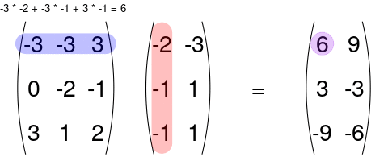

```{r setup, include=FALSE}
library(latex2exp)
knitr::opts_chunk$set(echo       = TRUE, 
                      fig.align  = "center")
ggplot2::theme_set(ggplot2::theme_bw() + ggplot2::theme(strip.background = ggplot2::element_rect(fill = "white")))
```

```{r klippy, echo=FALSE, include=TRUE}
klippy::klippy()
```

# Learning Objectives

- Introduce/review basic linear algebra.
- Sections 5.1--5.7 of KNNL
- Chapters 2 and 3 of [Linear Algebra for Data Science with examples in R](https://shainarace.github.io/LinearAlgebra/)

# Vectors and Matrices

- A **vector** is a list of numbers.

    $$
    \mathbf{x} = 
    \left(
    \begin{array}{c}
    10\\
    3\\
    5
    \end{array}
    \right)
    $$
    
- In the above vector, the first element is 10, the second is 3, and the third is 5. Or, using subscripts to denote indices, we have
    $$
    x_1 = 10,~x_2 = 3, \text{ and } x_3 = 5.
    $$

- Vectors are ordered, so 
    $$
    \left(
    \begin{array}{c}
    10\\
    3\\
    5
    \end{array}
    \right)
    \neq
    \left(
    \begin{array}{c}
    3\\
    10\\
    5
    \end{array}
    \right).
    $$

- I will generally use bold, lower-case letters to represent vectors.

- A **matrix** is a rectangular array of numbers.

    $$
    \mathbf{A} = 
    \left(
    \begin{array}{cc}
    -1 & 4\\
    11 & -4\\
    2 & 8
    \end{array}
    \right)
    $$
    
- The **dimension** of a matrix is the number of rows and columns of that matrix. So the dimension of the above matrix is $3\times 2$ since it has three rows and two columns.

- We index elements by the rows first, then the columns second. For example, in the above matrix, the $(1, 1)$th element is -1, the $(1, 2)$th element is 4, the $(2, 1)$th element is 11, the $(2,2)$th element is -4, the $(3, 1)$th element is 2, and the $(3,2)$th element is 8. Or, using subscripts as indices we have
    $$
    a_{11} = -1,~a_{12} = 4,~a_{21}=11,~a_{22}=-4,~a_{31} = 2,\text{ and } a_{32}=8.
    $$

- I will generally use bold, upper-case letters to represent matrices.

- A vector is just a matrix with one column.

- The **transpose** of a matrix/vector swaps the row and column indices.

    \begin{align}
    \mathbf{x}^T &= (10, 3, 5)\\
    \mathbf{A}^T &= 
    \left(
    \begin{array}{ccc}
    -1 & 11 & 2\\
    4 & -4 & 8
    \end{array}
    \right)
    \end{align}
    
    - First column of $\mathbf{A}$ is the first row of $\mathbf{A}^T$, second column of $\mathbf{A}$ is the second row of $\mathbf{A}^T$. 
    
- You can add two matrices together *as long as they have the same dimensions*. You just sum up the values element-wise:

    $$
    \left(
    \begin{array}{cc}
    1 & 2 \\
    3 & 4
    \end{array}
    \right) 
    +
    \left(
    \begin{array}{cc}
    5 & 6 \\
    7 & 8
    \end{array}
    \right)
    = 
    \left(
    \begin{array}{cc}
    6 & 8 \\
    10 & 12
    \end{array}
    \right)
    $$
    
- You can multiply a matrix by a scalar, where you multiply each element of that matrix by that scalar.
    $$
    2\mathbf{A} = 2
    \left(
    \begin{array}{cc}
    -1 & 4\\
    11 & -4\\
    2 & 8
    \end{array}
    \right)
    = 
    \left(
    \begin{array}{cc}
    2 \times -1 & 2 \times 4\\
    2 \times 11 & 2 \times -4\\
    2 \times 2 & 2 \times8
    \end{array}
    \right) 
    =
    \left(
    \begin{array}{cc}
    -2 & 8\\
    22 & -8\\
    4 & 16
    \end{array}
    \right)
    $$

    
- You can multiply two matrices together as long as the left matrix has the same number of columns as the number or rows of the right matrix. The rules for matrix multiplication are kinda weird (but they are justified if you ever take linear algebra). In effect, you multiply the *row* of the left matrix with the *column* of the right matrix, and add up the resulting multiplied numbers:

    \ 
    
- An awesome visualization from [Shaina Race](https://github.com/shainarace) does a better job of illustrating this:

    \ 
    
- The special case of a matrix multiplied by a vector is below (also from Shaina Race):

    \ 
    
- **Exercise**: Let
    \begin{align}
    \mathbf{X} &= 
    \left(
    \begin{array}{cc}
    3 & -1\\
    1 & -2
    \end{array}
    \right)\\
    \mathbf{Y} &= 
    \left(
    \begin{array}{cc}
    1 & 2\\
    2 & 1
    \end{array}
    \right)
    \end{align}
    Calculate $\mathbf{X}^T\mathbf{Y}$.
    
    ```{block, eval = FALSE, echo = FALSE}
    \begin{align}
    \left(
    \begin{array}{cc}
    5 & 7\\
    -5 & -4
    \end{array}
    \right)
    \end{align}
    ```

- Note that matrix multiplication is generally *not* commutative. That is
    $$
    \mathbf{A}\mathbf{B} \neq \mathbf{B}\mathbf{A}
    $$
    Indeed, even if $\mathbf{A}\mathbf{B}$ exists does not mean that $\mathbf{B}\mathbf{A}$ exists. E.g. Suppose $\mathbf{A}$ is $2 \times 3$ and $\mathbf{B}$ is $3 \times 4$.
    
- The **identity matrix** is the diagonal matrix with 1's in the diagonal. It is the matrix analogue to the number 1. For example, the $3 \times 3$ diagonal matrix is

    $$
    \mathbf{I}_3 = \left(
    \begin{array}{ccc}
    1 & 0 & 0 \\
    0 & 1 & 0 \\
    0 & 0 & 1
    \end{array}
    \right)
    $$
    
- For any matrix $\mathbf{A}$ of dimension $n \times p$, we have
    $$
    \mathbf{I}_n\mathbf{A} = \mathbf{A}\mathbf{I}_p = \mathbf{A}
    $$
    
- **Exercise**: Verify that
    $$
    \left(
    \begin{array}{cc}
    1 & 0 \\
    0 & 1
    \end{array}
    \right)
    \left(
    \begin{array}{cc}
    a & b \\
    c & d
    \end{array}
    \right)
    =
    \left(
    \begin{array}{cc}
    a & b \\
    c & d
    \end{array}
    \right)
    \left(
    \begin{array}{cc}
    1 & 0 \\
    0 & 1
    \end{array}
    \right)
    =
    \left(
    \begin{array}{cc}
    a & b \\
    c & d
    \end{array}
    \right)
    $$
    
- The $n$-vector of all $1$'s is usually denoted $\mathbf{1}_n$
    $$
    \mathbf{1}_n = 
    \left(
    \begin{array}{c}
    1 \\
    1 \\
    \vdots\\
    1
    \end{array}
    \right)
    $$

- The $n\times p$ matrix of all $1$'s is usually denoted $\mathbf{J}_{n\times p}$.
    $$
    \mathbf{J}_{n\times p} = 
    \left(
    \begin{array}{ccc}
    1 & \cdots & 1\\
    \vdots & \ddots & \vdots\\
    1 & \cdots & 1
    \end{array}
    \right)
    $$
    
- The $n$-vector of all $0$'s is usually denoted $\mathbf{0}_n$.
    $$
    \mathbf{0}_n = 
    \left(
    \begin{array}{c}
    0 \\
    0 \\
    \vdots\\
    0
    \end{array}
    \right)
    $$

## Matrix Inverse

- The inverse of a scalar is its reciprocal. E.g. the inverse of 5 is $\frac{1}{5}$. A number multiplied by its inverse is 1
    $$
    5 \times \frac{1}{5} = 1
    $$
- There is a concept of an inverse in linear algebra as well. 

- Only square matrices (the number of rows equals the number of columns) may have inverses.

- Not all square matrices have an inverse.

- When a square matrix has an inverse, it is unique.

- If $\mathbf{A}$ is an $r \times r$ square matrix, then we denote the inverse of $\mathbf{A}$ as $\mathbf{A}^{-1}$. It is the unique $r \times r$ matrix such that
    $$
    \mathbf{A}\mathbf{A}^{-1} = \mathbf{A}^{-1}\mathbf{A} = \mathbf{I}_r
    $$

- **Example**: The inverse of 
    $$
    \mathbf{A} = 
    \left(
    \begin{array}{cc}
    2 & 4\\
    3 & 1
    \end{array}
    \right)
    $$
    is
    $$
    \mathbf{A}^{-1} = 
    \left(
    \begin{array}{cc}
    -0.1 & 0.4\\
    0.3 & -0.2
    \end{array}
    \right)
    $$

- The formula for an inverse matrix is complicated, and not something you need to know for regression (just use a computer).

- Inverse matrices allow us to solve systems of equations. Suppose we have
    $$
    \mathbf{A}\mathbf{Y} = \mathbf{C}
    $$
    and we want to solve for $\mathbf{Y}$. Then we can *pre*multiply (multiply on the left) both the left and right equations by $\mathbf{A}^{-1}$ to obtain
    \begin{align}
    \mathbf{A}^{-1}\mathbf{A}\mathbf{Y} &= \mathbf{A}^{-1}\mathbf{C}\\
    \Rightarrow \mathbf{I}\mathbf{Y} &= \mathbf{A}^{-1}\mathbf{C}\\
    \Rightarrow \mathbf{Y} &= \mathbf{A}^{-1}\mathbf{C}.
    \end{align}
    
## Matrix Rank

- The matrix inverse does not exist if there is redundant information between the columns in the matrix.

- Formally, vectors $\mathbf{a}_1,\mathbf{a}_2,\ldots,\mathbf{a}_p$ are **linearly dependent** if there exist scalars $k_1, k_2,\ldots, k_p$ such that
    $$
    k_1\mathbf{a}_1 + k_2\mathbf{a}_2 + \cdots k_p \mathbf{a}_p = \mathbf{0}
    $$
    
- I.e., you can write one vector in terms of the other vectors.

- **Example**: Let
    \begin{align}
    \mathbf{a}_1 &= 
    \left(
    \begin{array}{c}
    1\\
    2\\
    3
    \end{array}
    \right)\\
    \mathbf{a}_2 &= 
    \left(
    \begin{array}{c}
    -1\\
    3\\
    2
    \end{array}
    \right)\\
    \mathbf{a}_3 &= 
    \left(
    \begin{array}{c}
    -3\\
    -1\\
    -4
    \end{array}
    \right)
    \end{align}
    Then $2\mathbf{a}_1 - \mathbf{a}_2 + \mathbf{a}_3 = \mathbf{0}_3$.
   
- Vectors are **linearly independent** if there do not exist such constants (so each vector provides some new information).

- The **rank** of the matrix is the maximum number of linearly independent columns in the matrix. (we treat each column as a vector).

- **Example**: The rank of the following matrix is 2:
    $$
    \mathbf{A} = 
    \left(
    \begin{array}{ccc}
    1 & -1 & -3\\
    2 & 3 & -1\\
    3 & 2 & -4 
    \end{array}
    \right)
    $$

- The inverse of an $r \times r$ square matrix $\mathbf{A}$  exists if and only if the rank of $\mathbf{A}$ is $r$.

- The maximum possible rank of an $n \times p$ matrix is $\min(n, p)$.

- If $\mathbf{C} = \mathbf{A}\mathbf{B}$, then the rank of $\mathbf{C}$ is less than or equal to $\min(\text{rank }\mathbf{A}, \text{rank }\mathbf{B})$.

- This will show up when we put the covariates in an $n \times p$ ($n$ individuals and $p$ variables) matrix $\mathbf{X}$ and need to calculate the inverse of $\mathbf{X}^T\mathbf{X}$, which is only possible if $n \geq p$.

## Basic Results for Matrices

- $\mathbf{A} + \mathbf{B} = \mathbf{B} + \mathbf{A}$
- $(\mathbf{A} + \mathbf{B}) + \mathbf{C} = \mathbf{A} + (\mathbf{B} + \mathbf{C})$
- $(\mathbf{A}\mathbf{B})\mathbf{C} = \mathbf{A}(\mathbf{B}\mathbf{C})$
- $\mathbf{C}(\mathbf{A} + \mathbf{B}) = \mathbf{C}\mathbf{A} + \mathbf{C}\mathbf{B}$
- $k(\mathbf{A} + \mathbf{B}) = k\mathbf{A} + k\mathbf{B}$
- $(\mathbf{A}^T)^T = \mathbf{A}$
- $(\mathbf{A} + \mathbf{B})^T = \mathbf{A}^T + \mathbf{B}^T$
- $(\mathbf{A}\mathbf{B})^T = \mathbf{B}^T\mathbf{A}^T$
- $(\mathbf{A}\mathbf{B}\mathbf{C})^T = \mathbf{C}^T\mathbf{B}^T\mathbf{A}^T$
- $(\mathbf{A}\mathbf{B})^{-1} = \mathbf{B}^{-1}\mathbf{A}^{-1}$
- $(\mathbf{A}\mathbf{B}\mathbf{C})^{-1} = \mathbf{C}^{-1}\mathbf{B}^{-1}\mathbf{A}^{-1}$
- $(\mathbf{A}^{-1})^{-1} = \mathbf{A}$
- $(\mathbf{A}^T)^{-1} = (\mathbf{A}^{-1})^T$

# Linear Algebra and Simple Linear Regression

- Why am I torturing you with this?
    - Linear algebra allows us to concisely represent linear regression models/estimates/procedures in terms of matrices and vectors.
    - Without linear algebra, such representations in multiple linear regression would be verbose, to say the least.

## Model Representation

- We can represent the simple linear regression model by arranging values in matrices.

- Let
    \begin{align}
    \mathbf{y} &= 
    \left(
    \begin{array}{c}
    Y_1\\
    Y_2\\
    \vdots\\
    Y_n
    \end{array}
    \right),\\
    \mathbf{X} &= 
    \left(
    \begin{array}{cc}
    1 & X_1\\
    1 & X_2\\
    \vdots & \vdots\\
    1 & X_n
    \end{array}
    \right),\\
    \mathbf{\beta} &= 
    \left(
    \begin{array}{c}
    \beta_0\\
    \beta_1
    \end{array}
    \right),\\
    \mathbf{\epsilon} &= 
    \left(
    \begin{array}{c}
    \epsilon_1\\
    \epsilon_2\\
    \vdots\\
    \epsilon_n
    \end{array}
    \right)
    \end{align}

- Then we can represent the simple linear regression model in terms of these matrices
    $$
    \mathbf{y} = \mathbf{X}\mathbf{\beta} + \mathbf{\epsilon}
    $$
    
- Using expectation notation, we can say that
    $$
    E[\mathbf{y}] = 
    \left(
    \begin{array}{c}
    E[Y_1]\\
    E[Y_2]\\
    \vdots\\
    E[Y_n]
    \end{array}
    \right)
    = \mathbf{X}\mathbf{\beta}
    $$

- The column of $1$'s in $\mathbf{X}$ can be seen of defining a variable $X_0 = 1$ and then having
    $$
    Y_i = \beta_0 X_0 + \beta_1 X_i + \epsilon_i
    $$

## Some standard matrix multiplications

$$
\mathbf{Y}^T\mathbf{Y} = \sum_{i=1}^nY_i^2
$$

$$
\mathbf{X}^T\mathbf{X} = 
\left(
\begin{array}{cc}
n & \sum_{i=1}^nX_i\\
\sum_{i=1}^nX_i & \sum_{i=1}^nX_i^2
\end{array}
\right)
$$

$$
\mathbf{X}^T\mathbf{Y} = 
\left(
\begin{array}{c}
\sum_{i=1}^n Y_i\\
\sum_{i=1}^n X_iY_i\\
\end{array}
\right)
$$
    
## Estimates Representation

- You can show that the estimated regression coefficients are
    $$
    \hat{\mathbf{\beta}} = (\mathbf{X}^T\mathbf{X})^{-1}\mathbf{X}^T\mathbf{Y}
    $$

- The fitted values are then
    $$
    \hat{\mathbf{Y}} = \mathbf{X}\hat{\mathbf{\beta}} = \mathbf{X}(\mathbf{X}^T\mathbf{X})^{-1}\mathbf{X}^T\mathbf{Y}
    $$

- The matrix
    $$
    \mathbf{H} = \mathbf{X}\hat{\mathbf{\beta}} = \mathbf{X}(\mathbf{X}^T\mathbf{X})^{-1}\mathbf{X}^T
    $$
    transforms $\mathbf{Y}$ to $\hat{\mathbf{Y}}$ through premultiplication, and so is often called the **hat matrix**. 
    
- The hat matrix plays an important part in diagnostics (Chapter 10).

- **Exercise**: Prove that the hat matrix is **idempotent**. That is
    $$
    \mathbf{H}\mathbf{H} = \mathbf{H}
    $$

    ```{block, eval = FALSE, echo = FALSE}
    \begin{align}
    \mathbf{H}\mathbf{H} &= \mathbf{X}(\mathbf{X}^T\mathbf{X})^{-1}\mathbf{X}^T\mathbf{X}(\mathbf{X}^T\mathbf{X})^{-1}\mathbf{X}^T\\
    &= \mathbf{X}(\mathbf{X}^T\mathbf{X})^{-1}\mathbf{X}^T\\
    &= \mathbf{H}.
    \end{align}
    ```

- The residuals are
    $$
    \mathbf{e} = \mathbf{Y} - \hat{\mathbf{Y}} = \mathbf{Y} - \mathbf{X}(\mathbf{X}^T\mathbf{X})^{-1}\mathbf{X}^T\mathbf{Y} = (\mathbf{I}_n - \mathbf{X}(\mathbf{X}^T\mathbf{X})^{-1}\mathbf{X}^T)\mathbf{Y} = (\mathbf{I}_n - \mathbf{H})\mathbf{Y}.
    $$

# Linear Algebra in R

- You create matrices with the `matrix()` function.

    ```{r}
    A <- matrix(c(1, 2, 3, 4, 5, 6), nrow = 3, ncol = 2)
    A
    ```
    
- Notice that the first column is populated first, then the second column, etc...
    
- You can add/subtract/multiply/divide using a scalar with basic arithmetic operations.
    ```{r}
    2 + A
    2 - A
    A - 2
    2 * A
    A / 2
    2 / A
    ```


- Matrices can be element-wise added/sabtracted/multiplied/divided using `+`/`-`/`*`/`/` as long as these matrices are the same dimension.
    ```{r}
    B <- matrix(c(7, 8, 9, 10, 11, 12), nrow = 3, ncol = 2)
    B
    A + B
    A - B
    A * B
    A / B
    ```
    
- Matrix multiplication is performed using `%*%`. The number of columns of the left matrix must equal the number of rows of the right matrix.

    ```{r}
    C <- matrix(c(-1, 2, 1, 3), nrow = 2, ncol = 2)
    C
    A %*% C
    ```

- The transpose of a matrix is calculated using `t()`.

    ```{r}
    t(A)
    ```

- The inverse of a matrix is calculated using `solve()` (remember, has to be a square matrix).
    ```{r}
    solve(C)
    ```

- You can create the identity matrix using `diag()`
    ```{r}
    diag(x = 3)
    ```

- You can create a matrix of `1`'s by just giving `matrix()` the number 1.
    ```{r}
    matrix(1, nrow = 2, ncol = 3)
    ```


