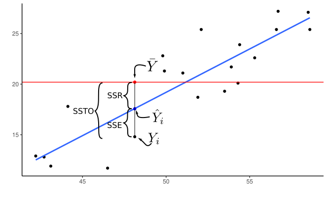

```{r setup, include=FALSE}
library(latex2exp)
knitr::opts_chunk$set(echo       = TRUE, 
                      fig.align  = "center",
                      fig.height = 3, fig.width = 4)
ggplot2::theme_set(ggplot2::theme_bw() + ggplot2::theme(strip.background = ggplot2::element_rect(fill = "white")))
```

```{r klippy, echo=FALSE, include=TRUE}
klippy::klippy()
```

# Learning Objectives

- ANOVA Perspective of hypothesis testing in the multiple linear regression model.
- Sections 6.5, 6.9, 7.1, 7.2, and 7.3 of KNNL

# Sums of squares

- Consider the multiple linear regression model
    $$
    Y_i = \beta_0 + \beta_1 X_{i1} + \beta_2 X_{i2} + \cdots + \beta_{p-1}X_{i,p-1} + \epsilon_i
    $$
- The *error sum of squares* associated with this model is the sum of squared residuals.
    $$
    SSE(X_1,X_2,\ldots,X_{p-1}) = \sum_{i=1}^n\left[Y_i - (\hat{\beta}_0 + \hat{\beta}_1X_{i1} + \hat{\beta}_2X_{i2} + \cdots + \hat{\beta}_{p-1}X_{i,p-1})\right]^2
    $$

- For example, with one variable we have
    $$
    SSE(X_1) = \sum_{i=1}^n\left[Y_i - (\hat{\beta}_0 + \hat{\beta}_1X_{i1})\right]^2
    $$
    or
    $$
    SSE(X_2) = \sum_{i=1}^n\left[Y_i - (\hat{\beta}_0 + \hat{\beta}_2X_{i2})\right]^2
    $$
    etc.
- With two variables we have
    $$
    SSE(X_1,X_2) = \sum_{i=1}^n\left[Y_i - (\hat{\beta}_0 + \hat{\beta}_1X_{i1} + \hat{\beta}_2X_{i2} )\right]^2
    $$

- Note that the $\hat{\beta}$'s are generally different in the above SSE's. That is, $\hat{\beta}_1$ will be different if we fit the model
    $$
    Y_i = \beta_0 + \beta_1 X_{i1} + \epsilon_i
    $$
    and obtain $SSE(X_1)$, versus if we fit the model
    $$
    Y_i = \beta_0 + \beta_1 X_{i1} + \beta_2 X_{i2} + \epsilon_i
    $$
    and obtain $SSE(X_1,X_2)$, versus if we fit the model
    $$
    Y_i = \beta_0 + \beta_1 X_{i1} + \beta_2 X_{i2} + \beta_3 X_{i3} + \epsilon_i
    $$
    and obtain $SSE(X_1,X_2,X_3)$, etc...

- That is, including new predictors affects the coefficient estimates of other predictors.

- Each $SSE$ measures how close the regression surface is to the data. Smaller means closer, larger means further away.


- Let's consider the Body Data example from Table 7.1 of KNNL. Variables include
    - `triceps`: Triceps skinfold thickness.
    - `thigh`: Thigh circumference.
    - `midarm`: Midarm circumference
    - `fat`: Body fat.
    
    The goal is to predict body fat from the other variables. You can load these data into R using:
    
    ```{r, message=FALSE}
    library(tidyverse)
    library(broom)
    body <- read_csv("https://dcgerard.github.io/stat_415_615/data/body.csv")
    glimpse(body)
    ```
    
    Then if we regress body fat on midarm, we obtain
    ```{r}
    lmmid <- lm(fat ~ midarm, data = body)
    lmmid
    ```
    The estimated regression function is
    $$
    y = 14.7 + 0.2x
    $$
    and the error sum of squares is
    ```{r}
    amid <- augment(lmmid)
    sum(amid$.resid^2)
    ```
    $$
    SSE(midarm) = 485.3
    $$
    If we regress body fat on both midarm and thigh, then we obtain
    ```{r}
    lm_mid_thigh <- lm(fat ~ midarm + thigh, data = body)
    lm_mid_thigh
    ```
    The estimated regression function is
    $$
    y = -26.00 + 0.10x_1 + 0.85x_2
    $$
    and the error sum of sqquare is
    ```{r}
    a_mt <- augment(lm_mid_thigh)
    sum(a_mt$.resid^2)
    ```
    - Notice that the coefficient estimate for `midarm` changed between these two fits.
    - Notice that the SSE decreased when we added thigh.
    
- **NOTE**: The SSE will **always** decrease as you add more predictors (more accurately, it never increases). So, by itself, it is not a good indication of model quality, since it is not always better to add more predictors to a model.
    
    $$
    SSE(X_1) \geq SSE(X_1, X_2) \geq SSE(X_1, X_2, X_3) \text{ etc...}
    $$
    
- But looking at SSE reductions can tell us how much more variability can be explained by adding predictors.


- The **extra sum of squares**
    $$
    SSR(X_1|X_2) = SSE(X_1) - SSE(X_1, X_2)\\
    SSR(X_2|X_1) = SSE(X_2) - SSE(X_1, X_2)\\
    SSR(X_1, X_2|X_3) = SSE(X_3) - SSE(X_1, X_2, X_3)\\
    \text{ etc...}
    $$
    
- Recall: The regression sum of squares is how much the total sum of squares is reduced by including a covariate in the model.
    $$
    SSR(X_1) = SSTO - SSE(X_1)\\
    SSR(X_2) = SSTO - SSE(X_2)\\
    SSR(X_1, X_2) = SSTO - SSE(X_1, X_2)\\
    etc...
    $$
    It is how much variability is accounted for by the regression model.
    
    \ 
    
    ```{r, echo = FALSE, eval = FALSE}
    ggplot(data = body, aes(x = thigh, y = fat)) +
      geom_point() +
      geom_smooth(method = "lm", se = FALSE) +
      geom_hline(yintercept = mean(body$fat), color = "red") +
      theme_classic() ->
      pl
    ## ggsave(filename = "./figs/ss.pdf", plot = pl)
    ```
    

- We can use this to show that the extra sum of squares is also how much the regression sum of squares improves

    $$
    SSR(X_1|X_2) = SSR(X_1, X_2) - SSR(X_1)\\
    SSR(X_2|X_1) = SSR(X_1, X_2) - SSR(X_2)\\
    SSR(X_1, X_2|X_3) = SSR(X_1, X_2, X_3) - SSR(X_3)\\
    \text{ etc...}
    $$

- Proof:
    \begin{align}
    SSR(X_1|X_2) &= SSE(X_1) - SSE(X_1, X_2)\\
    &= [SSTO - SSR(X_1)] - [SSTO - SSR(X_1, X_2)]\\
    &= SSR(X_1, X_2) - SSR(X_1).
    \end{align}

- **Exercise**: True/False and explain: The regression sum of squares never decreases as you include more covariates in a model.
    ```{block, eval = FALSE, echo = FALSE}
    TRUE. SSTO is a constant and SSTO = SSR + SSE. So if SSE never increases, that means that SSR never decreases.
    ```

- **Exercise**: Express $SSR(X_1, X_3 | X_2, X_4)$ both in terms of error sums of squares and in terms of regression sums of squares.

    ```{block, eval = FALSE, echo = FALSE}
    $$
    SSR(X_1, X_3|X_2, X_4) = SSE(X_2, X_4) - SSE(X_1, X_2, X_3, X_4)\\
    SSR(X_1, X_3|X_2, X_4) = SSR(X_1, X_2, X_3, X_4) - SSR(X_2, X_4)\\
    $$
    ```
    
- The total sum of squares can be decomposed using regression sum of squares, extra sum of squares, and error sum of squares as follows:

    $$
    SSTO = SSR(X_1) + SSR(X_2|X_1) + SSR(X_3|X_1, X_2) + SSE(X_1, X_2, X_3)
    $$
    with the pattern continuing if more covariates are in the model.

- The order of covariates does not matter

    $$
    SSTO = SSR(X_3) + SSR(X_2|X_3) + SSR(X_1|X_2, X_3) + SSE(X_1, X_2, X_3)
    $$
    
- Many researchers will represent regression results in terms of this sum of squares decomposition.

- E.g. in R if you use the `anova()` function on the `lm` object, you get the decomposition

    | SS                       |
    |--------------------------|
    | SSR($X_1$)               |
    | SSR($X_2$\|$X_1$)        |
    | SSR($X_3$\|$X_2$,$X_1$)  |
    | SSE($X_1$, $X_2$, $X_3$) |
    
    ```{r}
    lm_all <- lm(fat ~ triceps + thigh + midarm, data = body)
    anova(lm_all)
    ```

- In the above R output, if $X_1$ = triceps, $X_2$ = thigh, and $X_3$ = midarm, then we have
    - $SSR(X_1) = 352$
    - $SSR(X_2|X_1) = 33$
    - $SSR(X_3|X_1, X_2) = 12$
    - $SSE = 98$.
    
- The SSTO is then the sum of these values: $SSTO = 352 + 33 + 12 + 98 = 495$. We can verify this in R
    ```{r}
    ## SSTO
    sum((body$fat - mean(body$fat))^2)
    ```
    
- Showing the sum of squares in this pattern is called "Type I Sum of Squares". 

- Other researchers display the "Type II Sum of Squares":

    | SS                       |
    |--------------------------|
    | SSR($X_1$\|$X_2$, $X_3$) |
    | SSR($X_2$\|$X_1$, $X_3$) |
    | SSR($X_3$\|$X_2$,$X_1$)  |
    | SSE($X_1$, $X_2$, $X_3$) |

- The easiest way to get Type II Sum of Squares is through the `Anova()` function in the `{car}` package
    ```{r, message = FALSE}
    library(car)
    Anova(lm_all)
    ```
    
- **Exercise**: In the above output, using $X_1$ = triceps, $X_2$ = thigh, and $X_3$ = midarm, what is $SSR(X_1|X_2, X_3)$, $SSR(X_2|X_1, X_3)$, $SSR(X_3|X_1, X_2)$, and $SSE(X_1, X_2, X_3)$?
    ```{block, eval = FALSE, echo = FALSE}
    - $SSR(X_1|X_2, X_3)$ = 12.7
    - $SSR(X_2|X_1, X_3)$ = 7.5
    - $SSR(X_3|X_1, X_2)$ = 11.5
    - $SSE(X_1, X_2, X_3)$ = 98.4
    ```


- **Exercise**: Does the Type II sum of squares ANOVA table provide us with enough information to calculate SSTO?
    ```{block, eval = FALSE, echo = FALSE}
    No. It only gives information on conditionally adding each covariate, along with the SSE of using all three covariates. It does not give us marginal information on any of the covariates.
    ```


# Hypothesis Testing

- Why am I torturing you with sums of squares?

- Sums of squares have two uses
    1. Discussing proportionate decline in variability when you add a predictor.
    2. Hypothesis testing.
    
- E.g. "Adding tricep skinfold thickness decreased the sum of squares by 352, but adding in thigh only decreased it by an additional 33."

- Whether this is a big or small reduction is completely context dependent.

- For hypothesis testing, suppose we are considering two **nested** models (null model is a subset of the alternative model)

    - $H_0: Y_i = \beta_0 + \beta_1 X_{i1} + \cdots + \beta_qX_{i,q-1} + \epsilon_i$
    
    - $H_A: Y_i = \beta_0 + \beta_1 X_{i1} + \cdots + \beta_qX_{i,q-1} + \beta_{q}X_{i,q} + \cdots + \beta_{p-1}X_{i,p-1} + \epsilon_i$

    That is, the null model does not include $X_{q},\ldots,X_{p-1}$.
    
- **Exercise**: What values of $\beta_q, \beta_{q+1},\ldots,\beta_{p-1}$ would turn the model under the alternative into the model under the null?

    ```{block, eval = FALSE, echo = FALSE}
    Set them all to 0.
    ```
    
- Let $SSE(R) = SSE(X_1,X_2,\ldots,X_{q-1})$ be the sum of squares under the **reduced model**.

- Let $df_r = n - q$ be the degrees of freedom of the reduced model (sample size minus number of parameters).

- Let $SSE(F) = SSE(X_1,X_2,\ldots,X_{p-1})$ be the sum of squares under the **full model**.

- Let $df_f = n - p$ be the degrees of freedom of the full model (sample size minus number of parameters).

- The test statistic is
    $$
    F^* = \frac{[SSE(R) - SSE(F)] / (df_r - df_f)}{SSE(F) / df_f}
    $$
    
- Under $H_0$, we have
    $$
    F^* \sim F(df_r - df_f, df_f)
    $$
    
- Under $H_A$, $F^*$ would not follow this distribution, and would be larger than expected.
    - This is because the reduction in the error sums of squares ($SSE(R) - SSE(F)$) would be larger than expected by chance alone.

- So we can obtain a $p$-value via $\text{qf}(F^*, df_r - df_f, df_f, \text{lower.tail = FALSE})$.

    ```{r, echo = FALSE}
    library(latex2exp)
    df <- tibble(x = seq(0, 10, length.out = 500)) %>%
      mutate(y = df(x = x, df1 = 3, df2 = 10))
    df_sub <- filter(df, x > 2.5)
    ggplot(df, aes(x = x, y = y)) +
      geom_line() +
      theme_classic() +
      xlab(TeX("$F^*$")) +
      ylab("Density") +
      geom_ribbon(data = df_sub, mapping = aes(ymin = 0, ymax = y), fill = "blue", alpha = 1/2) +
      geom_vline(xintercept = 2.5, lty = 2, col = 2)
    ```
    
- **NOTE**: The null will be rejected if at least one of the unincluded variables have non-zero coefficients. That is, it is not necessarily that case that *all* $\beta_q,\beta_{q+1},\ldots,\beta_p$ are non-zero. So we can re-write the hypotheses as
    - $H_0: \beta_q = \beta_{q+1} = \cdots = \beta_p = 0$
    - $H_A:$ At least one of $\beta_q,\beta_{q+1},\ldots,\beta_p$ is non-zero.
    
- **NOTE**: We can re-write the $F$-statistic in terms of extra sums of squares
    $$
    F^* = \frac{[SSR(X_q,X_{q+1},\ldots,X_{p-1}|X_1,X_2,\ldots,X_{q-1})] / (df_r - df_f)}{SSE(F) / df_f}
    $$
    
    In which case, the **extra degrees of freedom** is $df_r - df_f$, which is the difference in the number of parameters in the full versus reduced model, $p - q$.
  
  
# Applications of $F$-test

## Overall $F$-test

- Consider the testing if at least one variable is associated with our response:
    - $H_0: \beta_1 = \beta_2 = \cdots = \beta_p = 0$
    - $H_A:$ At least one $\beta_1,\beta_{2},\ldots,\beta_p$

- Then under the null 
    $$
    F^* \sim F(p-1, n - p)
    $$
    
- **Exercise**: What is the degrees of freedom of the reduced model?
    ```{block, eval = FALSE, echo = FALSE}
    $n - 1$. There is only one parameter in the reduced model ($\beta_0$).
    ```

- **Exercise**: What is the degrees of freedom of the full model?
    ```{block, eval = FALSE, echo = FALSE}
    $n - p$. There are $p$ parameters in the full model.
    ```
    
- **Exercise**: What is the extra degrees of freedom?
    ```{block, eval = FALSE, echo = FALSE}
    This is the difference in the degrees of freedom of the full and reduced models. So
    
    $(n - 1) - (n - p) = n - 1 - n + p = p - 1$.
    ```

- In R, the overall $F$ test is done automatically and is included in the output of `glance()` from the `{broom}` package. It is the `p.value` term. The `statistic` term is $F^*$.

    ```{r}
    lm_all <- lm(fat ~ triceps + thigh + midarm, data = body)
    glance(lm_all)
    ```

- We can verify this manually
    ```{r}
    a_all <- augment(lm_all)
    
    sse_f <- sum(a_all$.resid^2)
    df_f <- nrow(body) - 4 ## four parameters
    sse_r <- sum((body$fat - mean(body$fat))^2)
    df_r <- nrow(body) - 1 ## one parameter (beta_0)
    
    F_star <- ((sse_r - sse_f) / (df_r - df_f)) / (sse_f / df_f)
    F_star
    pf(q = F_star, df1 = df_r - df_f, df2 = df_f, lower.tail = FALSE)
    ```

## $F$-test for one variable

- If we want to test whether we should include one more variable in the model, we would consider the hypotheses
    - $H_0: \beta_k = 0$
    - $H_A: \beta_k \neq 0$.
    
- If there are $p-1$ variables in the full model, then the full degrees of freedom would be $df_f = n - p$.

- The degrees of freedom of the reduced model would be $df_r = n - (p - 1) = n - p + 1$.

- The extra degrees of freedom would be $(n - p + 1) - (n - p) = n - p + 1 - n + p = 1$. This is the number of parameters different between the two models.

- **Exercise**: Suppose we have three variables and we are testing if $\beta_2$ should be 0. Write out the full and reduced models.
    ```{block, eval = FALSE, echo = FALSE}
    - Reduced: $Y_i = \beta_0 + \beta_1 X_{i1} + \beta_3 X_{i3} + \epsilon_i$
    - Full: $Y_i = \beta_0 + \beta_1 X_{i1} + \beta_2 X_{i2} + \beta_3 X_{i3} + \epsilon_i$
    ```

- Thus, the we have under the null that
    $$
    F^* \sim F(1, n - p)
    $$
- In R, you can obtain the result of all of these tests using `Anova()` from the `{car}` package.
    ```{r}
    lm_all <- lm(fat ~ triceps + thigh + midarm, data = body)
    Anova(lm_all)
    ```
    
- The output above returns

    |           | Sum Sq                   | Df                                              | F value                              | Pr(>F)                                   |
    |-----------|--------------------------|-------------------------------------------------|--------------------------------------|------------------------------------------|
    | triceps   | SSR($X_1$\|$X_2$, $X_3$) | $df_{extra} = 1$ for the test $H_0:\beta_1 = 0$ | $F^*$ for the test $H_0:\beta_1 = 0$ | $p$-value for the test $H_0:\beta_1 = 0$ |
    | thigh     | SSR($X_2$\|$X_1$, $X_3$) | $df_{extra} = 1$ for the test $H_0:\beta_2 = 0$ | $F^*$ for the test $H_0:\beta_2 = 0$ | $p$-value for the test $H_0:\beta_2 = 0$ |
    | midarm    | SSR($X_3$\|$X_1$,$X_2$)  | $df_{extra} = 1$ for the test $H_0:\beta_3 = 0$ | $F^*$ for the test $H_0:\beta_3 = 0$ | $p$-value for the test $H_0:\beta_3 = 0$ |
    | Residuals | SSE($X_1$, $X_2$, $X_3$) | n-p                                             |                                      |                                          |

- Let's verify one of these manually. 
    - First, we'll fit a reduced model without `triceps`
        ```{r}
        lm_tm <- lm(fat ~ thigh + midarm, data = body)
        ```
    - Now, let's get the sums of squares and degrees of freedom.
        ```{r}
        a_full <- augment(lm_all)
        a_red <- augment(lm_tm)
        
        sse_full <- sum(a_full$.resid^2)
        sse_red <- sum(a_red$.resid^2)
        df_full <- nrow(body) - 4
        df_red <- nrow(body) - 3
        
        f_star <- ((sse_red - sse_full) / (df_red - df_full)) / (sse_full / df_full)
        f_star
        pf(q = f_star, df1 = df_red - df_full, df2 = df_full, lower.tail = FALSE)
        ```
    
- Recall, we already came up with a way to test against the null of $H_0: \beta_k = 0$ using $t$-statistics.
    ```{r}
    tidy(lm_all)
    ```

- It turns out that using the $F$-test and the $t$-test are *equivalent*. So no need to worry about which one to use.

## $F$-test for multiple variables.

- Consider the Real Estate Sales data, which you can read about [here](https://dcgerard.github.io/stat_415_615/data.html#Real_Estate_Sales) and download from [here](https://dcgerard.github.io/stat_415_615/data/estate.csv).

- Suppose we wanted to explore the relationship between log-price, log-area, log-lot size, and bed-number.
    ```{r, message = FALSE}
    estate <- read_csv("https://dcgerard.github.io/stat_415_615/data/estate.csv")
    estate <- mutate(estate, 
                     log_price = log(price),
                     log_area = log(area),
                     log_lot = log(lot))
    estate <- select(estate, log_price, log_area, log_lot, bed)
    glimpse(estate)
    ```

- We want to regress log-price ($Y$) on log-area ($X_1$), log-lot ($X_2$), and bed number ($X_3$). Suppose we have already decided to include bed number, and we want to ask if we should include one of log-price and log-area. Then the two models that we care considering
    - Reduced: $Y_i = \beta_0 + \beta_3 X_{3i} + \epsilon_i$
    - Full: $Y_i = \beta_0 + \beta_1 X_{i1} + \beta_2 X_{i2} + \beta_3 X_{i3} + \epsilon_i$
    
- In other words, we are testing
    - $H_0: \beta_1 = \beta_2 = 0$.
    - $H_A:$ At least one $\beta_1$ or $\beta_2$ is not zero.
    
- The reduced model as $df_r = n - 2$ degrees of freedom and the full model has $df_f = n-4$ degrees of freedom. That means the extra degrees of freedom is $df_{extra} = df_r - df_f = 2$.

- So under the null
    $$
    F^* \sim F(df_r - df_f, df_f)
    $$
    
- To do this in R, we need to separately fit the full and reduced models.

```{r}
lm_estate_reduced <- lm(log_price ~ bed, data = estate)
lm_estate_full <- lm(log_price ~ log_area + log_lot + bed, data = estate)
```

- We then insert both models into `anova()` (**not** `Anova()`):

    ```{r}
    anova(lm_estate_reduced, lm_estate_full)
    ```
    
    
- The output above returns:

    | Res.Df   | RSS                  | Df         | Sum of Sq           | F                                                  | Pr(>F)                                                 |
    |----------|----------------------|------------|---------------------|----------------------------------------------------|--------------------------------------------------------|
    | $df_{r}$ | SSE($X_3$)           |            |                     |                                                    |                                                        |
    | $df_f$   | SSE($X_1, X_2, X_3$) | $df_{extra}$ | SSR($X_1, X_2|X_3$) | $F^*$ for the test of $H_0: \beta_1 = \beta_2 = 0$ | $p$-value for the test of $H_0: \beta_1 = \beta_2 = 0$ |

- From the above output, we have
    - $df_r = 520$
    - $df_f = 518$
    - $SSE(X_3) = 74.3$
    - $SSE(X_1, X_2, X_3) = 25.5$
    - $df_{extra} = 2$
    - $SSE(X_1, X_2|X_3) = 48.8$
    - $F^* = 496$
    - $p$-value is the `<2e-16`, indicating very strong evidence for including at least one of log-area and log-lot.
    
- **Exercise**: Fill in the blanks of the following ANOVA table:
    ```{r, echo = FALSE, message=FALSE}
    estate <- slice(estate, 1:300)
    lm_estate_full2 <- lm(log_price ~ log_area + log_lot + bed, data = estate)
    lm_estate_reduced2 <- lm(log_price ~ log_area, data = estate)
    an_estate <- anova(lm_estate_reduced2, lm_estate_full2)
    an_estate[1, 1] <- NA_real_
    an_estate[2, 2] <- NA_real_
    an_estate
    ```
    
    ```{block, eval = FALSE, echo = FALSE}
    The missing degrees of freedom is $df_r$, which is 2 + 296 = 298.
    
    The missing sum of squares is $SSE(F)$, which is 20.4 - 1.22 = 19.18. Since $SSE(R) - SSE(F) = SSR(extra)$ which means $20.4 - z = 1.22$. Solve for $z$.
    ```

## $F$-test for including a categorical variable

- We will use the earnings data for this example, which you can read about [here](https://dcgerard.github.io/stat_415_615/data.html#Earnings_Data) and download from [here](https://dcgerard.github.io/stat_415_615/data/earnings.csv)

    ```{r, message=FALSE}
    earnings <- read_csv("https://dcgerard.github.io/stat_415_615/data/earnings.csv")
    ```

- We will consider fitting a model of log-earnings on ethnicity and height.

    ```{r}
    earnings <- mutate(earnings, log_earn = log(earn))
    earnings <- select(earnings, log_earn, ethnicity, height)
    earnings <- filter(earnings, is.finite(log_earn))
    glimpse(earnings)
    ```

- Recall that we can encode a categorical variable with $c$ classes in terms of $c-1$ indicator variables.

- For example, the variable `ethnicity` with $c = 4$ values
    ```{r, echo = FALSE}
    unique(earnings$ethnicity)
    ```
    can be encoded with with variables
    ```{r, echo = FALSE}
    earnings %>%
      select(ethnicity) %>%
      distinct() %>%
      model.matrix(~ethnicity, data = .) %>%
      as_tibble() %>%
      mutate(race = unique(earnings$ethnicity))
    ```
    
- That is, 
    - black individuals are coded $X_1 = X_2 = X_3 = 0$, 
    - hispanic individuals are coded as $X_1 = 1$ and $X_2 = X_3 = 0$, 
    - white individuals are coded as $X_3 = 1$ and $X_1 = X_2 = 0$, and 
    - other individuals are coded as $X_2 = 1$ and $X_1 = X_3 = 0$.

- If we also include $X_4$ = height, then we can test for whether or not to include ethnicity in the model by comparing the two models
    - $H_0: Y_i = \beta_0 + \beta_4 X_{i4} + \epsilon_i$
    - $H_A: Y_i = \beta_0 + \beta_1X_{i1} + \beta_2 X_{i2} + \beta_3 X_{i3} + \beta_4 X_{i4} + \epsilon_i$
    
- This is exactly what an $F$-test is useful for.

- The $df_f$ in this case is $n-5$ while the $df_r$ is $n-2$, so the $df_{extra}$ is $(n-2) - (n-5) = 3$.

- We compare the resulting $F^*$ to a $F(3, n-5)$ distribution to obtain the $p$-value.

- In R, when you use a categorical variable in `lm()`, it will automatically convert the variable to indicators.

    ```{r}
    lm_earn <- lm(log_earn ~ ethnicity + height, data = earnings)
    tidy(lm_earn)
    ```

- Notice that the output returns only the $p$-values for tests of whether to include each indicator variable. This is rarely helpful. Use `Anova()` from the `{car}` package to obtain the $p$-value from the $F$-test of whether to include the ethnicity variable at all.

    ```{r}
    Anova(lm_earn)
    ```

- We can verify this calculation in R
    ```{r}
    lm_earn_red <- lm(log_earn ~ height, data = earnings)
    a_full <- augment(lm_earn)
    a_red <- augment(lm_earn_red)
    
    sse_full <- sum(a_full$.resid^2)
    sse_red <- sum(a_red$.resid^2)
    df_full <- nrow(earnings) - 5
    df_red <- nrow(earnings) - 2
    
    f_star <- ((sse_red - sse_full) / (df_red - df_full)) / (sse_full / df_full)
    f_star
    pf(q = f_star, df1 = df_red - df_full, df2 = df_full, lower.tail = FALSE)
    ```

## $F$-test for lack of fit

- If you have repeat observations at the same levels of predictor variables, then you can run a lack-of-fit test as before.

- NOTE: You need to have repeat observations where *all* predictor levels are equal. E.g. this design matrix has *no* repeat observations:
    $$
    \mathbf{X} = 
    \begin{pmatrix}
    1 & 55 & 13\\
    1 & 55 & 17\\
    1 & 43 & 13
    \end{pmatrix}
    $$
    whereas this design matrix has repeat observations at one level (55 for the first predictor and 13 at the second).
    $$
    \mathbf{X} = 
    \begin{pmatrix}
    1 & 55 & 13\\
    1 & 55 & 13\\
    1 & 43 & 13
    \end{pmatrix}
    $$

- Typically, you only have repeat observations like this in a controlled experiment. 

- It is nice to have such repeat observations specifically to test the adequacy of the linear model using an $F$-test lack-of-fit.

- To demonstrate this test, consider the textile strength data from @shadid2010study, which you can read about [here](https://dcgerard.github.io/stat_415_615/data.html#Textile_Data) and download from [here](https://dcgerard.github.io/stat_415_615/data/textile.csv).

    ```{r, message = FALSE}
    textile <- read_csv("https://dcgerard.github.io/stat_415_615/data/textile.csv")
    glimpse(textile)
    ```

- The goal for these data is to study the effects of yarn-count and and stitch-length on fabric's bursting strength.

    ```{r, message=FALSE}
    library(GGally)
    ggpairs(textile)
    ```

- The notation for a lack-of-fit $F$-test is kind of clunky, so we'll just discuss this test in intuitive terms.

- The full model assumes that there is a separate mean bursting strength for each unique combination of yard-count and stitch length.

- The reduced model assumes that the mean bursting strength is a linear function of yard-count and stitch length.

- Here is a table demonstrating these two mean models

    ```{r, echo = FALSE}
    textile %>%
      select(count, length) %>%
      distinct() %>%
      rename(`Yard-count` = count, `Stitch Length` = length) %>%
      mutate(`Mean Full` = paste0("$\\mu_{", 1:n(), "}$")) %>%
      mutate(`Mean Reduced` = paste0("$\\beta_0 + \\beta_1 ", `Yard-count`, " + \\beta_2 ", `Stitch Length`, "$")) %>%
      knitr::kable()
    ```

- Conceptually, we fit both models, obtain their error sum of squares for each, calculate the $F$-statistic, and compare this to the appropriate $F$ distribution.

- In the above example, the degrees of freedom of the full model is `n - 14` since there are 14 parameters to estimate (14 $\mu$'s).

- The degrees of freedom of the reduced model is $n - 3$, since there are only three $\beta$'s to estimate.

- To compare these models in R, we first fit both models.

- We fit the reduced model the usual way

    ```{r}
    lm_text <- lm(strength ~ count + length, data = textile)
    ```

- We fit the full model by first converting `count` and `length` into categorical variables.
    ```{r}
    textile <- mutate(textile,
                      count_cat = as.factor(count),
                      length_cat = as.factor(length))
    ```
    We then use these categorical variables as covariates, but you do so by including interactions between covariates using `*` (not `+`):
    ```{r}
    lm_sat <- lm(strength ~ count_cat * length_cat, data = textile)
    ```
    - The `*` means that there will be separate means for each unique combination of yard-count and stitch-length, instead of an additive effect for yard-count and a separate additive effect for stitch-length.

- Finally, we run `anova()` (the base R version, **not** the `{car}` version), on these fitted models.
    ```{r}
    anova(lm_text, lm_sat)
    ```

- In the above, the SSE is called `RSS` for "residual sum of squares" (it's confusing that software and books use different terminology, I know).

- The $p$-value is very small, indicating a lack-of-fit.

- **NOTE**: This does not necessarily imply that the model is not useful. This just indicates that the variability within conditions is much smaller than the variability between conditions. Use residual plots to better determine lack-of-fit. In this example, we can still use a linear model to say things like "higher yard-count tends to have lower bursting strength" and "higher length tends to have lower bursting strength". This might be all we need for our purposes.

# Summary

- If you have a full model and reduced model, which is a **submodel** of the full model (very important), then you can run an $F$-test with the null hypothesis being the reduced model.

- The degrees of freedom for each model is the sample size minus the number of parameters in each model.

- We calculate an $F$-statistic:
    $$
    F^* = \frac{[SSE(R) - SSE(F)] / (df_r - df_f)}{SSE(F) / df_f}
    $$

- Under $H_0$ (the reduced model), the $F^*$ follows an $F(df_r - df_f, df_f)$ distribution. 

- Larger values of $F^*$ provide evidence against the null, since then there is a bigger decline in the SSE between models than expected by chance alone.

- The $F$-test encompases many situations as special cases
    - Overall $F$-test. Use `glance()` from the `{broom}` package.
    - $F$-test for one predictor. Use `Anova()` from the `{car}` package and full model fit.
    - $F$-test for multiple predictors. Fit both models, use `anova()` to compare.
    - $F$-test for one categorical variable. Use `Anova()` from the `{car}` package on full model fit.
    - $F$-test lack-of-fit. Fit both models, use `anova()` to compare.
    
# Coefficient of Multiple Determination

- The MLR model
    \begin{align}
    Y_i &= \beta_0 + \beta_1X_{i1} + \beta_2X_{i2} + \cdots + \beta_{p-1}X_{i,p-1} + \epsilon_i\\
    E[\epsilon_i] &= 0\\
    var(\epsilon_i) &= \sigma^2\\
    cov(\epsilon_i, \epsilon_j) &= 0 \text{ for all } i \neq j
    \end{align}
    
- Sums of Squares
    \begin{align}
    SSE &= SSE(X_1,X_2,\ldots,X_{p-1}) = \sum_{i=1}^n(Y_i - \hat{Y}_i)^2\\
    SSR &= SSR(X_1,X_2,\ldots,X_{p-1}) = \sum_{i=1}^n(\hat{Y}_i - \bar{Y})^2\\
    SSTO &= \sum_{i=1}^n(Y_i - \bar{Y})^2
    \end{align}

- Coefficient of multiple determination
    \begin{align}
    R^2 = \frac{SSR}{SSTO} = 1 - \frac{SSE}{SSTO}
    \end{align}

- Proportionate reduction of total variation in $Y$ associated with the use of the set variables $X_1, X_2,\ldots,X_{p-1}$.
    - I.e. a measure of the strength of association between $Y$ and $X_1,X_2,\ldots,X_{p-1}$.

- $0 \leq R^2 \leq 1$.
    - Close to 0 when $Y$ is only weakly associated with $X_1,X_2,\ldots,X_{p-1}$.
    - Close to 1 when $Y$ is strongly associated with $X_1,X_2,\ldots,X_{p-1}$.

- Reduces down to the coefficient of simple determination when $p = 2$ (SLR model).


- Note, adding more $X$ variables can only increase $R^2$. So this cannot be used to compare two models with different number of predictors.

- Adjusted coefficient of multiple determination:
    \begin{align}
    R^2_a = 1 - \left(\frac{n-1}{n-p}\right)\frac{SSE}{SSTO}.
    \end{align}
    
- $R_a^2$ might decrease as we add variables to the model if the reduction in SSE is offset by the decrease in degrees of freedom of the model.
    - So, could potentially be used to compare different models.
    
- **Exercise**: Does a high $R^2$ indicate that multiple linear regression model is appropriate?
    ```{block, eval = FALSE, echo = FALSE}
    No. A high $R^2$ does not say anything about whether the assumptions of the linear model are fulfilled.
    
    $R^2$ is only a useful measure of association if all of the assumptions of the linear model are fulfilled.
    ```

# Coefficients of Partial Determination

- Sums of squares have two uses
    1. Discussing proportionate decline in variability when you add a predictor.
    2. Hypothesis testing.
    
- We already discussed hypothesis testing, let's talk about proportionate decline.

- The MLR model with two predictors
    \begin{align}
    Y_i &= \beta_0 + \beta_1X_{i1} + \beta_2X_{i2} + \epsilon_i\\
    E[\epsilon_i] &= 0\\
    var(\epsilon_i) &= \sigma^2\\
    cov(\epsilon_i, \epsilon_j) &= 0 \text{ for all } i \neq j
    \end{align}
    
- $SSE(X_2)$ measures variation in $Y$ when $X_2$ is included in the model.

- $SSE(X_1, X_2)$ measures the variation in $Y$ when both $X_1$ and $X_2$ are included in the model.

- $SSE(X_1, X_2) \leq SSE(X_2)$

- So the proportionate reduction in the variation in $Y$ when $X_1$ is added can be a measure of the contribution of $X_1$.
    
- Coefficient of multiple determination
    \begin{align}
    R^2_{Y1|2} = \frac{SSE(X_2) - SSE(X_1,X_2)}{SSE(X_2)} = \frac{SSR(X_1|X_2)}{SSE(X_2)}
    \end{align}
    
- Similarly, the proportionate reduction in the variation in $Y$ when $X_2$ is added, given that $X_1$ is already in the model, is defined by
    \begin{align}
    R^2_{Y2|1} = \frac{SSE(X_1) - SSE(X_1,X_2)}{SSE(X_1)} = \frac{SSR(X_2|X_1)}{SSE(X_1)}
    \end{align}
    
- General case
\begin{align}
    R^2_{Y1|23} &= \frac{SSR(X_1|X_2, X_3)}{SSE(X_2, X_3)}\\
    R^2_{Y2|13} &= \frac{SSR(X_2|X_1, X_3)}{SSE(X_1, X_3)}\\
    R^2_{Y3|12} &= \frac{SSR(X_3|X_1, X_2)}{SSE(X_1, X_2)}\\
    R^2_{Y4|123} &= \frac{SSR(X_4|X_1, X_2, X_3)}{SSE(X_1, X_2, X_3)}\\
    &\text{etc...}
\end{align}

- Number to left of vertical bar (the $|$ symbol) show the $X$ variable being added.

- The Numbers to the right of the vertical bar show the $X$ variables already in the model.


- **Example**: From the body fat example, we fit the model
    $$
    Y_i = \beta_0 + \beta_1X_{i1} + \beta_2X_{i2} + \beta_3X_{i3} + \epsilon_i,
    $$
    where $Y$ is fat, $X_1$ is triceps, $X_2$ is thigh, and $X_3$ is midarm. 
    We then obtain the Type I sums of squares using `anova()`.
    ```{r}
    lmout <- lm(fat ~ triceps + thigh + midarm, data = body)
    anova(lmout)
    ```
    
    - $SSR(X_1) = 352$
    
    - $SSR(X_2|X_1) = 33$
    
    - $SSR(X_3|X_1, X_2) = 12$
    
    - $SSE(X_1, X_2, X_3) = 98$.
    
    We have that 
    
    - $SSE(X_1) = SSE(X_1, X_2, X_3) + SSR(X_3|X_1, X_2) + SSR(X_2|X_1) = 98 + 12 + 33 = 143$
    
    - $SSE(X_1,X_2) = SSE(X_1, X_2, X_3) + SSR(X_3|X_1, X_2) = 98 + 12 = 110$
    
    - $SSR(X_1, X_2, X_3) = SSR(X_1) + SSR(X_2|X_1) + SSR(X_3|X_1, X_2) = 352 + 33 + 12 = 397$
    
    - $SSTO = SSR(X_1) + SSR(X_2|X_1) + SSR(X_3|X_1, X_2) + SSE(X_1, X_2, X_3) = 352 + 33 + 12 + 98 = 495$
    
    \begin{align}
    R^2 &= \frac{SSR(X_1, X_2, X_3)}{SSTO} = \frac{397}{495} = 0.80\\
    R^2_{Y1} = \frac{SSR(X_1)}{SSTO} = \frac{352}{495} = 0.71\\
    R^2_{Y2|1} &= \frac{SSR(X_2|X_1)}{SSE(X_1)} = \frac{33}{143} = 0.23\\
    R^2_{Y3|12} &= \frac{SSR(X_3|X_1,X_2)}{SSE(X_1, X_2)} = \frac{12}{110} = 0.11\\
    \end{align}
    
    - So including a single variable (in this case, $X_1$) accounts for most of the variation decrease in Y at 71\%. Including $X_2$ in the model reduces the variation an additional 23\%, and then including $X_3$ in the model additionally reduces the variation by 11\%

    - Changing the order that we fit the variables would change what coefficients of partial determination we could obtain.
    
- **Exercise**: Consider the following ANOVA table with Type I Sums of Squares:
    ```{r}
    lmout <- lm(fat ~ thigh + triceps + midarm, data = body)
    anova(lmout)
    ```
    
    1. What is SSR(X_2)?
    2. What is SSR(X_1|X_2)?
    3. What is SSR(X_3|X_1, X_2)?
    4. What is SSE(X_1, X_2, X_3)?
    5. What is SSE(X_2)?
    6. What is $R^2_{Y2}$?
    7. What is $R^2_{Y1|2}$?

    ```{block, echo = FALSE, eval = FALSE}
    - $SSR(X_2) = 382$
    - $SSR(X_1|X_2) = 3$
    - $SSR(X_3|X_1, X_2) = 12$
    - $SSE(X_1, X_2, X_3) = 98$
    - $SSE(X_2) = SSE(X_1, X_2, X_3) + SSR(X_3|X_1, X_2) + SSR(X_1|X_2) = 98 + 12 + 3 = 113$
    - $R^2_{Y2} = \frac{SSR(X_2)}{SSTO} = \frac{382}{495} = 0.77$
    - $R^2_{Y1|2} = \frac{SSR(X_1|X_2)}{SSE(X_2)} = \frac{3}{113} = 0.03$
    
    So adding $X_1$ when $X_2$ is already in the model only reduces the variation by an additional 3\%.
    
    It seems that $X_2$ (thigh) is a more important predictor of body fat tahn $X_1$ (triceps).
    ```
    
# Statistical versus Practical significance

- Recall: a relationship can be *statistically* significant without having any practical importance (because the effect size is small).
    - it is very common to see this in studies with large sample sizes.

- Coefficients of determination are useful for determining practical significance.

- Another tool to do this is to compare the effect sizes to the residual standard error.
    - Recall: Residual standard error is the estimated population standard deviation.
    - Recall: Residual standard error is the square root of the MSE.

- **Example**: Recall the [earnings data](https://dcgerard.github.io/stat_415_615/data.html#Earnings_Data). Let's read it in and fit a model for log-earnings on height:

    ```{r, message = FALSE}
    library(tidyverse)
    earnings <- read_csv("https://dcgerard.github.io/stat_415_615/data/earnings.csv")
    earnings <- mutate(earnings, log_earn = log(earn))
    earnings <- filter(earnings, is.finite(log_earn))
    qplot(x = height, y = log_earn, data = earnings)
    lm_earn <- lm(log_earn ~ height, data = earnings)
    ```
    
    ```{r}
    library(broom)
    tidy(lm_earn)
    ```
    
    The $p$-value is **tiny**. So is this a huge effect? Not really. Let's discuss.
    
    Individuals that are a whole foot taller earn about $0.05704 \times 12 = 0.6845$ log-dollars more. This corresponds to about twice as much money ($e^0.6845 = 1.98). This seems large. However, let's look at the residual standard deviation.
    
    ```{r}
    glance(lm_earn)$sigma
    ```
    
    The residual SD is 0.8772. This is the average variability about the regression line and is larger even when comparing folks that are a full foot different in height.
    
    If we compare prediction intervals between a 5'2'' individual and a 6'2'' individual (ignoring the appropriateness of the normal model for now), we have
    
    ```{r}
    predict(object = lm_earn, 
            newdata = data.frame(height = c(5.2 * 12, 6.2 * 12)),
            interval = "prediction") %>%
      exp()
    ```
    So it is true that the taller individual is expected to make twice as much money (\$12,938 versus \$25,652), but the range of individuals at each level is huge (\$2312 to \$72,387 and \$4579 to \$143,718). And this is on the larger side of comparisons between individuals (most individuals are less than a foot different).
    
    A simpler measure would be to look a the $R^2$.
    
    ```{r}
    glance(lm_earn)$r.squared
    ```
    
    So only 5\% of the variation in log-earnings can be explained by height. This is probably a good thing.
    
- Conclusion: A small $p$-value does **not** mean there is a big effect. 

- Make plots, look at residual standard deviations, look at the $R^2$ values, to determine if an effect is practically significant.

# Exercise

From the `estate` data, let's consider the association between log-price, the number of beds, and the number of baths.

```{r, message = FALSE}
estate <- read_csv("https://dcgerard.github.io/stat_415_615/data/estate.csv")
estate <- mutate(estate, log_price = log(price))
estate <- select(estate, log_price, bed, bath)
glimpse(estate)
```

We will consider regressing log-price ($Y$) on number of beds ($X_1$) and number of baths ($X_2$).

1. Make a pairs plot and explore the association between these variables. What do you conclude?

    ```{r, message = FALSE, echo = FALSE, eval = FALSE}
    library(GGally)
    ggpairs(estate)
    ```
    
    ```{block, eval = FALSE, echo = FALSE}
    It seems like the linear model is a good choice. Positive association between price and bed/bath number.
    ```

2. Create an ANOVA table that contains $SSR(X_2)$, $SSR(X_1|X_2)$, and $SSE(X_1, X_2)$. State what each of these are numerically.

    ```{r, echo = FALSE, eval = FALSE}
    lm_est <- lm(log_price ~ bath + bed, data = estate)
    anova(lm_est)
    ```

    ```{block, eval = FALSE, echo = FALSE}
    - $SSR(X_2)$ = 53.7
    - $SSR(X_1|X_2)$ = 0.4
    - $SSE(X_1, X_2)$ = 43.0
    ```

3. Calculate the SSTO from this output.

    ```{block, eval = FALSE, echo = FALSE}
    SSTO = 53.7 + 0.4 + 43.0 = 97.1
    ```
    
4. What proportion of variation in $Y$ can be explained by $X_2$?
    ```{block, echo = FALSE, eval = FALSE}
    $$
    R^2_{Y2} = \frac{SSR(X_2)}{SSTO} = \frac{53.7}{97.1} = 0.553
    $$
    ```

5. What is the proportionate decrease in variation when we add $X_1$ to the model that already contains $X_2$?

    ```{block, eval = FALSE, echo = FALSE}
    $R^2_{Y1|2} = \frac{SSR(X_1|X_2)}{SSE(X_2)} = \frac{0.4}{43 + 0.4} = 0.009217$
    
    So the proportionate reduction in variation in $Y$ is tiny.
    ```

6. How strong is the association between log-price and the predictors?

    ```{r, eval = FALSE, echo = FALSE}
    glance(lm_est)$r.squared
    ```
    
    ```{block, eval = FALSE, echo = FALSE}
    The $R^2$ is 0.56, so quite a bit of variation in log-price can be explained by beds and baths.
    ```

7. For each row of the above ANOVA table, state the full and reduced models of the hypothesis tests.

    ```{block, eval = FALSE, echo = FALSE}
    Row 1
    
    - Reduced: $Y_{i} = \beta_0 + \epsilon_i$
    - Full: $Y_i = \beta_0 + \beta_2X_{i2} + \epsilon_i$
    
    Row 2
    
    - Reduced: $Y_i = \beta_0 + \beta_1 X_{i1} + \epsilon_i$
    - Full: $Y_i = \beta_0 + \beta_1 X_{i1} + \beta_2 X_{i2} + \epsilon_i$
    ```

8. For each row of the above ANOVA table, state the conclusions of the hypothesis tests.

    ```{block, eval = FALSE, echo = FALSE}
    Row 1: we have strong evidence that bath is associated with liking ($p < 0.001$, $n = 522$).
    
    Row 2: We have moderate evidence that bed is associated with liking, after adjusting for bath ($p = 0.034$, $n = 522$).
    ```

9. Conduct an overall $F$-test for the model. 
    $$
    Y_i = \beta_0 + \beta_1X_{i1} + \beta_2 X_{i2} + \epsilon_i.
    $$
    State the hypotheses and conclusions.
    
    ```{block, eval = FALSE, echo = FALSE}
    - $H_0: \beta_1 = \beta_2 = 0$
    - $H_A:$ At least one $\beta_1$ or $\beta_2$ are non-zero.
    ```
    
    ```{r, eval = FALSE, echo = FALSE}
    glance(lm_est)
    ```
    
    ```{block, eval = FALSE, echo = FALSE}
    The $p$-value is small ($p < 0.001$) indicating very strong evidence that at least one of bath or bed is associated with liking.
    ```

10. Is it possible to run an $F$-test lack-of-fit for the model
    $$
    Y_i = \beta_0 + \beta_1X_{i1} + \beta_2 X_{i2} + \epsilon_i?
    $$
    If so, conduct one, stating the hypotheses and conclusions.
    
    
    ```{block, eval = FALSE, echo = FALSE}
    Yes, we have repeat observations of bed and bath.
    
    - $H_0$: E[Y_i] = \beta_0 + \beta_1X_{i1} + \beta_2 X_{i2}
    - $H_A$: E[Y_i] \neq \beta_0 + \beta_1X_{i1} + \beta_2 X_{i2}
    ```
    
    ```{r, eval = FALSE, echo = FALSE}
    estate <- mutate(estate, bed_cat = as.factor(bed), bath_cat = as.factor(bath))
    lm_sat <- lm(log_price ~ bed_cat * bath_cat, data = estate)
    anova(lm_est, lm_sat)
    ```
    
    ```{block, eval = FALSE, echo = FALSE}
    We have strong evidence of a lack of fit ($p < 0.001$), indicating that our data does not exactly fit the regression surface. Whether this matters is context specific.
    ```

# References
