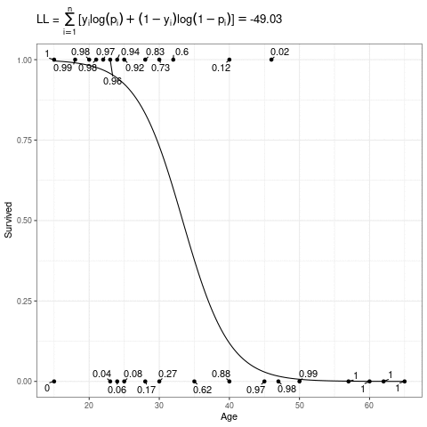
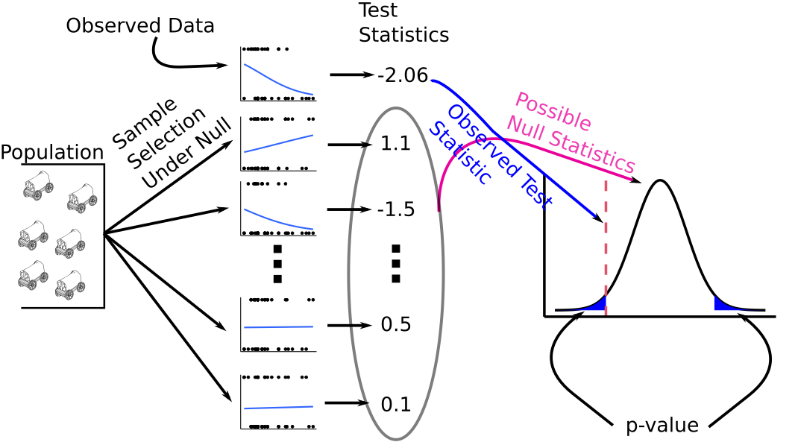

```{r setup, include=FALSE, message=FALSE}
set.seed(1)
library(latex2exp)
library(tidyverse)
library(ggthemes)
knitr::opts_chunk$set(echo       = TRUE, 
                      fig.align  = "center",
                      fig.height = 3, fig.width = 4)
ggplot2::theme_set(ggplot2::theme_bw() + ggplot2::theme(strip.background = ggplot2::element_rect(fill = "white")))
```

```{r klippy, echo=FALSE, include=TRUE}
klippy::klippy()
```

# Learning Objectives

- Logistic Regression for Binary Response Variables
- Chapters 20 and 21 of the *Statistical Sleuth*

```{r, message = FALSE}
library(tidyverse)
library(Sleuth3)
library(broom)
library(sandwich)
library(lmtest)
```

# Motivation

- Lots of regression problems involve response variables that are **binary** --- the only possible values are either 0 or 1.
    - Alive (1) vs dead (0)
    - Success (1) vs failure (0)
    - Presence (1) vs absence (0)
    
- It is arbitrary and unimportant which variable you encode as 1 vs 0. 
    - E.g. we could have coded "dead" as 1 and "alive" as 0.
    - Just keep track of the coding for interpretation purposes.
    
- E.g., either survival ($Y_i = 1$) or death ($Y_i = 0$) of individual $i$ from the Donner Party of 1846.

    ```{r}
    data("case2001")
    donner <- case2001
    glimpse(donner)
    ```
    
- We often want to quantify the association between a quantitative predictor $x$ and the binary response $y$. E.g. older folks tended to die at a higher frequency:
    ```{r}
    qplot(x = Age, y = Status, data = donner, geom = "point")
    ```

# Linear Probability Model (LPM)

- If your goal is *not* prediction, then it is **not entirely incorrect** to just use linear regression [@hellevik2009linear; @gomila2021logistic].
    - I am hedging here since this is a controversial statement.
    
- Let $Y_i \sim Bern(p)$. That is $Y_i$ is 1 with probability $p$ and is 0 with probability $1-p$. Then

    - $E[Y_i] = p$
    - $var(Y_i) = p(1-p)$
    
- Suppose $Y_i$ is 1 for "success" and "0" for failure. Suppose we have the model

    $$
    Y_i = \beta_0 + \beta_1X_{i1} + \beta_2X_{i2} + \cdots + \beta_{p-1}X_{i,p-1} + \epsilon_i.
    $$
    
- Since $E[Y_i]$ is the probability that $Y_i$ is 1, that mean's we can interpret the regression line as the probability that $Y_i$ is 1.

- Interpreting the regression coefficients: "Individuals that are 1 unit larger in $X_{ik}$ are $\beta_k \times 100$ percentage points more probable to have a $Y$ value of 1, adjusting for other variables."

- Let's apply this to the Donner party data

    ```{r}
    donner <- mutate(donner, Survived = if_else(Status == "Survived", 1, 0))
    lmout <- lm(Survived ~ Age, data = donner)
    lmout
    ```

- Thus, individuals that were one year older were 1.3 percentage points less likely to survive.
    
- Bernoulli random variables are always heteroscedastic since their variance is a function of the mean $p(1-p)$. So if you use the LPM, you *need* to use heteroscedastic robust standard errors.

    ```{r}
    cout <- coeftest(x = lmout, vcov. = vcovHC)
    tidy(cout)
    ```
    
- Residual plots are useless here, so never show them:

    ```{r}
    aout <- augment(lmout)
    qplot(x = .fitted, y = .resid, data = aout) + geom_hline(yintercept = 0)
    ```


## Issues

- Econometricians and psychometricians love the LPM because of its ease of interpretability.

- Statisticians typically do not like it (though I'm agnostic).

- The possible values of $\beta_0 + \beta_1X_{i1} + \beta_2X_{i2} + \cdots + \beta_{p-1}X_{i,p-1}$ are any real numbers between $-\infty$ and $\infty$, but the probability of $Y_i$ being 1 can only be between 0 and 1.

- So it is possible (and typical in many datasets) to have probability estimates that are negative or greater than 1. This makes folks squeamish.

- E.g., the point-wise confidence bands from the Donner party make no sense:

    ```{r}
    ggplot(donner, aes(x = Age, y = Survived)) +
      geom_point() +
      geom_smooth(method = "lm", formula = y ~ x)
    ```

- When the probability of a "1" is between about 0.2 and 0.8, then the linear and logistic (see below) models produce about the same results.

- Let's look at the differences in the Donner party example:

    ```{r}
    ggplot(donner, aes(x = Age, y = Survived)) +
      geom_point() +
      geom_smooth(method = "lm", se = FALSE, formula = y ~ x) +
      geom_smooth(method = "glm", 
                  se = FALSE,
                  method.args = list(family = "binomial"),
                  color = "red", 
                  lty = 2,
                  formula = y ~ x)
    ```

# Logistic Regression Model

- Let $p_i$ be the probability that individual $i$ is 1. I.e. $E[Y_i] = p_i$. Then our model is
    $$
    \text{logit}(p_i) = \beta_0 + \beta_1X_{i1} + \beta_2X_{i2} + \cdots \beta_{p-1}X_{i,p-1}
    $$

- Here, $\text{logit}(\cdot)$ is the "logit" function,
    $$
    \text{logit}(p_i) = \log\left(\frac{p_i}{1-p_i}\right).
    $$

- The inverse of the logit function is the "expit" function (confusingly, also known as the "logistic" function)
    $$
    \text{expit}(\eta) = \frac{e^{\eta}}{1 + e^{\eta}}.
    $$
    
- So we can equivalently write this model as
    $$
    p_i = \text{expit}\left(\beta_0 + \beta_1X_{i1} + \beta_2X_{i2} + \cdots \beta_{p-1}X_{i,p-1}\right)
    $$

- The $\text{expit}(\cdot)$ function takes a number from $-\infty$ to $\infty$ and places it between 0 and 1. Thus, it forces the probabilities to be between 0 and 1.

    ```{r, echo = FALSE}
    tibble(x = seq(-5, 5, length.out = 200)) %>%
      mutate(p = exp(x) / (1 + exp(x))) %>%
      ggplot(aes(x = x, y = p)) +
      geom_line() +
      ylab("expit(x)")
    ```


## Generalized Linear Model

- This is an example of a "generalized linear model". Let $Y_i$ follow any distribution we specify Let $\mu_i$ be the mean of $Y_i$. Then a generalized linear model is

    $$
    g(\mu_i) = \beta_0 + \beta_1X_{i1} + \beta_2X_{i2} + \cdots \beta_{p-1}X_{i,p-1}
    $$
    
- Here, $g(\cdot)$ is called the "link function". The model is linear on the link scale (hence "generalized linear model").

- In logistic regression, $Y_i \sim Bern(\mu_i)$ and $g(\mu_i) = \text{logit}(\mu_i)$.

- Another example is probit regression (more popular in econ) where $g(\mu_i) = \Phi^{-1}(\mu_i)$, the standard normal quantile function (`qnorm()`). This gives you almost identical results (and so can rarely be distinguished using data), but statisicians don't like the probit because it's less interpretable than the logit.

    ```{r, echo = FALSE, fig.width = 5}
    tibble(x = seq(-5, 5, length.out = 200)) %>%
      mutate(probit = pnorm(x, sd = pi / sqrt(3)),
             logit = exp(x) / (1 + exp(x))) %>%
      gather(-x, key = "Link Function", value = "g") %>%
      ggplot(aes(x = x, y = g, color = `Link Function`)) +
      geom_line() +
      ylab("g(x)") +
      scale_color_colorblind()
    ```
    
    - **Technical, unimportant note**: The above plots the quantile function of a $N(0, \pi^2/3)$ distribution for the probit to account for the difference in variances between the normal and logit distributions. This makes the two curves comparable.
    
- In [log-linear models](https://en.wikipedia.org/wiki/Poisson_regression) (which we might discuss later), we model counts with $Y_i \sim Poi(\mu_i)$ ([Poisson Distribution](https://en.wikipedia.org/wiki/Poisson_distribution)) and $g(\mu_i) = \log(\mu_i)$.

# Estimation

## Maximum Likelihood Estimation

- We don't use least squares for estimation. Rather, we use Maximum Likelihood.

- The probability that $Y_i = 1$ is $p_i$ and the probability that $Y_i = 0$ is $1 - p_i$. 

- Let $y_i \in \{0,1\}$ be the observed value of the random variable $Y_i$. Then we can succinctly write the probabilities of $Y_i$ as
    $$
    Pr(Y_i = y_i) = p_i^{y_i}(1-p_i)^{1 - y_i}
    $$
    Go ahead and plug in $y_i = 0$ and $y_i = 1$ to see this.

- So the probability of our data given $p_i$ is
    $$
    Pr(Y_1 = y_1, Y_2 = y_2, \ldots, Y_n = y_n) = \prod_{i=1}^n p_i^{y_i}(1-p_i)^{1-y_i}
    $$
    
- Recall that
    $$
    \text{logit}(p_i) = \beta_0 + \beta_1X_{i1} + \cdots \beta_{p-1}X_{i,p-1}.
    $$
    
- So the probability of the data is a function of $\beta_0,\beta_1,\ldots,\beta_{p-1}$.

- IDEA: Choose the $\beta_k$'s that make our observed data as probable as possible.
    - PHILOSOPHY: we observed our data (that's why we have it), so it is probably likely to have been generated. Choose the parameters that would maximize the probability of seeing the data we actually saw.

- The objective function is called the "likelihood".

- The resulting estimates are called the "maximum likelihood estimates" (MLE's).

- Typically, we actually maximize the log of the likelihood

$$
L(\mathbf{\beta}) = \sum_{i=1}^n [y_i\log(p_i) + (1-y_i)\log(1-p_i)]
$$


```{r, eval = FALSE, echo = FALSE}
library(ggrepel)
library(latex2exp)
beta0_seq <- seq(10, 1.8185, length.out = 20)
beta1_seq <- seq(-0.3, -0.0665, length.out = 20)
expit <- function(x) {
  exp(x) / (1 + exp(x))
}
df <- tibble(Age = seq(min(donner$Age), max(donner$Age), length.out = 200))
plist <- list()
for (i in seq_along(beta1_seq)) {
  beta0 <- beta0_seq[[i]]
  beta1 <- beta1_seq[[i]]
  
  df %>%
    mutate(Survived = expit(beta0 + beta1 * Age)) ->
    df
  
  donner %>%
    mutate(pi = expit(beta0 + beta1 * Age),
           pi = if_else(Survived == 1, pi, 1 - pi)) ->
    dontemp
  
  ll <- sum(log(dontemp$pi))
  
  dontemp %>%
    mutate(pi = round(pi, digits = 2)) %>%
    distinct(Age, Survived, .keep_all = TRUE) ->
    dontemp
  
  ggplot(dontemp, aes(x = Age, y = Survived, label = pi)) +
    geom_point() +
    geom_text_repel(min.segment.length = 0) +
    geom_line(data = df) +
    ggtitle(TeX(paste0("LL = $\\sum_{i=1}^n [y_i\\log(p_i) + (1-y_i)\\log(1-p_i)] = $", round(ll, digits = 2)))) ->
    plist[[i]]
}

saveGIF(expr = {
  for (i in seq_along(plist)) {
    print(plist[[i]])
  }
}, movie.name = "./06_figs/logistic_mle.gif", interval = 1)
```

- Below, the expit curve is morphing according to different values of $\beta_0$ and $\beta_1$. The text by the points is the probability of the those observed points, which in this case is just the height (when $Y_i = 1$) or one minus the height (when $Y_i = 0$) of the expit function. The likelihood is the product of those probabilities, and the log-likelihood is the sum of the log of those probabilities.

  \ 

## Implementation in R

- You should transform your binary variable to have 0's and 1's. You should call your new variable the value when $Y_i = 1$. E.g. in the Donner party we created the "Survived" variable.

```{r}
donner <- mutate(donner, Survived = if_else(Status == "Survived", 1, 0))
```

- Let $Y_i$ be an indicator for survival for individual $i$, let $X_{i1}$ be the age of individual $i$, and let $X_{i2}$ be an indicator for male Then we fit the model
    \begin{align}
    Y_i &\sim Bern(p_i)\\
    \text{logit}(p_i) &= \beta_0 + \beta_1X_{i1} + \beta_2X_{i2}
    \end{align}
    
- We fit all generalized linear models in R with `glm()`. The arguments are
    - `formula`: The same idea as in `lm()`. Response variable on the left of the tilde, explanatory variables on the right of the tilde.
    - `data`: The data frame where the variables are.
    - `family`: The distribution of $Y_i$. 
        - `gaussian` will assume normal errors (like in `lm()`).
        - `binomial` in this case will fit the bernoulli model since $Bern(p_i) = Bin(1, p_i)$.
    - You can specify the link function here as well. So for probit models you would do `binomial(link = "probit")`.
    
- Let's fit the model
    ```{r}
    glm_out <- glm(Survived ~ Age + Sex, data = donner, family = binomial)
    ```

- You again use `tidy()` from the `{broom}` package to get estimates / standard errors

    ```{r}
    tidy(glm_out)
    ```
    
- So the estimated regression surface is
    $$
    \text{logit}(p_i) = 3.23 -0.08X_{1} - 1.60X_{2}
    $$
    
- **Exercise**: What if $X_2$ would have been an indicator for female? What would the coefficient estimate of $\beta_2$ be?

    ```{block, eval = FALSE, echo = FALSE}
    1.60 instead of -1.60
    ```
    
## Bias reduction

- For small sample sizes, the MLE's of the logistic regression coefficients can be biased. A quick way to reduce this bias is through the [`{brglm2}`](https://cran.r-project.org/package=brglm2) package, which uses the method of @firth1993bias.

- Let's try this out on the Donner party example

    ```{r, warning = FALSE}
    library(brglm2)
    glm_out2 <- glm(Survived ~ Age + Sex,
                    data = donner, 
                    family = binomial, 
                    method = brglm2::brglm_fit)
    tidy(glm_out2, conf.int = TRUE)
    ```

- This actually resulted in some moderate differences!

# Interpretation

## Odds

- The interpretation of the logistic regression model requires you to be familiar with odds.

- As I write this, the Baltimore Ravens have 3 to 2 odds of defeating the Miami Dolphins tomorrow. This means that the odds of a Ravens victory are $3/2 = 1.5$.

- The odds of an event are the probability of that event divided by the probability of not that event.

- Let $p$ be the probability of an event, and let $\omega$ be the odds of the same event. Then we have the relations:
    $$
    \omega = \frac{p}{1-p}\\
    p = \frac{\omega}{1+\omega}
    $$

- So odds are just another description of probabilities. 

- In the football example above, the Ravens' probability of wining is 0.6, so the odds are 0.6/0.4 = 3/2 = 1.5.

- **Exercise**: The Chiefs have 2 to 1 odds over the Chargers tomorrow. What's the probability of a Chief's win?

    ```{block, eval = FALSE, echo = FALSE}
    2/3
    ```

- **Exercise**: As I write this, FiveThirtyEight has the Democrats with a 2/3 probability of keeping the Senate in the 2022 midterm election. What are the odds of a Democrat victory?

    ```{block, eval = FALSE, echo = FALSE}
    (2/3) / (1/3) = 2
    ```


## Interpreting Logistic Regression Model

- Let $\omega_{old}$ be the odds of an individual. We can write the logistic regression model as
    $$
    \omega_{old} = \exp\left(\beta_0 + \beta_1X_{1} + \beta_2X_{2} + \cdots \beta_{p-1}X_{p-1}\right)
    $$
    
- Suppose that a different individual has the exact same predictor values except one unit higher $X_1$. Then
    \begin{align}
    \omega_{new} &= \exp\left(\beta_0 + \beta_1(X_{1} + 1) + \beta_2X_{2} + \cdots \beta_{p-1}X_{p-1}\right)\\
    &= \exp\left(\beta_0 + \beta_1X_{1} + \beta_1 + \beta_2X_{2} + \cdots \beta_{p-1}X_{p-1}\right)\\
    &= \exp(\beta_1)\exp\left(\beta_0 + \beta_1X_{1} + \beta_2X_{2} + \cdots \beta_{p-1}X_{p-1}\right)\\
    &= \exp(\beta_1)\omega_{old}
    \end{align}
    
- Thus, the odds of the second individual are $e^{\beta_1}$ times as large as the odds of the first individual.

- Different way to say this: The odds ratio for the two individuals is $e^{\beta_1}$.

- Recall the estimated regression relationship from the Donner party example:
    $$
    \text{logit}(p_i) = 3.23 -0.08X_{1} - 1.60X_{2}
    $$
    
- So individuals of the same sex that are 10 years younger have about twice the odds of surviving ($e^{0.08} \times 10 = 2.186$). Also, a woman's odds of survival were about 5 times that of a man of the same age ($e^{1.6} = 4.95$).

- **Exercise**: The nocturia data set, described [here](https://dcgerard.github.io/stat_415_615/data.html#Nocturia) and dowloadable from [here](https://dcgerard.github.io/stat_415_615/data/nocturia.csv), contains patient covariates that are believed to be associated with whether the individual has nocturia (wakes up to pee). Download the data, the fit of logistic regression model of nocturia on age. Interpret the resulting coefficients.

    ```{r, eval = FALSE, echo = FALSE}
    nocturia <- read_csv("https://dcgerard.github.io/stat_415_615/data/nocturia.csv")
    qplot(x = age, y = nocturia, data = nocturia, geom = "jitter", width = 0, height = 0.05) +
      geom_smooth(method = "glm", se = FALSE, method.args = list(family = binomial))
    
    glmout <- glm(nocturia ~ age, data = nocturia, family = binomial)
    tout <- tidy(glmout)
    tout
    exp(tout$estimate[[2]] * 10)
    ```
    
    ```{block, eval = FALSE, echo = FALSE}
    Individuals 10 years older have about 1.6 times the odds of having nocturia.
    ```

# Retrospective studies

- In a **prospective** study, the explanatory variables are fixed and we imagine $Y_i$ being sampled given $X_i$.
    - E.g. we might choose $200$ patients and observe their cancer status.

- In a **retrospective** study, we fix $Y_i$ and later observe their $X_i$. 
    - E.g. we might choose $n = 100$ cancer patients and $n = 100$ controls.
    - This is typically done with the probability of one group is really small and you want more samples of that group.
    
- The LPM model (and probit model) are **not** valid in retrospective studies, but the logistic regression model **is** valid. So in retrospective studies you **must** use logistic regression.

- The reason is that the odds ratios for prospective studies and retrospective studies are the same, even though the probabilities are not.

- You can interpret slopes in the usual way in retrospective studies, but 
    - You cannot interpret the $Y$-intercept.
    - You cannot interpret **any** fixed estimate of the probability. 
    - You can **only** interpret the slope (the odds ratio).
    
### Proof

- Let's suppose that we have model
  $$
  Pr(Y = 1|X) = \text{expit}(\beta_0 + \beta_1X) = \frac{e^{\beta_0 + \beta_1X}}{1 + e^{\beta_0 + \beta_1X}}
  $$

- Let's introduce a binary variable $Z$ which is 1 if a unit is sampled, and 0 if it is not sampled. Let
    $$
    Pr(Z = 1|Y = 1) = \pi_1\\
    Pr(Z = 1|Y = 0) = \pi_0\\
    $$
    
- So we sample a $Y_i = 1$ individual with probability $\pi_1$ and a $Y_i = 0$ individual with probability $\pi_0$. This is a retrospective design, where the $\pi$'s are **not** functions of the $X_i$'s.

- We can only model the data we observe, so we want $Pr(Y = 1|Z=1, X)$, which we can calculate using [Bayes theorem](https://en.wikipedia.org/wiki/Bayes%27_theorem)
    \begin{align}
    Pr(Y = 1|Z=1, X) &= \frac{Pr(Z = 1|Y = 1, X) Pr(Y = 1|X)}{Pr(Z = 1|Y = 1, X) Pr(Y = 1|X) + Pr(Z = 1|Y = 0, X) Pr(Y = 0|X)}\\
    &= \frac{\pi_1 Pr(Y = 1|X)}{\pi_1 Pr(Y = 1|X) + \pi_0 Pr(Y = 0|X)}\\
    &= \frac{\pi_1 \text{expit}(\beta_0 + \beta_1X)}{\pi_1 \text{expit}(\beta_0 + \beta_1X) + \pi_0 (1 - \text{expit}(\beta_0 + \beta_1X))}\\
    &= \frac{\pi_1 \frac{e^{\beta_0 + \beta_1X}}{1 + e^{\beta_0 + \beta_1X}}}{\pi_1 \frac{e^{\beta_0 + \beta_1X}}{1 + e^{\beta_0 + \beta_1X}} + \pi_0 \frac{1}{1 + e^{\beta_0 + \beta_1X}}}\\
    &= \frac{\pi_1 e^{\beta_0 + \beta_1X}}{\pi_1 e^{\beta_0 + \beta_1X} + \pi_0}\\
    &= \frac{\frac{\pi_1}{\pi_0} e^{\beta_0 + \beta_1X}}{\frac{\pi_1}{\pi_0} e^{\beta_0 + \beta_1X} + 1}\\
    &= \frac{e^{(\beta_0 + \log(\pi_1 / \pi_0)) + \beta_1X}}{e^{(\beta_0 + \log(\pi_1 / \pi_0)) + \beta_1X} + 1}\\
    &= \frac{e^{\tilde{\beta}_0 + \beta_1X}}{e^{\tilde{\beta}_0 + \beta_1X} + 1}\\
    &= \text{expit}(\tilde{\beta}_0 + \beta_1X),
    \end{align}
    where $\tilde{\beta}_0 = \beta_0 + \log(\pi_1 / \pi_0)$.

- Thus, in a retrospective study, we are estimating $\beta_1$ and $\tilde{\beta}_0$ (not $\beta_0$).

- So, it is impossible to estimate $\beta_0$ (and hence, impossible to estimate the probability of $Y_i = 1$ at any value of $X$).

- **BUT** it is possible to estimate $\beta_1$ (and thus, the relationship between variables).

# Inference

- (Essentially) all maximum likelihood estimates enjoy good properties

1. Mostly unbiased.
2. Equations for standard deviation calculations are available.
3. Sampling distribution of MLE's is approximately normal for moderate to large sample sizes.

- That means that we can take take the same approaches as in linear regression to run hypothesis tests and obtain confidence intervals.

- For large samples, we have that the MLE's have the following sampling distribution:
$$
\frac{\hat{\beta}_i - \beta_i}{s(\hat{\beta}_i)} \sim N(0, 1)
$$

- Hypothesis test:
    - $H_0: \beta_i = 0$
    - $H_A: \beta_i \neq 0$
    
- $z^* = \frac{\hat{\beta}_i}{s(\hat{\beta}_i)}$

- Under the null, $z^*$ asymptotically follows a standard normal distribution. Use this to calculate a $p$-value in the usual way.

  \ 

- We can also use this property to obtain a confidence interval for $\beta_i$.

- Let $u = \text{qnorm}(1 - \alpha / 2)$, which is 1.96 when $\alpha = 0.05$.
    $$
    Pr\left(-u \leq \frac{\hat{\beta}_i - \beta_i}{s(\hat{\beta}_i)} \leq u\right) = 0.95
    $$
    
- Solving for $\beta_i$, we get the following $(1 - \alpha)\times 100\%$ confidence interval:
    $$
    \hat{\beta}_i \pm \text{qnorm}(1 - \alpha / 2) s(\hat{\beta}_i)
    $$

- We do not use the $t$-distribution here because the $t$ results from assuming normal error terms, which is not the case here.

- In R, you get these quantities by `tidy()`.

    ```{r}
    glm_out <- glm(Survived ~ Age + Sex, data = donner, family = binomial)
    tidy(glm_out, conf.int = TRUE)
    ```
    
# Point-wise estimation

- You again obtain point-wise estimates for log-odds by `predict()`.

    ```{r}
    glm_out <- glm(Survived ~ Age + Sex, data = donner, family = binomial)
    newdf <- data.frame(Age = c(25, 30), Sex = c("Male", "Female"))
    predict(glm_out, newdata = newdf)
    ```
    
- If you want the point-wise estimates for the probabilities, use `type = "response"`

    ```{r}
    predict(glm_out, newdata = newdf, type = "response")
    ```

- To calculate point-wise confidence intervals, you should do this on the logit-scale manually, then back-transform. Here is a function that will do all of that for you.
    ```{r}
    #' Point-wise confidence intervals for GLM objects.
    #' 
    #' Some documentation was borrowed from stats::predict().
    #' 
    #' @param object The output of stats::glm()
    #' @param newdata An optional data frame in which to look for
    #'     variables with which to predict. If omitted, the fitted 
    #'     values are used.
    #' @param interval Type of interval calculation.
    #' @param level Tolerance/confidence level.
    #' 
    #' @return A data frame, with `newdata` column-bound to the fits and 
    #'     the lower and upper ranges of the intervals.
    #' 
    #' @author David Gerard
    confglm <- function(object, 
                        newdata = NULL, 
                        type = c("link", "response"), 
                        level = 0.95) {
      # Check arguments ----
      stopifnot(inherits(object, "glm"))
      type <- match.arg(type)
      stopifnot(level >= 0, level <= 1, length(level) == 1)
      if (is.null(newdata)) {
        newdata <- as.data.frame(stats::model.frame(object))[-1]
      }
      
      ## predict ----
      object$family
      pout <- stats::predict(object = object, 
                             newdata = newdata,
                             se.fit = TRUE)
      alpha <- 1 - level
      z <- stats::qnorm(1 - alpha / 2)
      newdata$fit <- pout$fit
      newdata$lwr <- pout$fit - z * pout$se.fit
      newdata$upr <- pout$fit + z * pout$se.fit
      
      ## Inverse transformation ----
      if (type == "response") {
        fam <- family(object)
        newdata$fit <- fam$linkinv(newdata$fit)
        newdata$lwr <- fam$linkinv(newdata$lwr)
        newdata$upr <- fam$linkinv(newdata$upr)
      }
      
      return(newdata)
    }
    ```
    
    ```{r}
    confglm(object = glm_out, newdata = newdf, type = "response")
    ```
    
# Prediction

- To predict a response value at a given set of explanatory values, you obtain the estimated probability at those levels, like above

    ```{r}
    newdf <- data.frame(Age = c(25, 30), Sex = c("Male", "Female"))
    predict(glm_out, newdata = newdf, type = "response")
    ```

- We might then predict the 25 year-old male to die (since his estimated probability of survival is only 0.42) and the 30 year-old female to survive (since her estimated probability of survival is 0.71).

- In general, you choose some threshold $c$ and predict $Y_i = 1$ if the estimated probability is above $c$, and predict $Y_i = 0$ if the estimated probability is below $c$.

- You might think to always choose $c = 0.5$, but it's more complicated than that. You typically need to calibrate $c$ by balancing desired levels of [recall and precision](https://en.wikipedia.org/wiki/Precision_and_recall). See also [here](https://en.wikipedia.org/wiki/Confusion_matrix#Table_of_confusion).

- You will learn more about this in Machine Learning next semester.

# Drop-in-deviance Test (AKA the Likelihood Ratio Test)

- A **saturated model** is one where every single observation has its own paramter, so the data are fit exactly.

- In logistic regression the likelihood of the saturated model is 1 (since every observation is perfectly observed) and so the log-likelihood of the saturated model is 0.

- The **deviance** of a model is -2 times the difference between the saturated model and the model under consideration. So in logistic regression, the deviance is $-2L$ where $L$ is the maximized log-likelihood.

- `glm()` returns the deviance.

    ```{r}
    glance(glm_out) %>%
      select(deviance)
    ```

- We can calculate -2 times the log-likelihood manually to verify this:
    ```{r}
    donner <- mutate(donner, prob = predict(glm_out, type = "response"))
    donner <- mutate(donner, prob_obs = if_else(Survived == 1, prob, 1 - prob))
    -2 * sum(log(donner$prob_obs))
    ```

- The deviance is a generalization of the error sum of squares from linear regression. 

- If the reduced model is correct, the drop in deviance between two models follows a chi-squared distribution with degrees of freedom corresponding to the difference in the number of parameters between the two models.

- Let's test
    - $H_0: \beta_1 = \beta_2 = 0$
    - $H_A: $ either $\beta_1 \neq 0$ or $\beta_2 \neq 0$.
    
- The reduced model:
    $$
    \text{logit}(p_i) = \beta_0\\
    Y_i \sim \text{Bern}(p_i)
    $$
    
    ```{r}
    g_red <- glm(Survived ~ 1, data = donner, family = binomial)
    ```
    
- The full model:
    $$
    \text{logit}(p_i) = \beta_0 + \beta_1X_{i1} + \beta_2X_{i2}\\
    Y_i \sim \text{Bern}(p_i)
    $$
    
    ```{r}
    g_ful <- glm(Survived ~ Age + Sex, data = donner, family = binomial)
    ```

- Use `anova()` to test differences, using `test = "LRT"` to specify that you should obtain a $p$-value using the likelihood ratio test.
    ```{r}
    anova(g_red, g_ful, test = "LRT")
    ```
    
- **NOTE**: Unlike in linear models, the drop-in-deviance test is **not** equivalent to the $z$-test ("Wald-test") when we are just testing for one coefficient.

    - Below I run a drop-in-deviance and a Wald test for $H_0: \beta_1 = 0$. The $p$-values are different.

    ```{r}
    g_red <- glm(Survived ~ Sex, data = donner, family = binomial)
    g_ful <- glm(Survived ~ Age + Sex, data = donner, family = binomial)
    anova(g_red, g_ful, test = "LRT")
    tidy(g_ful) %>%
      filter(term == "Age") %>%
      select(term, p.value)
    ```

    - The drop-in-deviance and Wald tests give the same results for large samples, but for small samples the drop-in-deviance test tends to work better.
    
# Model Checking

- Residual plots are useless.
    - But we don't need to check for constant variance or outliers, two of the big uses of residual plots.
    
- We should evaluate the logistic model.
    - Compare to a more complicated model.
    - Compare to a model with cut explanatory variables.
    - Non-parametric smoother.

- Fit a more complicated model and see if there are any deficiencies:

    ```{r}
    glm_out <- glm(Survived ~ Sex + Age,
                   data = donner,
                   family = binomial)
    donner <- mutate(donner, Age2 = Age^2)
    g_big <- glm(Survived ~ Sex + Age + Age2 + Sex * Age + Sex * Age2, 
                 data = donner, 
                 family = binomial)
    anova(glm_out, g_big, test = "LRT")
    ```

    - Moderate to weak evidence of a model mispecification, but we would be fine ignoring this I think.
    
- [Hosmer-Lemeshow](https://en.wikipedia.org/wiki/Hosmer%E2%80%93Lemeshow_test) goodness-of-fit test for logistic regression.
    - Basically, divides the points into bins and compares a group-wise probability model to the logistic model.
    - Null is fitted model, alternative is deviation from fitted model.
    - Large $p$-values indicate no evidence of lack-of-fit.

    ```{r}
    glmtoolbox::hltest(glm_out)
    ```

- For one-dimensional logistic regression, compare logistic curve to a non-parametric smoother.

    ```{r}
    qplot(x = Age, y = Survived, data = donner, geom = "point") +
      geom_smooth(method = "glm", 
                  se = FALSE,
                  method.args = list(family = binomial)) +
      geom_smooth(color = "red", lty = 2, se = FALSE)
    ```
    
```{r, eval = FALSE, echo = FALSE}
#' Kernel regression plot demonstration
#' 
#' @param x The observed x-values
#' @param y The observed y-values
#' @param x0 The point at which we want to make a prediction
#' @param bandwidth The bandwidth
ksquart <- function(x, y, x0, bandwidth = 0.5) {
  ksdf <- as.data.frame(ksmooth(x = x, 
                                y = y,
                                kernel = "box",
                                bandwidth = 2 * bandwidth))
  
  df <- tibble(x = x,
               y = y,
               w = 1 * (abs((x0 - x) / bandwidth) <= 1)
               )
  y0 <- sum(df$w * df$y / sum(df$w))
  
  # df2 <- data.frame(x = seq(min(df$x), max(df$x), length.out = 200))
  # df2$w <- 1 * (abs((x0 - df2$x) / bandwidth) <= 1)
  # ggplot(df, aes(x = x, y = w)) +
  #   geom_point() +
  #   ylab("Gaussian Kernel Weight") +
  #   geom_line(data = df2)

  ggplot(df, aes(x = x, y = y, alpha = w)) +
    geom_point() +
    annotate(geom = "point", x = x0, y = y0, color = "red", shape = 2) +
    geom_vline(xintercept = x0 - bandwidth, lty = 2) +
    geom_vline(xintercept = x0 + bandwidth, lty = 2) +
    annotate(geom = "segment", 
             x = x0 - bandwidth,
             xend = x0 + bandwidth,
             y = y0, 
             yend = y0,
             col = 2) +
    geom_line(data = ksdf, mapping = aes(x = x, y = y), alpha = 1) +
    guides(alpha = "none") +
    coord_cartesian(xlim = c(min(x), max(x))) +
    theme_bw()
}

x <- mtcars$wt
y <- mtcars$mpg
ksquart(x = x, y = y, x0 = 2)

x0seq <- seq(min(x), max(x), length.out = 200)
pl_list <- list()
for (i in seq_along(x0seq)) {
  pl_list[[i]] <- ksquart(x = x, y = y, x0 = x0seq[[i]])
}
library(animation)
saveGIF(expr = {
  for (i in seq_along(pl_list)) {
    print(pl_list[[i]])
  }
}, movie.name = "./ksreg.gif", interval = 0.1)
```
    

# References
